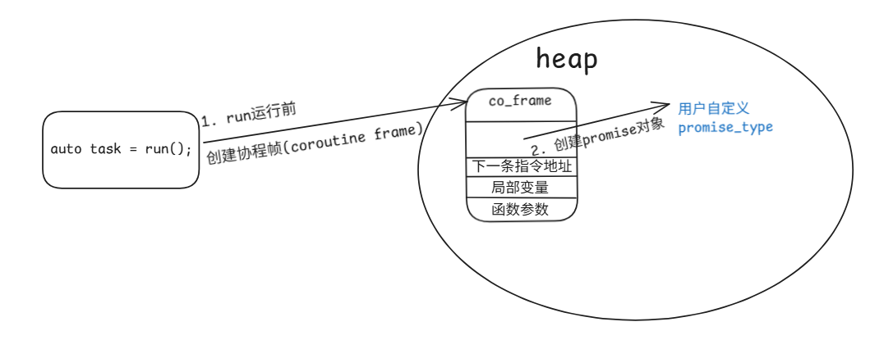
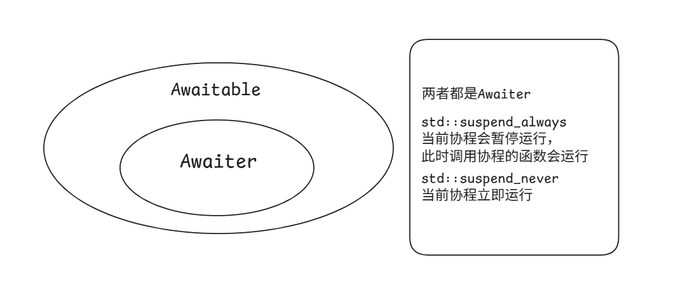
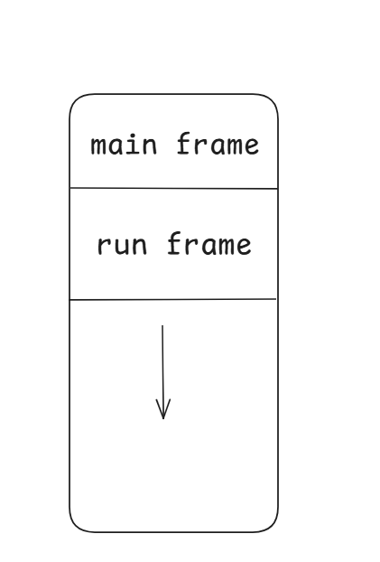
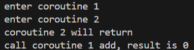
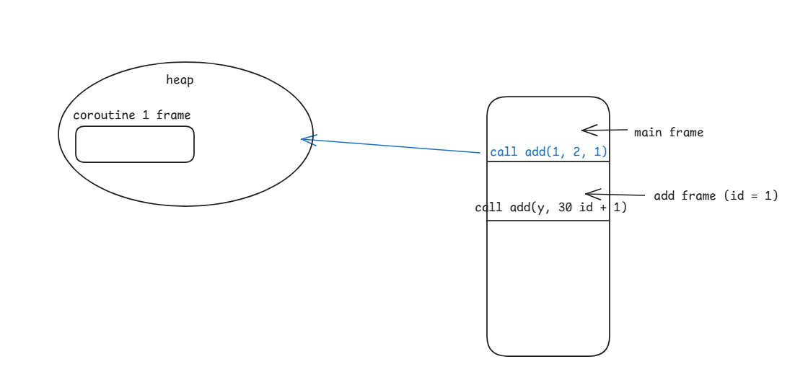
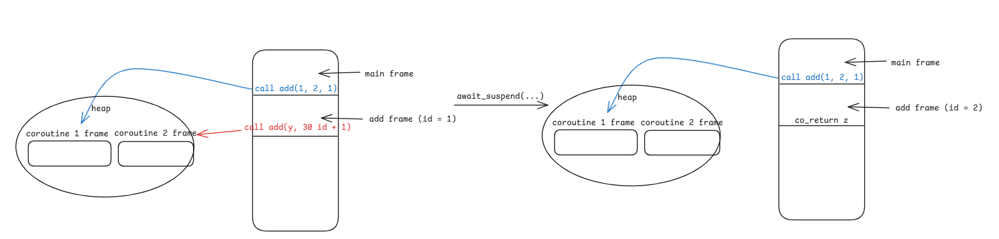

## c++20协程入门

### 前置语法

1. 一个函数体内如果有下面三个关键字的任意一个将被视为协程

   `co_await`，`co_yield`，`co_return`

2. 协程无法直接使用`void/int/vector<string>`这样的形式作为函数的返回类型，而是返回`Task`（一个由用户自定义的类），并指定其`promise_type`（通过以下方式）：

   ```c++
   class Task {
       ...
   };
   class promise1 {
       ...
   };
   struct std::coroutine_traits<Task> {
       // promise1也由用户自定义，但需要满足一些规范
       using promise_type = promise1; 
   };
   ```

   或者下面的方式：

   ```c++
   class promise1 {
       ...
   };
   class Task {
   public:
       using promise_type = promise;
       ...
   };
   ```

3. 实现`Task`和`promise_type`完毕后，利用如下语法编写一个协程函数：

   ```cpp
   Task run(int a, int b) {
       int c = a + b;
       co_return;
   }
   ```

4. 协程函数的调用者在调用协程函数之后可以拿到协程的返回值：

   ```c++
   int main () {
       auto task = run(1, 2);
   }
   ```

   这里`task`变量是上面定义的`Task`类型，通过该变量，我们可以在`main`函数中与协程交互（如让协程恢复执行，获取结果等）

**强烈推荐视频**：[【协程革命】理论篇！扫盲，辟谣一条龙！全语言通用，夯实基础，准备起飞！](https://www.bilibili.com/video/BV1K14y1v7cw/?spm_id_from=333.1387.homepage.video_card.click&vd_source=b93859dd8360e859dab85c63d1b91f9f)

### 协程的创建与销毁

#### 流程

协程函数与普通函数不同：

普通函数调用即：跳转到函数入口—执行—返回

协程函数则由编译器在某些阶段做了一些准备工作：**函数调用后到用户定义代码执行前**， **用户定义代码返回后到函数结束前**

具体如下面的代码所示：

```c++
T some_coroutine(P param)
{
  // 为协程帧分配内存，如果 promsie 存在内存分配重载则利用 promise 的内存分配函数
  auto* f = new coroutine_frame(std::forward<P>(param));

  // returnObject即Task对象, 会在协程第一次陷入 suspend 状态后通过语句`return returnObject`返回给调用者
  auto returnObject = f->promise.get_return_object();

  // 控制协程创建时的调度逻辑
  co_await promise.initial_suspend();
    
  // 用户定义代码执行前
  try
  {
    // 用户在协程函数体内定义的逻辑
    <body-statements>
  }
  catch (...)
  {
    // 处理协程运行中抛出的异常
    promise.unhandled_exception();
  }
  // 用户定义代码返回后

FinalSuspend:
  // 控制协程结束时的调度逻辑
  co_await promise.final_suspend();
  // 清理工作, 比如释放先前创建的协程帧
  clean code;
}
```

https://en.cppreference.com/w/cpp/language/coroutines.html

[从编译器视角揭秘 C++ 协程 | tinyCoroLab Docs](https://sakurs2.gitbook.io/tinycorolab-docs/knowledgeextension/coroutine_compiler_view)

下面会从以下几个根据协程的调度阶段，一个一个介绍上述执行流程的部分：

- coroutine frame
- promise结构
- `co_await`，`co_return`语义

#### 协程的创建

##### 协程函数运行之前的准备工作

从下面这个简单的协程函数开始，一步一步查看协程是如何创建的：

```c++
Task run(int a, int b) {
    int c = a + b;
    co_return;
}
int main() {
    auto task = run(1, 2);
}
```

当`main`函数调用`run`时，`run`函数不会像普通函数那样直接一路执行下去，编译器在函数体内部做了某些准备工作：

1. 创建协程帧(**co_frame**)：

   

   由于c++中是**无栈协程**（有栈的概念可以参考线程栈，指每创建一个协程，就有自己的栈区来支配），其运行依靠系统栈，但协程本身可以被暂停和恢复运行（此时系统栈的变化类似多次函数调用和结束），为了保存函数体内的变量，需要动态开辟内存空间，将一些数据存到堆区。

   上述步骤由编译器自动生成代码执行，协程帧由一些变量来组成，包括`run`的函数参数，`run`中创建的局部变量，**恢复执行后**下一条要执行的指令地址（只是为了容易理解，实际存储的并不一定是这个，但仍然与指令地址具有相同的效果），以及`promise_type`对象，其中最重要的是`promise_type`对象，它与协程的生命周期绑定，并可以通过其来控制协程的行为

2. 生成`Task`对象，执行第一次调度：

   这一步由`promise_type`的函数实现，`promise_type`是一个需要用户实现的接口，形式如下：
   
   ```c++
   class promise_type
   {
       friend class Task;
   public:
       promise_type(){}
       Task get_return_object()
       {
           return Task{std::coroutine_handle<promise_type>::from_promise(*this)};
       }
       constexpr std::suspend_always initial_suspend() { return {}; }
       
       /*
       void return_void() {}
       void unhandled_exception() {}
       constexpr std::suspend_always final_suspend() noexcept { return {}; }
       */
   };
   ```

   注释里的内容暂时不需要关注，编译器在构造了协程对应的`promise_type`对象后，按顺序：

   1. 执行`promise_type.get_return_object()`函数：

      - 通过`promise_type`对象来构建协程句柄（`coroutine_handle`，可以理解为一个指针，指向协程帧）
      - 使用协程句柄构建一个`Task`对象（**Task类需提供对应的构造函数**），该`Task`对象将作为协程函数的返回值，在协程第一次进入**暂停**（suspend）状态时被自动返回
   
      在代码中，执行`auto task = run(1, 2);`后，`task`变量就是该`Task`对象，通过该对象，`main`函数中可以利用Task类定义的方法简单的操作协程（恢复协程执行，获取结果等等）
   
   2. 执行`co_await promise_type.initial_suspend()`：
   
      该函数应返回一个`Awaitable`对象，关于`Awaitable`和`Awaiter`，两者关系如下图所示，`std::suspend_always`和`std::suspend_never`都属于`Awaiter`：
   
      
   
   3. 返回`Awaitable`对象后，进入暂停—恢复流程，决定当前协程是否会立即运行，比如上面的`promise_type`中返回`std::suspend_always`，那么此时协程会立即暂停，并将自己的状态更新到协程帧中，然后将控制权交给调用者`main`函数，此时`main`函数继续执行
   
   4. `main`函数拿到了可以和协程交互的对象`task`，但代码中并不恢复协程，那么就会直接退出程序
   
   4. `task`被析构
   
   **协程是如何根据suspend_always来把控制权交还给main函数的？**其实很简单，创建协程时除了会在堆区创建协程帧，也会像普通函数一样创建函数栈帧：
   
   
   
   只不过在`run`函数执行到其函数体的第一条语句之前，编译器就检查到`std::suspend_always`需要让协程暂停，此时会执行类似函数内`return`的指令，`run frame`被pop，回到`main frame`中对应位置执行，控制权就自然而然的交回给`main`函数了，至于如何恢复协程的执行，会在之后的篇幅进行讲解
   
   而如果`initial_suspend`返回的是`std::suspend_never`，`run frame`会保留，协程就会立即执行

#### 协程的销毁

##### co_return

当`run`函数执行到`co_return`语句时，协程的逻辑执行已经完成，接下来需要主动或被动的释放协程资源（主要是协程帧的销毁）

与协程的创建类似，执行`co_return`语句时，会触发一系列明确的收尾动作：

```c++
class promise_type
{
    friend class Task;
public:
    /*
    promise_type(){}
    Task get_return_object()
    {
        return Task{std::coroutine_handle<promise_type>::from_promise(*this)};
    }
    constexpr std::suspend_always initial_suspend() { return {}; }
    */
    
    void return_void() {}
    void unhandled_exception() {}
    constexpr std::suspend_always final_suspend() noexcept { return {}; }
};
```

流程如下：

1. 设置最终结果：

   `co_return;`会自动调用`promise_type.return_void()`，这将会通知`Promise`对象协程已经正常结束，但没有返回值

   **如果需要协程返回值该怎么做？**
   在`promise_type`类中增加一个`void return_value(T v)`函数和成员变量`val`，利用`val`保存`v`，同时`co_return;`变为`co_return v;`即可

   **注意**：一个`promise_type`类中无法同时实现`return_value`和`return_void`函数

   **如果协程因为一个未捕获的异常而终止会怎么样？**

   编译器会自动调用`promise::unhandle_exception()`函数来存储异常信息，等待后续逻辑处理

2. 跳转到`FinalSuspend`标号处，执行`co_await promise_type.final_suspend()`

   与创建时`co_await initial_suspend()`类似，由编译器主动调用，函数的返回结果也是一个`Awaitable`对象，这个对象将直接决定协程接下来的行为，仍以`std::suspend_always`和`std::suspend_never`为例做介绍：

   - 该函数返回`std::suspend_always()`：根据上面的介绍，返回这个对象代表着协程当前要暂停，并将执行权转移给**调用者（caller）**，此时**堆中创建的协程帧仍然存在**，如果调用者之后不主动恢复该协程（大部分情况都不会再恢复，因为此时协程的逻辑生命已经结束了）或者不主动调用协程句柄的`destroy()`函数，将会出现**内存泄露**

     **如何主动释放协程帧？**

     答案是：**协程句柄**，其应与`Task`绑定

     ```c++
     class Task {
         // ...
         std::coroutine_handle<promise_type> handle;
     	Task(std::coroutine_handle<promise_type> h) : handle(h) {}
         ~Task() {
             if (handle) {
                 // 协程帧还存在的话，就销毁
                 handle.destroy();
             }
         }
     };
     ```

     在上面的代码中，`std::coroutine_handle<promise_type>`在`Task`类中定义一个与`promise_type`类绑定的协程句柄，该协程句柄由`promise_type::get_return_object()`设置值

     在析构函数中检查句柄的有效性，并使用`destroy()`主动释放协程帧

     **关于`std::coroutine_handle`和协程句柄的更详细的知识，将在之后进行介绍**

     这样，在协程逻辑上退出之后，借由返回的`Task`对象，就能主动释放协程所占的资源

   - 该函数返回`std::suspend_never()`，根据上面的介绍，返回这个对象代表着协程当前不会暂停，会继续执行，而当前协程已经运行到函数体末尾，在函数体的末尾之后，是编译器自动生成的**清理代码（cleanup code）**，这部分代码负责析构所有局部变量并释放协程帧的内存。

     所以，协程的销毁与否，完全取决于执行流**有没有机会执行到那段清理代码**。

     但是，

     **这是一个危险的选项，尤其是其绑定的task对象还存活的时候**
     
     - 如果 `co_return` 之后，调用者仍然尝试使用协程句柄（例如，通过`Task`对象），这将立即导致**悬垂指针和未定义行为**。

### 协程的恢复

#### std::coroutine_handle

操控协程的句柄，其类似一个指针，指向一个协程帧，并向用户暴露操控对应协程的接口

`std::coroutine_handle`是一个类模板，有两种形式：

1. `std::coroutine_handle<>`：是对所有协程类型进行类型擦除后的版本，能表示任何协程句柄
2. `std::coroutine_handle<promise_type<return_type>>`：只能表示`promise_type<return_type>`对应的协程句柄

#### 成员函数

##### static

1. `from_promise(promise_type &p)`：从`promise_type`对象中创建一个协程句柄。

   该函数返回一个类型为`std::coroutine_handle<promise_type<return_type>>`的协程句柄，但`std::coroutine_handle<>`类并不具有此静态函数，无法调用该函数

2. `from_address(void* ptr)`：从协程帧地址中创建一个协程句柄

   `std::coroutine_handle<>`和`std::coroutine_handle<promise_type>`类都有该函数，返回的句柄类型也与调用时的类 类型相同

   通常需要使用另一个协程句柄传入地址来构建新的协程句柄，不太常用

##### non-static

1. `done()`：判断协程是否结束，返回`true`或`false`，判断条件是协程是否在最终挂起点处暂停（即`promise_type.final_suspend()`）
2. `resume()`：使该协程句柄所代表的协程继续运行
3. `destroy()`：销毁该协程句柄所代表的协程（协程句柄`done()`必须为`true`）
4. `promise()`：返回该协程内部`promise_type`对象的引用（`std::coroutine_handle<>`类没有该函数）
5. `address()`：返回协程句柄对应的协程帧的地址

总之，c++通过`std::coroutine_handle`为用户提供了操作一个协程的接口，方便操作协程

其通常作为`Task`类的成员变量存在

### 一个简单的协程案例

了解了协程的创建和销毁，就可以创建一个简单的协程来模拟一个普通的函数：

```c++
#include <coroutine>
#include <exception>
#include <iostream>
#include <ostream>

class Task {
public:
    class promise_type; // 前向声明
    using coroutine_handle = std::coroutine_handle<promise_type>;
    class promise_type {
    public:
        // 必须实现
        Task get_return_object()
        {
            return Task { coroutine_handle::from_promise(*this) };
        }
        // 必须实现
        std::suspend_always initial_suspend() { return {}; }
        // 必须实现
        void unhandled_exception()
        {
            ex = std::current_exception();
        }
        // void 和 value选一种实现
        // void return_void() { }
        void return_value(int res) { res_ = res; }
        // 必须实现 并置为noexcept
        std::suspend_always final_suspend() noexcept { return {}; }

    public:
        std::exception_ptr ex;
        int res_;
    };

public:
    Task()
        : handle_(nullptr)
    {
    }
    explicit Task(coroutine_handle handle)
        : handle_(handle)
    {
    }
    ~Task()
    {
        if (handle_) {
            handle_.destroy();
        }
    }
    bool resume()
    {
        if (!handle_.done()) {
            handle_.resume();
        }
        return !handle_.done();
    }
    int result()
    {
        return handle_.promise().res_;
    }

private:
    coroutine_handle handle_;
};
Task add(int x, int y)
{
    int z = x + y;
    co_return z;
}
int main(int argc, char const* argv[])
{
    auto task = add(1, 2);
    task.resume();
    std::cout << "call coroutine add, result is " << task.result() << std::endl;
    return 0;
}
```

目前来看，创建一个普通函数所花费的功夫貌似比创建一个协程要小的多，那么为什么还要使用协程？后面会继续介绍c++协程中最重要的关键字`co_await`

### co_await

在之前介绍的协程中创建和销毁中，刻意省略了一些过程，这些过程都与`co_await`相关：

```c++
co_await promise_type.initial_suspend();
co_await promise_type.final_suspend();
```

`co_await`和协程的调度相关联，和之前的`Awaitable`对象共同掌管着一个协程的暂停和恢复

#### co_await语义

`co_await`的语法是：`co_await <expr>`

`co_await`关键字用于暂停协程，其中`<expr>`必须是或返回一个`Awaitable`对象

在调用协程函数时，编译器为我们隐式执行了`co_await promise_type::initial_suspend();`

在协程`co_return`时，编译器也会隐式执行`co_await promise_type::final_suspend();`

在`co_await <expr>`时，编译器会展开该语句，执行跟`Awaitable`对象相关的固定流程：

```c++
{
	auto&& value = <expr>;
    // 伪代码, 获取awaitable和awaiter
 	auto&& awaitable = get_awaitable(promise, static_cast<decltype(value)>(value));
 	auto&& awaiter = get_awaiter(static_cast<decltype(awaitable)>(awaitable));
	// 跟awaiter相关的执行流程
  	if (!awaiter.await_ready()) {
	    using handle_t = std::coroutine_handle<P>;

    	using await_suspend_result_t =
      	decltype(awaiter.await_suspend(handle_t::from_promise(promise)));

    	// 在该处协程准备陷入 suspend 状态，编译器生成代码来保存协程当前的运行状态
    	<suspend-coroutine>

    	if constexpr (std::is_void_v<await_suspend_result_t>) {
            awaiter.await_suspend(handle_t::from_promise(promise));
            <return-to-caller-or-resumer>
    	}
    	else {
        	// 这里暂不考虑返回 std::coroutine_handle 的 await_suspend
            static_assert(
                std::is_same_v<await_suspend_result_t, bool>,
                "await_suspend() must return 'void' or 'bool'.");

            if (awaiter.await_suspend(handle_t::from_promise(promise))) {
                <return-to-caller-or-resumer>
            }
        }
        // 协程陷入 suspend 状态后恢复会从该处开始执行而不是从<suspend-coroutine>处
		<resume-point>
    }
	return awaiter.await_resume();
}
```

#### Awaiter

从协程的创建中，应大致了解了`Awaiter`对象和`Awaitable`对象的关系，现在将协程的创建与`std::suspend_always`与`co_wait`关联起来介绍：

1. `std::suspend_always`是一个`Awaiter`对象：

   一个`Awaiter`对象要求实现以下三个函数**（都必须声明为`noexcept`）**：

   - `await_ready()`：字面意思，指执行`co_await awaiter;`语句的协程是否能够继续运行，`true`代表可以，否则进入`suspend_point`
   - `await_suspend(coroutine_handle<>)`：参数`coroutine_handle<>`指的是执行了`co_await std::suspend_always`的协程（**这一点很重要**），并执行协程暂停前的一些准备工作，调用该函数后，编译器会生成相应代码来暂停协程
   - `await_resume()`：恢复上一步`suspend`的协程，可以在此处做一些恢复的动作（如准备返回值），调用该函数，编译器会生成相应代码来恢复协程

   ```c++
   struct awaiter
   {
       bool await_ready() noexcept;
       void await_suspend(coroutine_handle<>) noexcept;
       void await_resume() noexcept;
   };
   ```

   在编译器生成的代码中，其工作流程如下，其中，`await_suspend()`有三种返回值，编译器根据返回值类型的不同，会做不一样的动作：

   1. `void await_suspend(std::coroutine_handle<>) noexcept` ：调用完毕后立即暂停入参指向的协程

   2. `bool await_suspend(std::coroutine_handle<>) noexcept`：

      返回`true`则暂停入参指向的协程

      返回`fasle`则继续运行入参指向的协程（仍然需要经过`await_resume`逻辑）

   3. `std::coroutine_handle<> await_suspend(std::coroutine_handle<>) noexcept`：挂起入参指向的协程，并恢复返回值指向的协程的运行

   ```c++
   if (!awaiter.await_ready()) {
       // 编译器会在这里准备挂起，并拿到当前协程的句柄 `h`
       // std::coroutine_handle<> h = /* ... get current handle ... */;
   
       // 调用 await_suspend(h)，并根据其返回值决定下一步
       // --- 情况 A: await_suspend 返回 void ---
       if constexpr (std::is_void_v<decltype(awaiter.await_suspend(h))>) {
           awaiter.await_suspend(h);
           // 编译器魔法: 保存当前所有状态，挂起协程，将控制权返回给调用者/恢复者
           COMPILER_SAVE_STATE_AND_SUSPEND(); 
           // 当协程被 .resume() 时，将从这里继续执行
           :resume_label1; 
       }
   
       // --- 情况 B: await_suspend 返回 bool ---
       else if constexpr (std::is_same_v<decltype(awaiter.await_suspend(h)), bool>) {
           if (awaiter.await_suspend(h)) { // 如果返回 true
               // 编译器魔法: 同上，挂起协程
               COMPILER_SAVE_STATE_AND_SUSPEND();
               :resume_label2;
           }
       }
   
       // --- 情况 C: await_suspend 返回另一个协程句柄 ---
       else if constexpr (std::is_convertible_v<decltype(awaiter.await_suspend(h)), std::coroutine_handle<>>) {
           auto next_coro_to_run = awaiter.await_suspend(h);
           // 编译器魔法: 对称转移。挂起当前协程，并立即调度 next_coro_to_run 恢复执行
           COMPILER_PERFORM_SYMMETRIC_TRANSFER(next_coro_to_run);
           :resume_label3;
       }
   }
   
   // 调用 await_resume() 获取最终结果
   // (如果表达式有返回值的话)
   // ValueType result = awaiter.await_resume();
   awaiter.await_resume(); // 如果返回 void
   ```

   所谓注释中的**当前协程的句柄**：简单理解为调用`co_await awaiter;`的那个协程

2. 介绍了`awaiter`接口后，再看`std::suspend_always`的代码：

   ```c++
   struct suspend_always
   {
       constexpr bool await_ready() const noexcept { return false; }
       constexpr void await_suspend(coroutine_handle<>) const noexcept {}
       constexpr void await_resume() const noexcept {}
   };
   ```

   根据1中介绍的流程，`co_await std::suspend_always{}`：

   - 调用`await_ready()`，结果为`fasle`

   - 然后调用`await_suspend()`，返回值为`void`
   - 保存协程状态，挂起协程，将控制权返回给调用者**（指协程函数的调用者，不是await对象方法的调用者）**

用户可以构建自己的awaiter类，只要实现了以上三个函数即可（都要标记为`noexcept`）

#### Awaitable

将一个对象称为可`Awaitable`，当且仅当其满足了以下三个条件中的一个：

- 实现了`await_ready()`，`await_suspend(std::coroutine_handle<>)`，`await_resume()`三个函数
- 重载了`operator co_await()`运算符，并令其返回一个`Awaiter`对象
- 实现了`await_transform`成员函数

##### 为task实现operator co_await()

上面阐述了`co_await`是如何与`awaiter`协同工作的，但我们更多的时候需要让`co_await`后跟另一个协程函数，即：

```c++
Task func1() {
    std::cout << "func1()" << endl;
    co_return 1;
}

Task func2() {
    co_await func1();
    std::cout << "func2()" << endl;
    co_return 2;
}
```

那就可以考虑在Task类中实现`co_await()`运算符：

1. 实现一个最简单的`operator co_await()`：

   ```c++
   class Task {
   public:
       class promise_type; // 前向声明
       using coroutine_handle = std::coroutine_handle<promise_type>;
       class promise_type {
       /* ... */
       };
   
   public:
       /*...*/
       std::suspend_always operator co_await() {
         return std::suspend_always{};
       }
       /*...*/
   
   private:
       coroutine_handle handle_;
   };
   ```

2. 自定义`awaiter`，在父协程调用子协程时，挂起父协程，运行子协程：

   ```c++
   class Task {
   public:
       class promise_type; // 前向声明
       using coroutine_handle = std::coroutine_handle<promise_type>;
       class promise_type {
       /* ... */
       };
   public:
       struct awaiter {
           awaiter() : handle_(nullptr) {}
           explicit awaiter(coroutine_handle handle) : handle_(handle) {}
           bool await_ready() const noexcept {return false;}
           coroutine_handle await_suspend(std::coroutine_handle<> coroutine) noexcept {
               return handle_;
           }
           int await_resume() noexcept {return handle_.promise().res_;}
           std::coroutine_handle<promise_type> handle_;
       };
   public:
       /*...*/
       awaiter operator co_await() {
         return awaiter{handle_};
       }
       /*...*/
   
   private:
       coroutine_handle handle_;
   };
   ```

##### 理解operator co_await()

以`func2()`中`co_await func1()`为例（为避免混淆，我将`func2()`对应的返回值称为Task2，将`func1()`对应的返回值称为Task1）：

```c++
auto&& value = <expr>;
// 伪代码, 获取awaitable和awaiter
auto&& awaitable = get_awaitable(promise, static_cast<decltype(value)>(value));
auto&& awaiter = get_awaiter(static_cast<decltype(awaitable)>(awaitable));
```

编译器会执行类似上面伪代码形式的流程，具体的：

1. 执行`func1()`，进行**协程的创建**：

   ```c++
   auto* f = new coroutine_frame(std::forward<P>(param));
   auto Task1 = f->promise.get_return_object();
   co_await promise.initial_suspend(); // 将Task返回
   ```

2. 调用`Task1`中的`operator co_await()`，获取返回的`awaiter`

3. 执行`co_await awaiter;`

`add`协程实例：

```c++
Task add(int x, int y, int id)
{
    std::cout << "enter coroutine " << id << std::endl;
    int z = x + y;
    if (id == 2) {
        std::cout << "coroutine " << id << " will return\n";
        co_return z;
    }
    z += co_await add(y, 30, id + 1);
    std::cout << "coroutine " << id << " will return\n";
    co_return z;
}
int main(int argc, char const* argv[])
{
    auto task = add(1, 2, 1);
    task.resume();
    std::cout << "call coroutine 1 add, result is " << task.result() << std::endl;
    return 0;
}
```




在`add`函数里执行了加法，但是结果没有传入`result`中，从输出来看，嵌套的协程2正常返回了，但是`main`函数调用的协程1没有正常返回，解释如下：

1. 在执行`task = add(1, 2, 1)`后，`main`函数主动恢复协程1运行，此时堆区和`main`线程栈区如下：

   

2. 当协程1执行了`co_await add(y, 30, id + 1)`后：

   协程1暂停，并返回协程2的句柄，这样协程2将会继续从上一次暂停中恢复运行（从`initial_suspend()`处恢复运行，直到`co_return`返回一个`std::suspend_always`暂停了协程2

   

3. 在暂停协程2后，理应将执行权交给逻辑上的调用者（即协程1），但这里并没有，原因是：在协程2调用`co_return`后，执行的`final_suspend()`只是暂停了当前的协程，那么协程2的栈帧被pop，执行权将交给栈中的前一个栈帧（即main栈帧），从main栈帧继续执行

   要注意的是，此时堆上的协程2的协程帧并没有被释放，因为它被暂停了，还**没有执行清理代码**

3. `main`中没有再主动恢复协程1，协程1不会运行，`main`结束后，先执行了协程1对应的Task1对象的析构函数，在销毁协程1帧时，协程2对应的Task2对象作为协程1帧的一部分，也会调用Task2对象的析构函数，由此来完成对两个协程帧的释放


至此，c++20中的协程的基本运行流程介绍完毕，但想要使用协程来执行异步操作，还需要将其封装成库，并将其调用封装成普通函数那样的执行顺序
