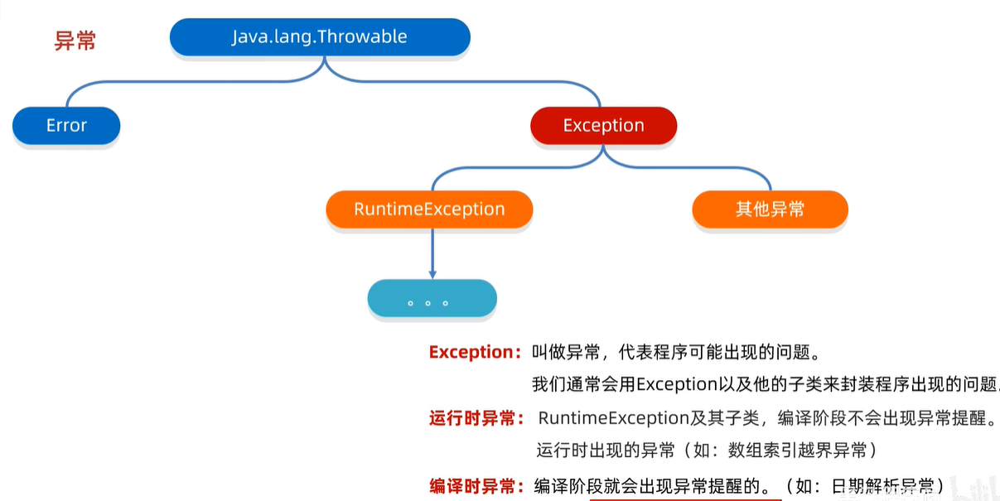

## 一. 传参

- java普通类型如`int`，`double`，`char`，与c++相同，都是值传递，方法内修改不影响外部传入的值

  ```java
  public class ValuePassing {
     public static void main(String[] args) {
         int x = 10;
         modifyValue(x);
         // x仍然为10
     }
     public static void modifyValue(int value) {
         value = 20; // 修改的是副本，不影响原始变量
     }
  }
  ```

  ```c++
  void func() {
      int x = 10;
      modifyValue(x);
      // x仍然为10
  }
  void modifyValue(int value) {
      value = 20;
  }
  ```

- java 对象类型如`String`，类似c++指针参数（但传递的时候显示的还是对象），传入的是指向对象的指针，可以在方法内修改对象，但对该对象整体重新赋值则相当于c++中让函数内指针指向新内存地址，不会改变外部对象

  ```java
  public class Switch {
      public static void main(String[] args) {
          String x1 = "10";
          String y1 = "20";
          System.out.println("交换前x1 = "+x1);
          System.out.println("交换前y1 = "+y1);
  		// 进行数据交换
          swap(x1, y1);
  		// x1, y1不会变化
          System.out.println("交换后x1 = "+x1);
          System.out.println("交换后y1 = "+y1);
   
   
      }
   	// 在c++中相当于swap(string* x, string* y)
      public static void swap(String x, String y) {
          // 跟c++类似，传递的指针实际是复制了一份指针指向对象
          // java中重新赋值相当于c++让复制的那份指针指向别的内存，但原指针不变
          String z ;
          z = x;
          x = y;
          y = z;
          System.out.println("x = "+x);
          System.out.println("y = "+y);
      }
  }
  ```

  ```c++
  void func() {
      string* s1 = new string("123");
      string* s2 = new string("456");
      swap(s1, s2);
      // s1, s2的指向仍然没变
  }
  void swap(string* s1, string* s2) {
      string* temp = s1;
      s1 = s2;
      s2 = temp;
  }
  ```

- java引用传递，即传数组，与c++行为一致

## 二. 继承

大致类似，主要区别：

1. c++使用`: public ClassName`表示继承，java使用`extends ClassName`表示继承
2. c++可以多继承，java只有单继承

在可见性，继承规则上基本一致：

1. 继承规则

   - 默认继承父类的成员变量和方法

   - 同名变量，使用时取决于静态类型

2. 可见性

   - `private`：子类不可直接访问
   - `protect/public`：子类可直接访问

### 2.1 方法重写

java中子类定义与父类相同的方法（方法名，形参），**默认是重写行为**

c++中子类与父类相同的方法，默认是两个不同的方法

### 2.2 super

作用：

- 在子类构造方法中调用父类的构造方法：

  ```java
  // B继承A
  public B() {
      // 调用父类无参构造
      super();
  }
  public B(int x) {
      // 调用父类有参构造
      super(x);
  }
  ```

- 访问父类中的变量/方法

  形式：

  `super.var`

  `super.method()`

## 三. 多态

### 3.1 强制方法重写

java中在子类方法上使用`@Override`注解，可以由编译器检查是否进行了正确的重写

其行为与c++ `override`关键字类似，在子类方法后加上`override`，可以重写父类中定义的虚方法（`virtual method`）

java重写**Object**的三个方法（常用）：

```java
// 显示更有意义的字符串:
@Override
public String toString() {
    return "";
}

// 比较当前对象和对象o是否相等: 逻辑相等
@Override
public boolean equals(Object o) {
    return false
}

// 计算hash:
@Override
public int hashCode() {
    return 0;
}
```

### 3.2 抽象类

与c++中的纯虚类概念类似，包含抽象方法/纯虚函数的类

定义：

```java
abstract class A {
    private String s;
    public abstract void method();
    public void method2();
}
```

- 抽象类不能实例化
- 类和抽象方法都被`abstract`修饰
- 可以定义普通变量和方法

### 3.3 转型

- 子转父：直接强制类型转换即可

  ```java
  Child c = new Child();
  Father f = (Father) c; // 去掉强制转换也生效
  ```

- 父转子：有风险，使用`instanceof`

  ```java
  Object obj = "hello";
  if (obj instanceof String) {
      String s = (String) obj;
      System.out.println(s.toUpperCase());
  }
  ```

### 3.4 接口

一组抽象方法的集合，所有方法默认是`public abstract`修饰

相当于c++的纯虚函数类只定义纯虚方法不定义变量和普通方法

1. 定义：

   ```java
   interface A() {
       void method1();
   }
   ```

2. 类实现接口：

   ```java
   class B implements A {
       @Override
       public void method1() {
           
       }
   }
   ```

- 接口可以继承接口

- 类可以实现多个接口（`implements A, B`）

- 接口可以定义`default`方法

  ```java
  interface A() {
      void method1();
      default void method2() {
          method1();
          System.out.println("");
      }
  }
  ```

  `default`方法的目的是，当我们需要给接口新增一个方法时，会涉及到修改全部子类。如果新增的是`default`方法，那么子类就不必全部修改，只需要在需要覆写的地方去覆写新增方法。

当一个类实现了一个接口，就可以使用接口类型指向类的实例，从而调用实际的接口方法来完成对应功能

### 3.5 内部类

顾名思义，就是在类A中定义类B，B被称为内部类

与c++不同，c++在类A中定义类B，除了影响类B的作用域外，两者几乎没有关系

java中三种内部类：

1. 普通内部类，类A中明确定义类B：

   ```java
   class Outer {
       private String name;
   
       Outer(String name) {
           this.name = name;
       }
   
       class Inner {
           void hello() {
               System.out.println("Hello, " + Outer.this.name);
           }
       }
   }
   ```

   - 内部类可以访问外部类的private字段
   - 内部类依附外部类，持有一个外部类的引用

2. 静态内部类（使用`static`修饰内部类）：

   ```java
   class Outer {
       private static String NAME = "OUTER";
   
       private String name;
   
       Outer(String name) {
           this.name = name;
       }
   
       static class StaticNested {
           void hello() {
               System.out.println("Hello, " + Outer.NAME);
           }
       }
   }
   ```

   - 不依附外部类
   - 可以访问外部类的静态字段

3. 匿名内部类（简化代码，临时使用）

   ```java
   // 实现接口的匿名类
   Runnable r = new Runnable() {
       @Override
       public void run() {
           System.out.println("Hello, " + Outer.this.name);
       }
   };
   // 继承父类的匿名类
   HashMap<String, String> map2 = new HashMap<>() {
       // 该类继承了HashMap, 可以访问其中的所有变量和方法
   };
   ```

   - 继承父类或实现接口
   - 可以访问父类中的变量和方法

#### 3.5.1 lambda表达式

java与c++中的lambda表达式形式基本相同，但本质不太一样，c++的lambda表达式本质是重载了`()`的对象，也可以叫做函数对象，java则是对匿名内部类的一种简化写法

1. java lambda：本质是实现接口的方法

   实现条件：

   - 接口
   - 单一方法

   或者用`@FunctionalInterface`来注解一个接口

   ```java
   @FuntionalInterface
   interface Swim {
       void swimming();
   }
   
   public static void main(String[] args) {
       Swim swim = () -> {
           System.out.println("swim...");
       };
   }
   ```

   如上所示，当某个方法使用`Swim`接口做参数时，可以这么写：

   ```java
   void func1(Swim s) {
       ...
   }
   void call_func1() {
       func1(() -> {
           System.out.println("swim...");
       });
   }
   ```

   由于lambda表达式是对应接口的实现，所以`()`是接口方法的形参列表，函数体返回值也要和接口方法保持一致

2. c++ lambda：

   以`std::sort()`为例：

   ```c++
   std::vector<int> v {1, 2, 5, 4, 3};
   std::sort(v.begin(), v.end(), [](int x, int y) -> bool {
       return x > y;
   });
   ```

   形式为：

   ```c++
   // -> return_type可省略
   auto lambda = [捕获](形参列表) -> return_type {
       函数体
   };
   ```

   本质是把对象当函数用，没有java的必须实现接口的限制，还多了可捕获列表，不过二者在写法上大差不差

#### 3.5.2 方法引用

对lambda进一步的简化，用已有的方法来代替lambda表达式成为函数式接口的方法体，参数，返回值等要和接口方法保持一致

使用形式很像c++带作用域的函数：

```java
class Function1 {
    public static int subtraction(int a, int b) {
        return b - a;
    }
}
// 方法引用
Arrays.sort(arr, Function1::subtraction);
```

1. 静态方法引用：`类名::方法名`

2. 对象方法引用：`对象::方法名`

   - 引用本类方法：`this::方法名`
   - 引用父类方法：`super::方法名`

3. 类名引用成员：跟接口中抽象方法的第一个参数有关

   ```java
   ArrayList<String> list = new ArrayList<>();
   // 
   list.stream.map(String::toUpperCase);
   ```

   如上，`map()`里要求实现的抽象方法第一个参数是`String str`，那么可以直接引用`String`类的方法，其实际含义为调用`str.toUpperCase()`

4. 构造方法引用：`类名::new`

## 四. 泛型

类似c++模板，但是伪泛型

1. 泛型类

   ```java
   // 可以指定多个类型
   public class A<T, E> {
       
   }
   ```

2. 泛型方法

   ```java
   // 在返回值前加<T>标识方法为泛型方法
   public <T> void method(T val) {
       
   }
   ```

3. 泛型接口

   ```java
   public interface B<E> {
       
   }
   ```

   实现类实现接口时，可以指定E为具体类型，也可以延续泛型，创建对象时再确定

泛型通配符

泛型不具备继承性，但数据具有继承性

1. `? extends E`：表示可以传递E和E的所有子类类型
2. `? super E`：表示可以传递E和E的所有父类类型

## 五. 常用数据结构和API

### 5.1 String

1. 构造

   ```java
   public String();
   public String(String original);
   public String(char[] chs);
   public String(byte[] chs);
   ```

2. 常用方法

   ```java
   int length(); // 长度
   char charAt(int index); // 指定索引字符
   char[] toCharArray(); // 转为字符数组
   String substring(int beginIndex, int endIndex); // 截取子字符串
   String toUpperCase(); // 大小写转换
   boolean equals(Object anObject); // 比较
   boolean equalsIgnoreCase(String antherString); // 忽略大小写比较
   String[] split(String regex); // 根据指定正则表达式分割字符串
   ```

### 5.2 StringBuilder

1. 构造

   ```java
   public StringBuilder();
   public StringBuilder(String str);
   ```

2. 常用方法

   ```java
   StringBuilder append(任意类型); // 在末尾追加
   StringBuilder reverse();	// 反转字符串
   int length();	// 当前字符串长度
   String toString();	// 转为String类型
   ```

### 5.3 StringJoiner

添加字符串之间需要用**间隔符**分开，并最终需要添加开头和结尾符号

1. 构造

   ```java
   public StringJoiner(间隔符);
   public StringJoiner(间隔符, 开始符, 结尾符);
   ```

2. 常用方法

   ```java
   StringJoiner add(任意类型);	// 追加
   int length();		// 长度
   String toString();	// 转为String类型 
   ```

### 5.4 Math

功能和`cmath`类似

使用时一般是`Math.func()`的形式：

```java
int abs(int);	// 绝对值
double ceil(double);	// 上取整
double floor(double);	// 下取整
int round(float);		// 四舍五入
int max(int, int);		// 最大
double pow(double, double);	// 指数
double random();		// [0.0, 1.0)的随机值
```

### 5.5 System

三个：退出，当前时间，数组拷贝

```java
System.exit(0);
long ms = System.currentTimeMillis();

System.arraycopy(src, index1, dest, index2, len);
```

### 5.6 Object

其中三个在**强制方法重写**里记过，`toString()`，`equals()`，`hashCode()`

- `clone()`

  类似c++中的拷贝构造，同样分深克隆和浅克隆

  - 浅克隆：重写的`clone()`中直接调用`super.clone()`，会默认返回一个浅克隆的`Object`对象

  - 深克隆：先`super.clone()`，返回的对象中的引用数据类型重新从当前对象复制一遍即可

**Objects**：

三个静态方法，`equals`，`isNull`，`nonNull`

### 5.6 包装类和BigInteger

1. 就是封装一下原始的`int`，`double`，`boolean`数据类型，使其变为类

   在保留了原数据类型的用法上，额外新增类的静态方法：

   ```java
   Integer valueOf(var); // 将var转为对应的类型
   String toBinaryString(int); // 数字转二进制
   String toOctalString(int);
   String toHexString(int);
   int parseInt(String); // 字符串转数字
   ```

   需要注意的是，包装类和`String`一样是不变类，这意味着：

   ```java
   Integer i = 1000000;
   i += 1; // 会新生成一个Integer对象, i将指向这个新对象
   ```

2. BigInteger

   每一个BigInteger都是一个不可变对象，换句话说每一次计算都会生成新的BigInteger对象

   - 构造：

     字符串：`new BigInteger("12345678")`

     数字（最高支持long）：`BigInteger.valueOf(1234)`

   - 常用方法

     ```java
     BigInteger add(BigInteger val);
     BigInteger substract(BigInteger val);
     BigInteger multiply(BigInteger val);
     BigInteger divide(BigInteger val);
     BigInteger[] divideAndRemainder(BigInteger val); // 取余, 返回商和余数
     BigInteger equals(BigInteger val);	//	比较两个大整数是否相同
     BigInteger pow(int val);		// 次幂
     BigInteger max(BigInteger val);	// 返回两个整数中大的一个
     int intValue(BigInteger val);
     ```

### 5.7 时间

### 5.8 Arrays

```java
String toString([] arr); // 数组拼接为字符串
int binarySearch([] arr, elem); // 数组中找elem
int[] copyOf([] src, destLen); // 拷贝数组
int[] copyOfRange([] src, srcStart, srcEnd);
void fill([] arr, elem); // 填充
void sort([] arr);
void sort([] arr, 排序规则);
```

### 5.9 Collection

通用方法：

```java
int size();	
boolean isEmpty();
boolean contains(Object o);
boolean add(E e);
boolean remove(Object o);
Object[] toArray();
void clear();
Iterator<E> iterator(); // 获取迭代器
```

三种遍历方式：

1. 迭代器

   ```java
   Iterator<> it = collection.iterator();
   while (it.hasNext()) {
       it.next();
   }
   ```

2. 增强for

   ```java
   for (type it : collection) {
       
   }
   ```

3. forEach

   ```java
   collection.forEach(new Consumer<>() {
       @Override
       public void accept(type s) {
   		// 
       }
   });
   // lambda
   collection.forEach((type s) -> {
       // 
   })
   ```

#### 5.9.1 ArrayList

用法类似c++中的`vector`

```java
boolean add(E e); // push_back(e);
E get(int index); // val = v[index];
E set(int index, E element); // v[index] = val;
```

#### 5.9.2 LinkedList

链表结构，api稍有不同

```java
void addFirst(E e);
void addLast(E e);
E getFirst();
E getLast();
E removeFirst();
E removeLast();
```

#### 5.9.3 HashSet

套用Collection api

自定义类要重写`hashCode`方法，否则默认使用地址值

#### 5.9.4 TreeSet

套用Collection api

默认升序

自定义类需要实现`Comparable<E>`接口：

```java
class A implements Comparable<A> {
    @Override
    public int compareTo(A o) {
        // return 0, -1, 1
        // 0: 相等
        // -1: this 比 o 小
        // 1: this 比 o 大
        // 返回-1, 顺序是this, o
        // 返回1, 顺序是o, this
    }
}
```

或者指定TreeSet的排序规则（`Comparator<E>`）：

```java
TreeSet<A> = new TreeSet<A>(new Comparator<A>() {
    @Override
    public int compare(A o1, A o2) {
        // 0: 相等
        // -1: o1 < o2
        // 1 : o1 > o2
        // return 0, -1, 1
        // 返回-1, 顺序是o1, o2
        // 返回1, 顺序是o2, o1
    }
})
```

还有一些其他的方法，第一个/最后一个元素，树上二分查找等

### 5.10 Map

1. 通用方法

   ```java
   V put(K key, V val);	// 添加键值对
   V get(Object key); 		// 取键对应值
   V remove(Object key);	// 删除键
   void clear();			// 清空
   boolean containsKey(Object key); // 是否有键
   boolean containsValue(Object val);	// 是否有值
   boolean isEmpty();			// 空
   int size();				// 键个数
   ```

2. 遍历

   - keySet，返回一个键集合，遍历键，获取值

     ```java
     Set<Object> keySet = map.keySet();
     for (Object obj : keySet {
     	Object val = map.get(obj);
     }
     ```

   - entrySet，返回一个键值对集合，直接遍历键值对

     ```java
     Set<Map.Entry<Object, Object>> entrySet = map.entrySet();
     for (Map.Entry<Object, Object> entry : entrySet) {
         entry.getKey();
         entry.getValue();
     }
     ```

   - forEach，类似Collection，接收键值两个参数

     ```java
     map.forEach((Object key, Object value) -> {
     	//
     });
     ```

#### 5.10.1 TreeMap

按键排序，默认升序

自定义排序：

1. Key类实现`Comparable<Key>`接口
2. 指定TreeMap的排序规则（`Comparator<Key>`）

第一个，最后一个键值对，树上二分查找等

#### 5.10.2 HashMap

依赖`hashCode()`和`equals()`保证键唯一

### 5.11 可变参数

本质是数组

使用方法：`func(Object... args)`

1. 一个方法只能有一个可变参数
2. 可变参数在所有参数最后

### 5.12 Stream链式编程

目的是简化Collection和数组的操作

#### 5.12.1 创建流

```java
// Collection
default Stream<E> stream();
// Arrays
public static<T> Stream<T> stream(T[] array);
// Stream
public static<T> Stream<T> of (T... values);
```

#### 5.12.2 中间方法

```java
Stream<T> filter(Predicate<? super T> predicate); // 按条件过滤
Stream<T> limit(long maxSize);	// 获取前maxSize个元素
Stream<T> skip(long n);	// 跳过前n个元素
Stream<T> distinct();	// 元素去重，需要hashCode和equals
Stream<T> concat(Stream a, Stream b); // 合并a,b流为一个流
Stream<T> map(Function<T, R> mapper); //
```

示例：

1. filter：

   ```java
   list.stream().fiter((Object obj) -> {
       // 过滤掉返回值为false的
       // return true; 
       // return false;
   });
   ```

2. map：

   ```java
   list.stream().map((Object obj) -> {
       // 对object做操作, 返回新的数据类型
       // 比如将一个String转为Integer, 之后的流上都是Integer类型的数据
       return newObj;
   });
   ```

#### 5.12.3 终结方法

```java
void forEach(Consumer action); // 遍历
long count();	// 统计数据个数
toArray();		// 转为数组
collect(Collector collector); // 转为集合
```

1. toArray()

   将流中的数据封装到`Object[]`中返回

2. toArray(IntFunction<A[]> generator)

   返回对应类型的数组

   ```java
   list.stream().toArray((int value) -> {
       return new type[value];
   });
   ```

3. collect(Collector collector)

   - 封装到List中返回

     ```java
     List<> list = list.stream().collect(Collectors.toList());
     ```

   - 封装到Set中

     ```java
     Set<> set = list.stream().collect(Collectors.toSet());
     ```

   - 封装到Map中

     ```java
     Map<> map = list.stream().collect(Collectors.toMap(
         (Object obj) -> {
             // 返回键, 不能重复
         },
         (Object obj) -> {
             // 返回值
         }
     ));
     ```

     

## 六. 异常

c++异常一坨，java更成体系，没有类比的必要了，东西也不多，直接记住就好了



1. 编译时异常，编译阶段给提示，必须先手动处理
2. 运行时异常，运行程序可能出现异常

### 6.1 捕获

`catch`支持多级，支持同时捕获多个异常（用`|`分割）

- `e.printStackTrace()`：打印异常堆栈信息

```java
try {
    
} catch (Exception e) {
    e.printStackTrace();
} finally {
    
}
```

### 6.2 抛出

- `throws 异常类1, 异常类2`：方法定义后，表示使用方法可能会抛出这些异常
- `throw 异常`：方法内，手动抛出异常，停止方法运行并将异常返回给调用者

```java
public void method() throws Exception {
    throw Exception();
}
```

### 6.3 自定义

- 编译时异常，继承`Exception`
- 运行时异常，继承`RuntimeException`

```java
public class MyException extends RuntimeException {
    // 空参
    public MyException() {
        
    }
    // 带参
    public MyException(String messgae) {
        super(message)
    }
}
```

## 七. IO流


## 八. 多线程


## 九. 反射

加载类，并解剖类中的信息

### 9.1 获取Class对象

1. `Class.forName("package.className")`：填全类名
2. `className.class`：做参数传递
3. `obj.getClass()`：能创建对象再考虑使用

### 9.2 常用方法

- 获取构造器`Constructor`对象，并利用其构造类对象
- 获取成员变量`Field`对象，获取/修改类成员变量
- 获取方法`Method`对象，执行类方法

获取`Constructor`，`Field`，`Method`类型的对象，大部分签名都很类似，挑重点的记：

- `getName`：获取类名

- `getDeclaredConstructors()`：返回可用的`Constructor`数组

  `getDeclaredConstructor(xx1.class, xx2.class)`：返回对应有参的`Constructor`对象

  其他，要获取对应类的成员变量和方法，其get方法也类似上面

1. 使用`Constructor`对象构造原对象

   ```java
   Class c1 = ArrayList.class;
   // 获取无参构造器对象（可能是 private，因此使用 getDeclaredConstructor）
   Constructor con = c1.getDeclaredConstructor();
   // 临时设置访问权限，使得可以访问 private 构造函数
   con.setAccessible(true);
   // 构造对象, 需要强转，因为返回的是 Object
   ArrayList s1 = (ArrayList) con.newInstance();
   ```

2. 使用`Field`对象设置/获取类成员变量

   ```java
   Class c1 = ArrayList.class;
   // 获取 ArrayList 类中的对应成员变量，例如 "size"
   Field fieldSize = c1.getDeclaredField("size");
   // 临时关闭 Java 权限检查
   fieldSize.setAccessible(true);
   // arr 是一个 ArrayList 的对象
   ArrayList arr = new ArrayList();
   // 设置字段值为指定内容
   fieldSize.set(arr, 10);
   // 获取字段值
   int var = (int) fieldSize.get(arr);
   System.out.println("size = " + var);
   ```

3. 使用`Method`对象调用类方法

   ```java
   Class c1 = String.class;
   // 获取 private 方法，如 String 中的 "indexOfSupplementary"
   Method method = c1.getDeclaredMethod("indexOfSupplementary", int.class, int.class);
   // 开放权限
   method.setAccessible(true);
   // 调用方法，需要传入对象和参数
   String s = "hello";
   int result = (int) method.invoke(s, 0x10400, 0);
   System.out.println(result);
   ```

作用：

- 获取一个类的全部成分然后操作
- 破坏封装性
- 绕过泛型，比如在`ArrayList<Integer>`添加`"123"`

- **框架**

## 十. 注解

### 10.1 定义

```java
public @interface MyAnnotation {
    public String name1() default "123";
}
```

本质是一个接口，自定义注解是继承了`Annotation`接口的接口

1. 使用

   默认情况下可以在类名，方法名，变量名上直接加`@MyAnnotation`使用，这代表接口的一个实现类

2. 要指定里面的属性值就用`@MyAnnotation(name1="", xxx)`，如果注解里面非默认属性只有一个`value`，可以直接把`value=`省略

**元注解**

注解在注解上的注解

形式：

```java
@Rentention
@Target
public @interface MyAnnotation {
    public String name1() default "123";
}
```

1. `Rentention`：声明注解的保留周期
   - **`@Rentention(RententionPolicy.RUNTIME)`**：一直保留，**常用**
   - `RententionPolicy.SOURCE`：源码保留
   - `RententionPolicy.CLASS`：字节码保留
2. `Target`：限制注解的范围
   - `@Target(ElementType.Type)`：该注解可以在类和接口上使用
   - `ElementType.FIELD`：成员变量
   - `ElementType.METHOD`：成员方法
   - `ElementType.PARAMETER`：方法参数

### 10.2 解析

利用反射

1. 获取使用注解的类对象

   `Class c1 = Demo.class`

2. 判断对应注解是否存在

   `c1.isAnnotationPresent(MyAnnotation.class)`

3. 获取注解对象并获取其属性值

   `MyAnnotation myan = (MyAnnotation) getDeclaredAnnotation(MyAnnotation.class)`

`Class`，`Method`，`Field`，`Constructor`等都实现了`AnnotatedElement`接口：

```java
public Annotation[] getDeclaredAnnotations();	// 获取当前对象上的注解
public T getDeclaredAnnotation(Class<T> annotationClass);	// 获取指定的注解对象
public boolean isAnnotationPresent(Class<Annotation> annotationClass); // 判断当前对象是否存在某个注解
```

使用场景：

比如JUnit框架定义的`@Test`，加上就测试，本质就是底层利用反射，看`Method`上是否有`@Test`注解，决定是否`invoke`

## 十一. 动态代理

像是一个包装类，使用非侵入式的形式来对被代理的类增添功能代码（底层使用反射）

核心是`Proxy.newPorxyInstance`，简易代码如下，`invoke`中的`proxy`指的是`T proxy`：

```java
class ProxyUtil {
    public static <T> T createProxy(T obj) {
        T proxy = (T) Proxy.newProxyInstance(ProxyUtil.class.getClassLoader(),
                obj.getClass().getInterfaces(), new InvocationHandler() {
                    @Override
                    public Object invoke(Object proxy, Method method, Object[] args) throws Throwable {
                        // do something before method...
                        Object result = method.invoke(obj, args);
                        // do something after method...
                        return result; // return method result
                    }
                });
        return proxy;
    }
}
```

关于`Proxy.newPorxyInstance`：

```java
public static Object newProxyInstance(ClassLoader loader,
                                      Class<?>[] interfaces,
                                      InvocationHandler h)
```

- `ClassLoader loader`：指定加载代理类的类加载器
- `Class<?>[] interfaces`：指定代理要实现的接口，一般被代理的类实现哪些，就填哪些
- `InvocationHandler h`：匿名内部类，在内部指定生成的代理类对象要增加的功能
