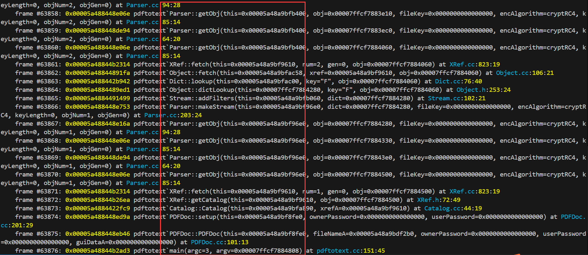
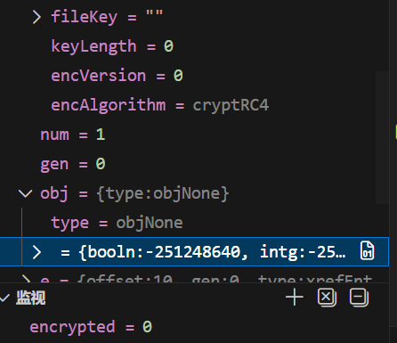

## 环境准备

这里的环境还是使用第一次构建的docker环境

- 在物理机上创建目录下载文件：

  ```bash
  cd ~/github
  mkdir fuzzing_xpdf && cd fuzzing_xpdf
  # 下载xpdf3.02版本并解压
  wget https://dl.xpdfreader.com/old/xpdf-3.02.tar.gz
  tar -xvzf xpdf-3.02.tar.gz
  ```

- 创建docker环境，`--name`参数会给该容器命名为"fuzzing101"

  ```bash
  docker run --name "fuzzing101" -it \
    -v "$(pwd)":/target \
    aflpp-built
  ```

  这表示将会使用`aflpp-built`镜像来创建一个容器，同时将本地的`~/github/fuzzing_xpdf`目录挂载在容器内的`/target`目录下

  由于没有了`--rm`参数，所以该容器在关闭后不会自行删除，如果需要重新启动，需要使用`docker start fuzzing101`命令，同时，无法更改挂载的本地目录，如果需要更改，最好删除容器并重新构建一个

- `aflpp-built`镜像里预先编译过了`AFLPLUSPLUS`项目，直接使用对应的编译器来编译`xpdf3.02`

  有几个需要注意的点：

  - AFL++一直在更新，`LLVM_CONFIG`需要使用对应的版本，我这里是19

  - 如果之前AFL++项目安装过，可以不必指定afl编译器的完整路径，只指定编译器名

  ```bash
  export LLVM_CONFIG="llvm-config-19"
  CC=afl-clang-fast CXX=afl-clang-fast++ ./configure --prefix="./fuzzing_xpdf/install/"
  make
  make install
  ```

- 准备测试文件：

  在`fuzzing_xpdf`目录下：

  ```bash
  cd $HOME/fuzzing_xpdf
  mkdir pdf_examples && cd pdf_examples
  wget https://github.com/mozilla/pdf.js-sample-files/raw/master/helloworld.pdf
  # 剩下两个网址已失效, 直接github找一个仓库拉取即可
  # wget http://www.africau.edu/images/default/sample.pdf
  # wget https://www.melbpc.org.au/wp-content/uploads/2017/10/small-example-pdf-file.pdf
  ```

## 测试启动

环境准备完毕后，使用下面的命令运行模糊测试器：

```bash
afl-fuzz -i ./fuzzing_xpdf/pdf_examples/ -o ./fuzzing_xpdf/out/ -s 123 -- ./fuzzing_xpdf/install/bin/pdftotext @@ ./fuzzing_xpdf/output
```

- *-i* 指示我们需要放置输入案例（即文件示例）的目录，这里就是`fuzzing_xpdf/pdf_examples`
- *-o* 就是AFL++记录运行结果的目录，包括编译后的文件，统计路径信息等
- *-s* 表示要使用的静态随机种子，这使得模糊测试的过程是可复现的。如果你使用相同的种子、相同的输入和相同的目标程序再次运行 AFL，它将以完全相同的方式生成和测试输入。这对于复现和调试特定的崩溃很有用
- *@@* 是占位符目标命令行，AFL 会将其替换为每个输入文件名，`xpdf3.02`需要接受一个命令行参数（也就是pdf文件路径），AFL++在每次执行`xpdf`的时候会把@@换成对应的文件路径

## 测试结果

### 空指针错误

先用AFL++测了一个小时，前3个漏洞大致都相同，只能单独使程序出错，但不会耗尽资源

漏洞出错的主要原因是流读取时出错，break之后没有做错误检查，导致的空指针异常

这次使用镜像内自带的`lldb-19`来调试程序：

```bash
# --参数就相当于gdb的--args参数
lldb-19 -- ./install/bin/pdftotext
# 禁用地址随机化以调试程序
(lldb) settings set target.disable-aslr false
# 运行程序
(lldb) run out/default/crashes/id:000000,sig:11,src:001033,time:276919,execs:242688,op:havoc,rep:3
Process 93421 launched: '/target/install/bin/pdftotext' (x86_64)
```

查看栈帧：

```bash
(lldb) bt
* thread #1, name = 'pdftotext', stop reason = signal SIGSEGV: address not mapped to object (fault address: 0x0)
  * frame #0: 0x000055814c6dfcdc pdftotext`EmbedStream::getChar(this=0x0000558177919510) at Stream.cc:787:22
    frame #1: 0x000055814c6915a4 pdftotext`Gfx::opBeginImage(this=0x0000558177917600, args=0x00007ffc97979b30, numArgs=0) at Gfx.cc:3880:44
    frame #2: 0x000055814c67f639 pdftotext`Gfx::execOp(this=0x0000558177917600, cmd=0x00007ffc97979b20, args=0x00007ffc97979b30, numArgs=0) at Gfx.cc:690:20
    frame #3: 0x000055814c67f008 pdftotext`Gfx::go(this=0x0000558177917600, topLevel=1) at Gfx.cc:581:13
    frame #4: 0x000055814c67ede1 pdftotext`Gfx::display(this=0x0000558177917600, obj=0x00007ffc97979e80, topLevel=1) at Gfx.cc:553:5
    frame #5: 0x000055814c6d8c10 pdftotext`Page::displaySlice(this=0x00005581779156e0, out=0x0000558177914e80, hDPI=72, vDPI=72, rotate=0, useMediaBox=0, crop=0, sliceX=-1, sliceY=-1, sliceW=-1, sliceH=-1, printing=0, catalog=0x00005581779144b0, abortCheckCbk=0x0000000000000000, abortCheckCbkData=0x0000000000000000) at Page.cc:317:17
    frame #6: 0x000055814c6d87e6 pdftotext`Page::display(this=0x00005581779156e0, out=0x0000558177914e80, hDPI=72, vDPI=72, rotate=0, useMediaBox=0, crop=1, printing=0, catalog=0x00005581779144b0, abortCheckCbk=0x0000000000000000, abortCheckCbkData=0x0000000000000000) at Page.cc:264:15
    frame #7: 0x000055814c6db49b pdftotext`PDFDoc::displayPage(this=0x0000558177914fe0, out=0x0000558177914e80, page=1, hDPI=72, vDPI=72, rotate=0, useMediaBox=0, crop=1, printing=0, abortCheckCbk=0x0000000000000000, abortCheckCbkData=0x0000000000000000) at PDFDoc.cc:317:34
    frame #8: 0x000055814c6db519 pdftotext`PDFDoc::displayPages(this=0x0000558177914fe0, out=0x0000558177914e80, firstPage=1, lastPage=1, hDPI=72, vDPI=72, rotate=0, useMediaBox=0, crop=1, printing=0, abortCheckCbk=0x0000000000000000, abortCheckCbkData=0x0000000000000000) at PDFDoc.cc:330:16
    frame #9: 0x000055814c6ff0f9 pdftotext`main(argc=2, argv=0x00007ffc9797a218) at pdftotext.cc:237:22
```

1. 在最后一个栈帧发现`str`是一个`null`，对应的代码：

   ```c++
   int EmbedStream::getChar() {
     if (limited && !length) {
       return EOF;
     }
     --length;
     // str为null, 这里进行的空指针调用
     return str->getChar();
   }
   ```

2. 向上找栈帧，找到了`str`被赋值的代码：

   ```c++
   void Gfx::opBeginImage(Object args[], int numArgs) {
     Stream *str;
     int c1, c2;
   
     // build dict/stream
     // str变量在这里被赋值
     str = buildImageStream();
     ...
     // 崩溃点
     c1 = str->getUndecodedStream()->getChar();
   }
   ```

3. 继续找这个`buildImageStream`函数：

   ```c++
   Stream *Gfx::buildImageStream() {
     Object dict;
     Object obj;
     char *key;
     Stream *str;
   
     // build dictionary
     dict.initDict(xref);
     parser->getObj(&obj);
     while (!obj.isCmd("ID") && !obj.isEOF()) {
       if (!obj.isName()) {
         error(getPos(), "Inline image dictionary key must be a name object");
         obj.free();
       } else {
         key = copyString(obj.getName());
         obj.free();
         parser->getObj(&obj);
         if (obj.isEOF() || obj.isError()) {
   	gfree(key);
   	break;
         }
         dict.dictAdd(key, &obj);
       }
       parser->getObj(&obj);
     }
     if (obj.isEOF()) {
       error(getPos(), "End of file in inline image");
       obj.free();
       dict.free();
       return NULL;
     }
     obj.free();
   
     // make stream
     str = new EmbedStream(parser->getStream(), &dict, gFalse, 0);
     str = str->addFilters(&dict);
   
     return str;
   }
   ```

   可以看到`str`是一个`EmbedStream`类型的对象，才搞清楚这里new出来的`str`（也就是`EmbedStream`类型有一个成员也叫`str`），所以实际上是`str->str`为一个空指针

4. 打上断点，调试发现，问题出在`buildImageStream`里的`while`循环，在里面`break`的时候是由于`obj.isError()`，但是`break`之后没有检查这个条件，导致构建对象时由于出错错误的设置了成员变量的初始值

修复：`while`循环之后额外检查`obj.isError`，如果为真就`return NULL`

### 栈溢出错误

第4个漏洞是重量级漏洞：栈溢出漏洞

使用lldb-19启动调试，输入崩溃文件，stack很明显的溢出

1. 由于栈帧没法从`main`开始看，只能使用`bt`命令在终端打印所有栈帧

   

   从栈帧看出来，在`XRef::getCatalog`中调用`XRef::fetch`之后，启动了一个递归调用过程，导致了栈溢出

2. 从`PDFDoc::setup`看出，传了一个文档拥有者的密码和用户密码，下一个调用是`catalog = new Catalog(xref)`，传入的`xref`对象是用`str->reset()`初始化的，并且经过了检查，密码也经过了检查，继续深入

   ```c++
   GBool PDFDoc::setup(GString *ownerPassword, GString *userPassword) {
     str->reset();
   
     // check header
     checkHeader();
   
     // read xref table
     xref = new XRef(str);
     if (!xref->isOk()) {
       error(-1, "Couldn't read xref table");
       errCode = xref->getErrorCode();
       return gFalse;
     }
   
     // check for encryption
     if (!checkEncryption(ownerPassword, userPassword)) {
       errCode = errEncrypted;
       return gFalse;
     }
   
     // read catalog
     catalog = new Catalog(xref);
     if (!catalog->isOk()) {
       error(-1, "Couldn't read page catalog");
       errCode = errBadCatalog;
       return gFalse;
     }
   
   #ifndef DISABLE_OUTLINE
     // read outline
     outline = new Outline(catalog->getOutline(), xref);
   #endif
   
     // done
     return gTrue;
   }
   ```

3. `catalog`只看构造函数中的一部分即可，构造函数中会调用`xref->getCatalog(&catDict)`，这个`catDict`重点关注一下，其是一个`Object`类型的对象

   ```c++
   Catalog::Catalog(XRef *xrefA) {
     Object catDict, pagesDict, pagesDictRef;
     Object obj, obj2;
     char *alreadyRead;
     int numPages0;
     int i;
   
     ok = gTrue;
     xref = xrefA;
     pages = NULL;
     pageRefs = NULL;
     numPages = pagesSize = 0;
     baseURI = NULL;
     // 这里是出问题的地方
     xref->getCatalog(&catDict);
     if (!catDict.isDict()) {
       error(-1, "Catalog object is wrong type (%s)", catDict.getTypeName());
       goto err1;
     }
     ...
   }
   ```

   `Object`类型的私有数据：

   ```c++
   private:
   
     ObjType type;			// object type
     union {			// value for each type:
       GBool booln;		//   boolean
       int intg;			//   integer
       double real;		//   real
       GString *string;		//   string
       char *name;			//   name
       Array *array;		//   array
       Dict *dict;			//   dictionary
       Stream *stream;		//   stream
       Ref ref;			//   indirect reference
       char *cmd;			//   command
     };
   ```

   `catDict`调用了`Object`的构造函数，只会将其`type`设置为`None`，推测`xref->getCatalog(&catDict)`是为这个`catDict`赋值，继续查看下一个调用链

4. `fetch`函数，其中`obj`就是上面的`catDict`

   无限循环发生在`switch`语句中，在`case xrefEntryUncompressed: `里：

   - 其首先初始化了一个`parser`
   - 从`parser`中初始化三个`object`
   - 检查过后，进入`parser->getObj(obj, encrypted ? fileKey : (Guchar *)NULL, encAlgorithm, keyLength, num, gen);`无开始无限递归

   ```c++
   Object *XRef::fetch(int num, int gen, Object *obj) {
     XRefEntry *e;
     Parser *parser;
     Object obj1, obj2, obj3;
   
     // check for bogus ref - this can happen in corrupted PDF files
     if (num < 0 || num >= size) {
       goto err;
     }
   
     e = &entries[num];
     switch (e->type) {
   
     case xrefEntryUncompressed:
       if (e->gen != gen) {
         goto err;
       }
       obj1.initNull();
       parser = new Parser(this,
   	       new Lexer(this,
   		 str->makeSubStream(start + e->offset, gFalse, 0, &obj1)),
   	       gTrue);
       parser->getObj(&obj1);
       parser->getObj(&obj2);
       parser->getObj(&obj3);
       if (!obj1.isInt() || obj1.getInt() != num ||
   	!obj2.isInt() || obj2.getInt() != gen ||
   	!obj3.isCmd("obj")) {
         obj1.free();
         obj2.free();
         obj3.free();
         delete parser;
         goto err;
       }
       // 从这里开始就进入无限循环了
       parser->getObj(obj, encrypted ? fileKey : (Guchar *)NULL,
   		   encAlgorithm, keyLength, num, gen);
       obj1.free();
       obj2.free();
       obj3.free();
       delete parser;
       break;
       ...
   }
   ```

   通过调试，`parser->getObj(obj, encrypted ? fileKey : (Guchar *)NULL, encAlgorithm, keyLength, num, gen);`中的参数分别为：

   

5. 继续跟踪到`Parser`中，这里先初始化了`obj`，也就是传入的`catDict`这个字典，然后向这个字典中添加数据，在进行了一系列的递归初始化数据与添加之后，执行了`makeStream`函数

6. 在`makeStream`函数中执行`addFilters`函数

7. 最后找到`Dict.cc`文件中的`Object *Dict::lookup(char *key, Object *obj)`函数

   当该函数被调用时，比如`Stream.cc`文件中调用`dict->dictLookup()`函数，

   该函数负责在一个字典对象中根据`"key"`找一个`"value"`，并将该`"value"`赋值给一个对象，但是`"value"`本身可能是一个间接引用（就像指针一样指向别的地方），这个时候就需要继续去找，此时如果出现循环引用的问题，就会不停的找下去（类似两个类对象互相持有`std::shared_ptr`最后无法释放），AFL++恶意构造的坏PDF文件中出现了这种引用并被xpdf程序记录到字典对象中，导致parser解析失败并进行循环调用，最后爆栈

修复：这是`parser`本身设计的失误，改起来应该比较困难，看了一下新版本源码，直接限制了`dictLookup`的次数，这样就限制了找间接引用的次数，从而不会爆栈

### HELP. vscode进行图形化调试

直接使用`lldb-19`这样的终端调试工具在打断点和调试的过程中可能不顺手，可以借用`codelldb`插件

直接`F5`自动创建一个`launch.json`，填写以下内容：

```json
{
    // 使用 IntelliSense 了解相关属性。 
    // 悬停以查看现有属性的描述。
    // 欲了解更多信息，请访问: https://go.microsoft.com/fwlink/?linkid=830387
    "version": "0.2.0",
    "configurations": [
        {
            "name": "Debug pdftotext",
            "type": "lldb",
            "request": "launch",
            "program": "${workspaceRoot}/install/bin/pdftotext",
            "args": [
                // 这里是可执行程序需要的命令行参数 "${workspaceRoot}/out/default/crashes/id:000000,sig:11,src:001033,time:276919,execs:242688,op:havoc,rep:3",
                // 将转换后的文本输出到标准输出
                "-" 
            ],
            "cwd": "${workspaceRoot}",
            "sourceMap": {
                // 将编译时记录的源码路径映射到当前工作区的实际路径
                // 假设编译时的源码根目录是 /target/xpdf-3.02
                "/target/xpdf-3.02": "${workspaceRoot}/xpdf-3.02"
            }
        }
    ]
}
```

