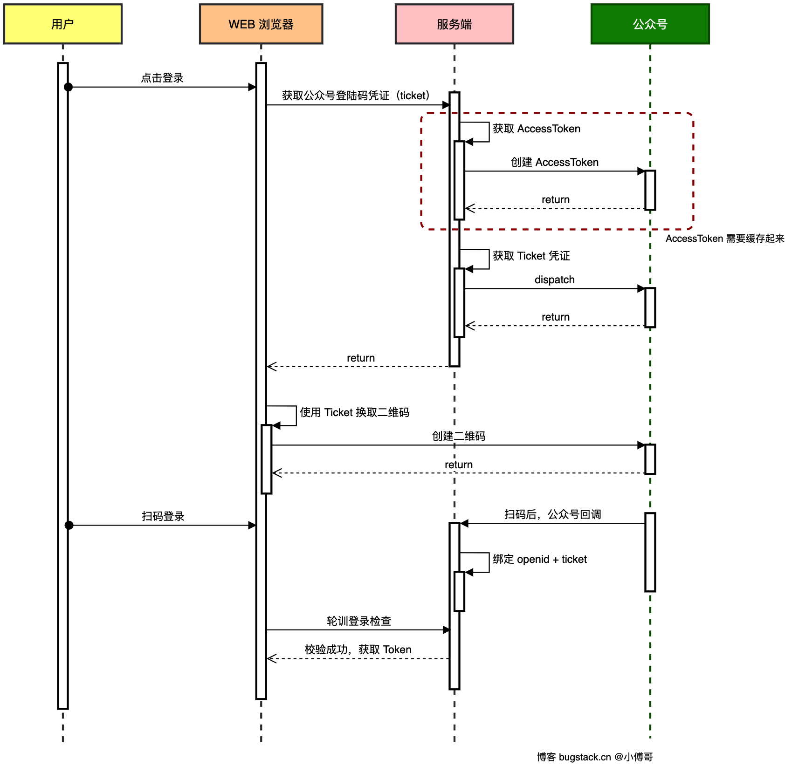
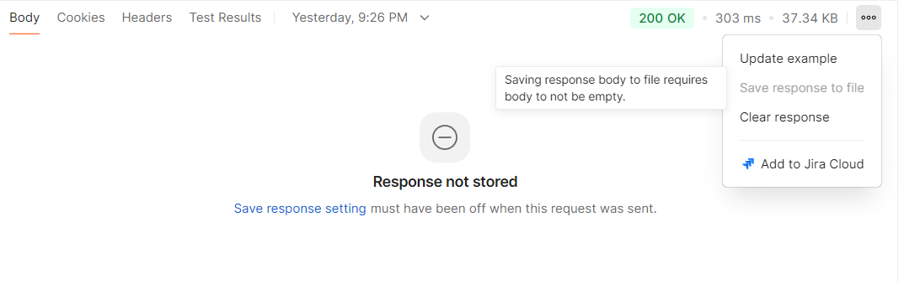
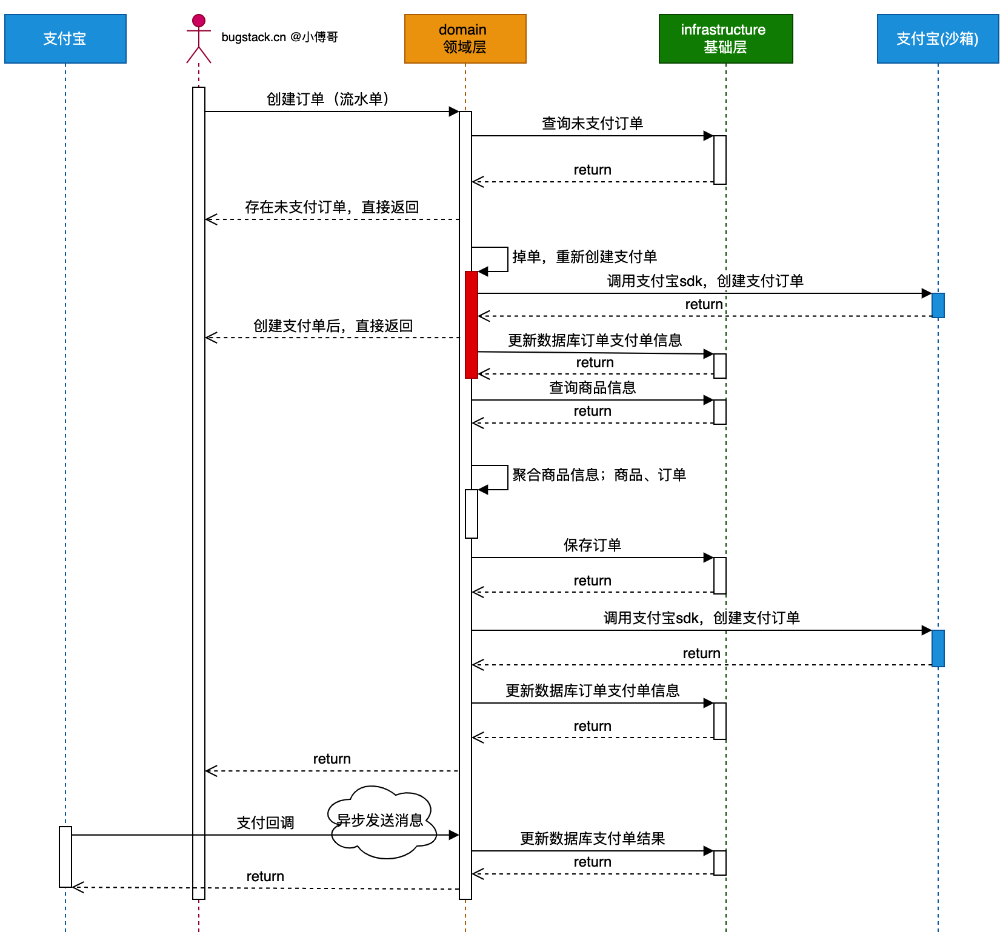

## MVC

### 登录

考虑下面这张图，按照MVC的分层模式，利用微信二维码实现的微信登录

1. 当用户发送登录请求时，后端需要向微信服务器发送请求以获取一个`ticket`（后面转为二维码来登录微信）

2. 后端请求微信的接口是有条件的，以公众号为例，微信方会为公众号提供独一无二的`appId`和`appSecret`，后端服务器以此为凭证先去请求一个固定的微信服务器接口，获取`accessToken`，之后请求其他微信接口时附带上这个`accessToken`方被视为有效请求
3. 后端获取到`ticket`之后将其返回给前端
4. 前端会将该`ticket`转为一个微信登录二维码
5. 用户扫码后，微信会收到登录请求，成功了会向后端发送消息（http post请求），后端接受消息后处理用户登录成功的事件，比如生成`jwt token`，记录缓存等等（从微信服务器到后端服务器发送用户登录信息的这一过程叫**回调**）
6. 前端在生成二维码的同时，会定时请求后端服务器，获取用户的登录状态，当后端收到微信的消息后会返回登录成功，并跳转到指定页面，否则为未登录状态，前端不会发生跳转



简单登录，暂时没有涉及数据库，流程主要涉及下面三个类：

1. LoginController：提供前端请求的接口
   - **请求生成微信登录的ticket**
   - **请求检查登录状态**（是否已经登录成功）
2. WechatLoginServiceImpl，实现登录service接口
   - 创建二维码的ticket
   - 检查登录状态
   - 保存登录状态
3. IWechatApiService，定义调用微信api的接口
   - 获取accessToken
   - 获取ticket
   - 公众号发送模板消息

#### 获取ticket

##### LoginController

前端首先要向controller请求ticket，该ticket的解释在：[生成微信二维码](https://developers.weixin.qq.com/doc/service/api/qrcode/qrcodes/api_createqrcode.html)，凭该ticket可以在有效时间内换取二维码

```java
public class LoginController {

    @Resource
    private ILoginService loginService;

    @RequestMapping(value = "weixin_qrcode_ticket", method = RequestMethod.GET)
    public Response<String> wechatQRCodeTicket() {
        try {
            String QRCodeTicket = loginService.createQRCodeTicket();
            log.info("生成微信扫码登录 ticket {}",  QRCodeTicket);
            return Response.<String>builder()
                    .code(Constants.ResponseCode.SUCCESS.getCode())
                    .info(Constants.ResponseCode.SUCCESS.getInfo())
                    .data(QRCodeTicket)
                    .build();
        } catch (Exception e) {
            log.error("生成微信扫码登录 ticket 失败",  e);
            return Response.<String>builder()
                    .code(Constants.ResponseCode.UN_ERROR.getCode())
                    .info(Constants.ResponseCode.UN_ERROR.getInfo())
                    .build();
        }
    }
    ...
}
```

##### WechatLoginServiceImpl

其实现的接口是ILoginService

1. ILoginService再去调用微信提供的接口，以获取accessToken和ticket，这里说一下二者的作用和区别

   - accessToken是给后端服务器用的，是后端服务器访问微信接口的凭证，以公众号为例，微信会给公众号绑定唯一的一个`AppId`和`AppSecret`，后端服务器以二者获取accessToken后，就可以用accessToken作为凭证去调用其他的微信接口

   - ticket是给用户（客户端）使用的，由后端服务器请求微信接口生成之后，返回给用户（客户端）生成二维码

2. 流程：`String createQRCodeTicket()`：

   - 获取accessToken，并缓存起来

   - 设置二维码的有效时间和场景值，获取ticket

   - 返回ticket

3. 请求和响应的DTO对象

   根据接口需要的参数和返回值来设计，包括request和response对象，具体的参数意义可以直接去看微信接口文档：

   ```java
   @Data
   @Builder
   @NoArgsConstructor
   @AllArgsConstructor
   public class WechatQRCodeReq {
       private int expire_seconds;
       private String action_name;
       private ActionInfo action_info;
   
       @Data
       @Builder
       @AllArgsConstructor
       @NoArgsConstructor
       public static class ActionInfo {
           Scene scene;
   
           @Data
           @Builder
           @AllArgsConstructor
           @NoArgsConstructor
           public static class Scene {
               int scene_id;
               String scene_str;
           }
       }
   
       @Getter
       @AllArgsConstructor
       @NoArgsConstructor
       public enum ActionNameTypeVO {
           QR_SCENE("QR_SCENE", "临时的整型参数值"),
           QR_STR_SCENE("QR_STR_SCENE", "临时的字符串参数值"),
           QR_LIMIT_SCENE("QR_LIMIT_SCENE", "永久的整型参数值"),
           QR_LIMIT_STR_SCENE("QR_LIMIT_STR_SCENE", "永久的字符串参数值");
   
           private String code;
           private String info;
       }
   }
   ```

   ```java
   @Data
   public class WechatQRCodeRes {
       private String ticket;
       private Long expire_seconds;
       private String url;
   }
   ```

   ```java
   @Data
   public class WechatTokenRes {
       private String access_token;
       private int expires_in;
       private String errcode;
       private String errmsg;
   }
   ```

##### IWechatApiService

**调用微信的接口实际上是向微信服务器发送一次http请求**，因此定义IWechatApiService，使用retrofit2封装一层接口，简要介绍一下retrofit2这个包：如果看过springcloud，那么后端服务器在发起http请求的时候会用到restTemplate之类的东西，主要用于向别的服务器发送http请求，retrofit2做的就是发送http请求，但是把形式封装成了类似rpc调用的这种形式，使用起来就跟函数调用差不多：

```java
public interface IWechatApiService {

    /**
     * 获取 Access token
     * 文档：<a href="https://developers.weixin.qq.com/doc/offiaccount/Basic_Information/Get_access_token.html">Get_access_token</a>
     *
     * @param grantType 获取access_token填写client_credential
     * @param appId     第三方用户唯一凭证
     * @param appSecret 第三方用户唯一凭证密钥，即appsecret
     * @return 响应结果
     */
    @GET("cgi-bin/token")
    Call<WechatTokenRes> getToken(@Query("grant_type") String grantType,
                                  @Query("appid") String appId,
                                  @Query("secret") String appSecret);

    /**
     * 获取凭据 ticket
     * 文档：<a href="https://developers.weixin.qq.com/doc/offiaccount/Account_Management/Generating_a_Parametric_QR_Code.html">Generating_a_Parametric_QR_Code</a>
     * <a href="https://mp.weixin.qq.com/cgi-bin/showqrcode?ticket=TICKET">前端根据凭证展示二维码</a>
     *
     * @param accessToken            getToken 获取的 token 信息
     * @param weixinQrCodeReq 入参对象
     * @return 应答结果
     */
    @POST("cgi-bin/qrcode/create")
    Call<WechatQRCodeRes> createQrCode(@Query("access_token") String accessToken, @Body WechatQRCodeReq weixinQrCodeReq);
}
```

在定义完了接口之后，实现类由retrofit2运行时自动生成，所以需要使用一个配置类，把IWechatApiService封装成一个Bean，再由其他模块调用，配置类一般在web包下的config文件下：

```java
@Slf4j
@Configuration
public class Retrofit2Config {

    private static final String BASE_URL = "https://api.weixin.qq.com/";

    @Bean
    public Retrofit retrofit() {
        return new Retrofit.Builder()
                .baseUrl(BASE_URL)
                .addConverterFactory(JacksonConverterFactory.create()).build();
    }

    @Bean
    public IWechatApiService weixinApiService(Retrofit retrofit) {
        return retrofit.create(IWechatApiService.class);
    }
}
```

#### 扫描二维码

前端拿到ticket之后，[生成二维码](https://developers.weixin.qq.com/doc/service/api/qrcode/qrcodes/api_createqrcode.html)，请求

```bash
https://mp.weixin.qq.com/cgi-bin/showqrcode?ticket=
```

填充ticket，这里直接用postman做测试，返回的结果可能是乱码，保存结果为png即可：



##### WeixinPortalController

使用微信扫码后，微信服务器会向后端服务器发送一个http请求，将用户扫描二维码的动作传递给后端服务器，同时传递给一个openid（同一个微信用户在某个公众号下的唯一身份）给后端服务器，后端检查到SCAN这个动作就认定为用户已经登录，同时调用ILoginService来保存用户的登录状态（ticket-openid）

##### WechatLoginServiceImpl

1. 注入：

   ```java
   @Value("${weixin.config.app-id}")
   private String appId;
   @Value("${weixin.config.app-secret}")
   private String appSecret;
   @Value("${weixin.config.template_id}")
   private String templateId;
   
   @Resource
   private Cache<String, String> wechatAccessToken;
   @Resource
   private IWechatApiService wechatApiService;
   @Resource
   private Cache<String, String> openIdToken;
   ```

2. Cache配置：

   ```java
   @Configuration
   public class GuavaConfig {
   
       @Bean(name = "wechatAccessToken")
       public Cache<String, String> wechatAccessToken() {
           return CacheBuilder.newBuilder()
                   .expireAfterWrite(2, TimeUnit.HOURS)
                   .build();
       }
   
       @Bean(name = "openIdToken")
       public Cache<String, String> openIdToken() {
           return CacheBuilder.newBuilder()
                   .expireAfterWrite(1, TimeUnit.HOURS)
                   .build();
       }
   
   }
   ```

3. `saveLoginState(String ticket, String openid)`流程：

   - 将ticket和用户的openid作为一组保存到缓存中，记录用户已经登录的状态

   - 获取accessToken

   - 发送模板消息

4. 消息模板需要一个DTO对象

   templateId是模板消息的id，在[微信公众平台](https://mp.weixin.qq.com/debug/cgi-bin/sandboxinfo?action=showinfo&t=sandbox/index)中的模板消息接口中创建后会生成一个模板ID，内容可以这么填：

   ```ini
   标题：登录成功通知       
   详细内容：
   用户ID：{{user.DATA}}    
   ```


#### 检查登录状态

前端生成二维码之后，不知道用户有没有登录，因此需要不断请求后端，根据ticket查询用户是否登录了，由后端返回登录状态（这里返回的是openid）

#### 问题

1. WechatLoginServiceImpl中获取accessToken步骤没有加锁，如果一开始token不存在，多个请求可能同时会去尝试获取token，应该使用redis替代缓存，并实现锁与一致性
2. openid作为token不安全（因为其由微信生成，相对固定），在返回前端的时候应该使用jwt，后端只需要记录openid与jwt令牌的关系，并可以设置过期等
3. 轮询请求登录状态可以改为websocket

### 下订单

图上看着复杂，主流程和登录是类似的

1. 用户选择商品后发起下单
2. 后端收到请求，开始创建订单（对于一些小型商城或支付选择，同一个用户选择同一商品进行下单时，先去检查先前有没有**已创建了但未支付**的订单或者**已创建了但未生成支付链接**的订单，如果有，优先让用户处理之前的订单），并保存到数据库
3. 创建订单后，调用支付宝接口，创建支付链接，保存到数据库，然后返回给前端订单链接
4. 前端收到订单链接会转到支付宝，付款
5. 支付宝完成双方交易转账，将完成的消息通过http post请求发送给后端服务器进行处理，后端接受消息后处理用户支付成功的事件，比如更改数据库中的订单状态，通知物流，增加积分等等，然后返回支付宝方一个`success`消息表示回调消息处理完毕
6. 前端在支付完成后，隔一段时间，会跳转到预先设定的网址（由后端服务器设定）



#### 支付与回调

主要是调用支付宝相关的流程：

1. 初始化客户端 (Setup)
   一切始于`AlipayClient`。这是与支付宝服务端交互的唯一入口。

   * 代码：`new DefaultAlipayClient(gatewayUrl, appId, privateKey, ...)`
   * 作用：配置沙箱/正式环境地址、应用 ID、签名算法（RSA2）以及最重要的商户私钥（用于请求签名）和支付宝公钥（用于响应验签）。

  2. 发起支付请求 (Create Payment)

        * 关键类：`AlipayTradePagePayRequest`

        * 动作：
          1. 创建 Request 对象。
          2. 设置 回调地址：
             * `ReturnUrl`: 支付成功后浏览器跳转回的页面（给用户看的）。
             * `NotifyUrl`: 支付宝服务器偷偷通知你服务器的接口（给代码看的，最重要）。
          3. 设置 业务参数 (`BizContent`)：
             * `out_trade_no`: 你系统里的唯一订单号。
             * `total_amount`: 金额。
             * `subject`: 订单标题（如“iPhone 15”）。
          4. 执行：`alipayClient.pageExecute(request).getBody()`。

        * 结果：支付宝不直接返回支付链接，而是返回一段 HTML 表单代码 (`<form>...`)。后端把这段 HTML 直接写回给前端浏览器，浏览器会自动提交表单并跳转到支付宝收银台。    


  3. 用户支付 (User Pays)
     用户在支付宝页面（或 App）完成付款。

  4. 支付回调通知 (Notify)
     用户付完钱后，支付宝服务器会立即向你的`NotifyUrl`发送一个 HTTP POST 请求。

        * 关键类：`AlipaySignature`

        * 动作：
          1. 接收参数：支付宝传回一大堆数据（订单号、金额、状态、签名等）。
          2. 验签 (这是最关键的一步！)：
             * 为了防止黑客伪造回调（比如黑客自己发个 POST 说“订单 1001 已支付”），你必须验证这个请求真的是支付宝发的
             * 方法：`AlipaySignature.rsa256CheckContent(content, sign, alipayPublicKey, ...)`
             * 原理：用配置的支付宝公钥解密签名，对比参数内容
          3. 业务处理：
             * 如果验签通过 `checkSignature == true` 且 `trade_status` 是 `TRADE_SUCCESS`。
             * 更新本地数据库订单状态为“已支付”。
          4. 回复支付宝：必须返回字符串 "`success`"，否则支付宝会以为你没收到，并在接下来的 24 小时内不断重试（轰炸你）。 


**关键 Class 用法总结**

- `AlipayClient`：客户端核心。封装了 HTTP 请求、加签、验签等底层细节。全局单例使用。所有请求都通过它发起

- `AlipayTradePagePayRequest`：电脑网站支付请求。生成跳转到支付宝收银台的 HTML 表单
- `AlipayTradeQueryRequest`：交易查询请求，主动去问支付宝：“这个订单到底付了没？”（常用于补单逻辑）
- `AlipayTradeRefundRequest`：退款请求 用户退货时调用，原路退回资金。
- `AlipaySignature`：签名工具类。在 Controller 的回调接口中，用于验证发来数据的真伪
- `AlipayTradeQueryModel`： 业务参数模型。新版 SDK 推荐将参数封装在这个 Model 里，而不是手拼 JSON 字符串。

#### 补偿

当创建订单时，可能会由于网络或其他原因，导致调用支付宝接口失败，又或者支付宝回调后端接口失败。此时会出现：

- 有订单id，但没有支付链接（掉单）
- 支付成功，数据库状态没有变更

补偿一般是指通过检查来消除上述数据一致性不完整状态的手段，具体方式是额外起线程，赋予定时任务去检查，当发现数据不一致的状态时，及时的去处理

1. 在启动类上加上注解：`@EnableScheduling`

2. 创建任务类：

   ```java
   @Slf4j
   @Component
   public class NotPayNotifyOrderJob {
       @Resource
       private IOrderService orderService;
       @Resource
       private AlipayClient aliPayClient;
   
       @Scheduled(cron = "0/3 * * * * ?")
       public void exec() {
           try {
               List<String> notPayOrderIdList = orderService.queryNotPayNotifyOrderList();
               if (null == notPayOrderIdList || notPayOrderIdList.isEmpty()) {
                   return;
               }
               log.info("任务: 检测到未接收到或未正确处理的支付回调通知");
               for (String orderId : notPayOrderIdList) {
                   AlipayTradeQueryRequest alipayRequest = new AlipayTradeQueryRequest();
                   AlipayTradeQueryModel bizModel = new AlipayTradeQueryModel();
                   bizModel.setOutTradeNo(orderId);
                   alipayRequest.setBizModel(bizModel);
                   // 查询
                   AlipayTradeQueryResponse response = aliPayClient.execute(alipayRequest);
                   // 判断状态码
                   String tradeStatus = response.getTradeStatus();
                   if ("TRADE_SUCCESS".equals(tradeStatus)) {
                       orderService.changeOrderPaySuccess(orderId);
                   }
               }
           } catch (Exception e) {
               log.error("检测未接收到或未正确处理的支付回调通知失败", e);
           }
       }
   }
   ```

   - `Component`表明交给spring容器管理
   - `@Scheduled`表明一个任务类的工作参数（比如定时时间等）

### 微服务的一致性问题

微服务与单体架构不同的一点在于事务的一致性无法直接保证，原因很简单：

订单和商品管理不在一个服务中，数据也不在一个库中，订单服务只能通过rpc来访问商品管理的服务（比如扣减库存），那就会出现诸如以下问题：

* 问题 A（RPC 超时）：尝试rpc减库存，网络卡了，抛出 TimeoutException。
      * 不知道商品服务那边到底是没收到请求（没扣），还是扣完库存返回时网络波动断连了（扣了）。
      * 困境：你敢回滚吗？如果那边已经扣了，你这边回滚（不创订单），那商品就白白少了（少卖）。
* 问题 B（半成功）：RPC 成功了（库存扣了），但紧接着你的 插入本地数据库挂了（数据库满、死锁）。
          * 困境：本地事务回滚，订单没生成。但远程的商品库存已经被扣掉了。RPC 调用无法像数据库那样“回滚”。

既然做不到“同生共死”，我们只能追求“即使现在乱了，过一会儿也能修正回来”，这就是最终一致性。

如何实现最终一致性：

1. 补偿任务
2. 唯一幂等字段，确保在重复消费时，只有一条记录产生或发生变更

## DDD

- app：启动层，Application和config
- trigger：触发层，所有的调用（包括http请求，rpc调用，mq消息处理等等等）都被视为一种触发行为，mvc-controller被移动到该层下
- case/application：领域编排层，对domain层的业务逻辑进行组合封装（**小项目一般去掉这一层，省去不必要的参数传递和对象转换**）
- api：统一接口层，外部需要调用服务时，查看api层对外暴露的接口以及对应的DTO对象，接口的实现由trigger完成，外部无需了解细节
- domain：领域层，按功能来划分，而不是service、贫血对象（只有属性没有方法）、dao的分层来划分，每个领域都有【模型、仓库、服务】三部分
- infrastructure：基础设施层，主要包括数据库操作，缓存操作，事件消息，外部sdk调用（一般在gateway包下）等等
- type：通用类型定义层，包括基本的Response、Constants和枚举等


### 登录

业务流程是一样的

原先的service被放在新的领域下：domain/auth

- adapter

  - port：对接外部的接口

    比如这里要向微信发送请求来获取ticket，给微信发送请求的代码不会放在domain/auth下，而是预先在port中定义好业务接口，然后在infrastructure基础设施层来实现这个接口

    这样domain/auth不会去在意由谁实现了这个功能，只需要注入接口使用对应的业务就可以了

  - repository：对接本地的接口

    登录业务里暂时没有用到，但也解释一下，这里关注的是本地数据库、缓存等操作，同样的在domain/auth中定义好业务接口，由infrastructure中对应的模块实现，这么做是为了不暴露dao层的po对象

- service

  这里放置的是基本业务逻辑，原本的wechatLoginServiceImpl会被搬到这里，即为当前领域中的业务层

当微信服务器需要鉴权或要向后端服务器发起回调请求时，需要有对应处理，这部分由：trigger负责，LoginController被安排至此


### 订单


## 设计模式

工厂、模板、策略三种设计模式

工厂用于创建复杂对象（省去手动）

模板用于定义流程，具体的实现交给子类

策略可以简单理解为接口

