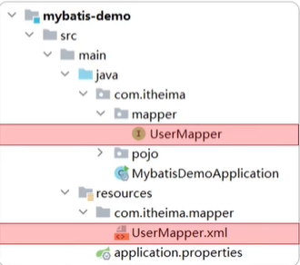
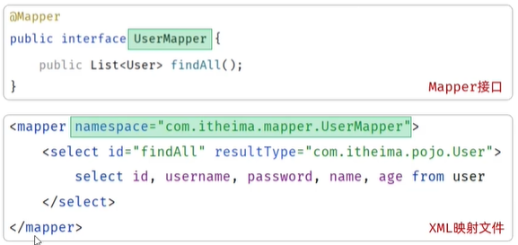

# javaweb

## maven

1. 管理jar包
2. 跨平台构建
3. 标准化目录结构

### 配置

1. 下载地址[Download Apache Maven – Maven](https://maven.apache.org/download.cgi)，解压目录不要有中文

2. `apache-maven-xxx/conf/settings.xml`修改：

   ```xml
   <!--找到localRepository， 添加本地仓库地址-->
   <localRepository>xxx\apache-maven-3.9.11\repo</localRepository>
   
   <!--mirrors 标签中新增标签mirror，为阿里云-->
   <mirror>
       <id>alimaven</id>
       <name>aliyun maven</name>
       <url>http://maven.aliyun.com/nexus/content/groups/public/</url>
       <mirrorOf>central</mirrorOf>
   </mirror>
   ```

3. `apache-maven-xxx/bin`添加到环境变量中

### idea集成

#### 创建maven项目

`setting`->`Build...`->`Build Tools`->`Maven`

- 修改`maven home path`为maven根目录
- 修改`setting file`为`setting.xml`文件
- 修改`Local repository`为设置的本地仓库文件夹

创建空项目后，新创建`module`，`build system`选择maven即可

#### maven坐标

```xml
<groupId>org.example</groupId>
<artifactId>maven-project01</artifactId>
<version>1.0-SNAPSHOT</version>
```

1. groupId：项目隶属组织名称（域名反写）
2. artifactId：项目名称
3. version：项目版本号

这三项在后面配置依赖时会用到

#### 导入maven项目

1. 将文件夹复制到空项目中
2. `File`->`Project Structures`->`Modules`->`+`->`import module`->`选择文件夹中的pom.xml`文件

### 依赖管理

#### 依赖

[依赖下载官网](https://mvnrepository.com/)

在`<dependencies>`标签下增加`<dependency>`标签，然后刷新xml文件即可

```xml
<dependencies>
    <!-- https://mvnrepository.com/artifact/org.springframework/spring-context -->
    <dependency>
        <groupId>org.springframework</groupId>
        <artifactId>spring-context</artifactId>
        <version>6.1.4</version>
    </dependency>
</dependencies>
```

#### 排除依赖

在对应的`<dependecy>`标签内增加`<exclusions>`标签：

```xml
<dependency>
    <groupId>org.springframework</groupId>
    <artifactId>spring-context</artifactId>
    <version>6.1.4</version>
    <!--排除依赖-->
    <exclusions>
        <exclusion>
            <groupId>io.micrometer</groupId>
            <artifactId>micrometer-observation</artifactId>
        </exclusion>
    </exclusions>
</dependency>
```

#### 依赖范围

在`<dependency>`标签内的maven坐标下添加`<scope>`标签，标签值和作用如下：


Y表示可以使用，-表示不行

比如`<scope>test</scope>`表示让某一个依赖包只能在项目的test包下使用，其他包不能使用

### 生命周期

三个周期相互独立

1. clean：清除之前编译的结果
2. default：编译->测试->打包->安装 （执行后一个前会先执行前一个）
3. site：上线

直接在idea的maven面板中的`LifeCycle`运行或者在模块目录下运行以下命令：

```bash
mvn [clean/compile/test/pacakge/install]
```

## JUnit（单测）

### 使用

`pom.xml`添加依赖：

```xml
<dependency>
    <groupId>org.junit.jupiter</groupId>
    <artifactId>junit-jupiter</artifactId>
    <version>5.9.1</version>
</dependency>
```

类名：`xxxTest`

位置：`test/java/com.xxxx/xxxTest`

方法：必须是`public void`，加上注解`@Test`

```java
public class MainTest {
    @Test
    public void test() {
        
    }
}
```

### 断言

在`Assertions`包，最后一个参数通常设置为错误提示信息（String）

文档：[Assertions (JUnit 5.0.1 API)](https://docs.junit.org/5.0.1/api/org/junit/jupiter/api/Assertions.html)

### 常见注解

#### 环境准备和销毁

- `@BeforeAll`：方法必须为static，通常作为setup初始化资源，在所有测试启动前仅运行一次
- `@AfterAll`：方法必须为static，通常用于释放资源，在所有测试完成后仅运行一次
- `@BeforeEach`：通常作为setup初始化资源，在每个测试启动前都运行一次
- `@AfterEach`：通常用于释放资源，在每个测试完成后都运行一次

#### 参数化测试

同时使用下面两个注解：

- `@ParameterizedTest`：标识方法会使用多个参数进行测试
- `@ValueSource([])`：在()内添加一个数组来指明使用的参数

#### 设置测试名

`@DisplayName("xxx")`：显示测试类/方法名为"xxx"

## Spring Boot

### 创建

idea可以自动化配置spring boot：

`new module`->`Spring Boot`->`Type: Maven`->`设置项目名与jdk版本`->`next`

->`选择Spring boot版本`->`Dependency:Web:Spring Web`

#### 启动入口

`main/java/xxx/SpringbootxxxApplication`中的main方法，带有`@SpringBootApplication`注解

#### 请求注解

1. `@RestController`：类注解，标识其是一个请求处理类
2. `@RequestMapping("")`：方法注解，填写对应的请求路径，标识其是该请求路径对应的处理方法

```java
@RestController
public class HelloController {
    @RequestMapping("/hello")
    public String Hello(String name) {
        System.out.println("name: " + name);
        return "Hello " + name + "~";
    }
}
```

### HTTP

- 无状态，不同请求之间相互独立
- 一次请求对应一次响应，请求和响应都由 **行/头/体**组成
- 基于TCP

#### spring boot处理请求

内置的tomcat web服务器会将http文本封装为`HttpServletRequest`对象，在使用时可以直接将其作为函数参数：

```java
String method = request.getMethod();	// get/post
String url = request.getRequestURL().toString();	// http://localhost:8080/request
String uri = request.getRequestURI();	// request
String protocol = request.getProtocol();	// HTTP/1.1
String name = request.getParameter("name");	// 
String age = request.getParameter("age");
// 获取请求头参数
String accept = request.getHeader("accept");
String contentType = request.getHeader("content-type");
```

#### 响应码

- 1xx：响应中，临时状态码
- 2xx：成功
- 3xx：重定向
- 4xx：客户端错误
- 5xx：服务端错误

#### spring boot返回响应

1. 用`HttpServletResponse`对象来设置：

   ```java
   response.setStatus(HttpServletResponse.SC_OK);
   response.setHeader("name", "1");
   response.getWriter().write("<h1>hello response</h1>");
   ```

2. 使用`ResponseEntity`对象来链式设置

   ```java
   @RequestMapping("/response")
   public ResponseEntity<String> response(HttpServletRequest request) {
       return ResponseEntity
           .status(401)
           .header("Access-Control-Allow-Origin", "*")
           .body("");
   }
   ```

一般不手动设置响应状态码和响应头

### 三层架构

- Controller（控制层）：接受请求、响应数据
- Service（业务逻辑层）：处理具体的业务逻辑
- dao（数据访问层）：负责数据访问（增删改查...）

架构：

```bash
--controller
	--xxxController.java
--dao
	--impl
		xxxDaoImpl.java
	xxxDao.java
--service
	--impl
		xxxServiceImpl.java
	xxxService.java
Application.java
```

其中，`impl`存接口实现，`xxxDao`存的是接口，`service`同理

1. controller直接使用service的功能，将请求数据解析后调用service处理业务逻辑

2. service直接使用dao的功能，在处理业务逻辑时涉及数据的增删改查，最后将数据返回给controller

3. dao负责提供数据增删改查的接口，一般和model（模型），数据库关联

4. controller在调用完service完成业务逻辑处理后，将数据封装一层作为相应的数据返回给客户端

#### 分层解耦

为了解决在Controller中主动new Service对象和在Service中主动new Dao对象导致的不方便改变接口实现的问题

通过Spring boot框架提供的**Bean**对象来解决上述问题**（Bean对象是容器中创建和管理的对象）**

##### 控制反转（IOC）

将对象的创建控制权转移给外部容器

##### 依赖注入（DI）

容器为应用程序提供运行时所依赖的资源

##### 解决方案1

使用`@Component`和`@Autowired`注解：

```java
// IOC: 将对象交给容器管理
@Component
public class UserDaoImpl implements UserDao {
    ...
}

// DI: 从容器中取对象
@Component
public class UserServiceImpl implements UserServcie{
    @Autowired
    private UserDao userDao;
}

// DI: 从容器中取对象
@RestController
public class UserController {
    @Autowired
    private UserDao userDao;
}
```

##### 解决方案2

```java
@Repository
public class UserDaoImpl implements UserDao {
    ...
}

@Serivce
public class UserServiceImpl implements UserService {
    @Autowired
    private UserDao userDao;
}

@RestController
public class UserController {
    @Autowired
    private UserDao userDao;
}
```

`@Repository`和`@Service`细化了`@Component`注解，controller一般只设置`@RestController`注解，因为其包含了`@Controller`

##### DI详解

1. 基于`@Autowired`注解的三种注入：

   - 在变量名上添加：

     ```java
     @Autowired
     private UserDao userDao;
     ```

   - 构造函数上添加：

     ```java
     @Serivce
     public class UserServiceImpl implements UserService {
         private final UserDao userDao;
         @Autowired
         UserServiceImpl(UserDao userDao) {
             this.userDao = userDao;
         }
     }
     ```

   - 设置set方法（省略，一般用前两种）

2. `@Autowired`默认按照类型注入，即如果有多个类实现了同一个接口，bean对象就不知道该保存哪个类型，从而报错，解决方案如下：

   - 使用`@Primary`注解表明哪个类是主要实现的类

     ```java
     @Primary
     @Repository
     public class UserDaoImpl implements UserDao {
         ...
     }
     ```

   - **要使用不同的实现**：使用`@Qualifier`注解变量或构造函数表明使用哪个实现类

     ```java
     @Autowired
     @Qualifier("userDaoImpl")
     private UserDao userDao;
     ```

   - 使用`@Resource`注解变量表明使用的实现类的名称（**不是Spring框架的提供，推荐使用第二个实现**）

     ```java
     @Resource(name = "userDaoImpl")
     private UserDao userDao;
     ```

### 配置文件

将原来的`.property`文件换为`.yml`文件（键值对配置）

```yaml
spring:
  applicaiton:
    name: springboot-mybatis-quickstart
  datasource:
    type: ..
    url: ..
    driver-class-name: ..
```

- 同缩进同级
- 键和值之间有一个空格

### 测试

测试类要在引导程序同包或子包下，同时对类添加`@SpringBootTest`注解

## MYSQL

### 连接

`mysql -u{username} -p [-h{ip} -P{port}]`

- `{username}`：要填的用户名，自用填`root`
- `{ip}`：远程数据库的ip地址
- `{port}`：远程数据库的端口

### SQL基本操作

DDL/DML/DQL/DCL（定义/操作/查询/控制）

#### DLL

定义数据库对象（数据库，表，字段）

##### 数据库操作

```mysql
-- 查询数据库
show database;
-- 创建指定数据库
create database dbname;
-- 删除指定数据库
drop database dbname;
-- 查看数据库表
select database();
-- 使用指定数据库
use dbname;
```

##### 表操作

```mysql
-- 创建表 []代表可选项
create table tablename(
    字段1 字段类型 [约束] [comment 注释],
    ...
)[comment 表注释]
```

1. 约束：
   - 非空`not null`
   - 唯一`unique`
   - 主键`primary key`
   - 默认`default` 跟一个值，表示字段默认值
   - 外键`foreign`
   - 自增`auto increment`
2. 数据类型：
   - 数字：`tinyint`，`int`，`bigint`
   - 字符串：`char`（固定），`varchar`（不固定）
   - 日期：`date`，`datetime`

```mysql
-- 查看当前数据库所有表
show tables;
-- 查看表的所有字段
desc tablename;
-- 查询建表语句
show create table tablename;
-- 向表中增加，修改，重命名，删除字段以及重命名表名
alter table tablename add 字段 类型 [comment] [约束];
alter table tablename modify 字段 类型;
alter table change 旧字段名 新字段名 类型 [comment] [约束];
alter table tablename drop column 字段;
alter table tablename rename to 表名;
-- 删除表
drop table [if exists] tablename;
```

#### DML

- 插入

  ```mysql
  insert into tablename(字段1， 字段2) values (值1 ，值2);
  insert into tablename values (值1， 值2);
  -- 可叠加
  ```

- 更新

  ```mysql
  update tablename set 字段1 = 值1, 字段2 = 值2, ... [where ...]
  -- 不加where条件表示更新所有行
  ```

- 删除

  ```mysql
  delete from tablename [where ...]
  -- 不加where会删除所有行
  ```

#### DQL

```mysql
select 
	-- distinct 去重
	[distinct] 字段 [AS 别名1] 
from
	tablename
where
	-- 比较 <, >, =, !=, between ... and, in(...), like _/%, is null
	-- 逻辑 &&, ||, !
	条件
group by
	-- 聚合函数 count(), max(), min(), avg(), sum(), select用
	-- 使用group by, 前面的select只能选择分组的字段或者聚合函数
	分组字段
having 
	-- 解决where后不能跟聚合函数的问题
	分组后条件列表
order by
	-- 默认asc升序排序, 要降序需指明desc
	排序字段列表 [asc]	
limit
	-- 如0, 5表示查出来的结果从第0条开始展示，最多展示5条, 第一个参数为0可以省略
	起始索引, 查询记录数
```

### JDBC

一套接口，由数据库厂商实现，比如使用mysql要引入对应的jar包：

```xml
<dependency>
    <groupId>com.mysql</groupId>
    <artifactId>mysql-connector-j</artifactId>
    <version>8.0.33</version>
</dependency>
```

简单使用：

```java
// 1. 注册
class.forName("com.mysql.cj.jdbc.Driver");
// 2. 连接
String url = "jdbc:mysql://localhost:3306/dbname";
String username = "root";
String password = "123456";
Connection conn = DriverManager.getConnection(url, username, password);
// 3. 获取sql执行对象
Statement statement = connection.createStatement();
// 4. 执行语句, i是执行语句后影响的行数
int i = statement.executeUpdate("update user set age = 25 where id = 1");
// 5. 释放连接
statement.close();
conn.close();
```

#### 预编译执行查询

```java
String sql = "select id, username from user where username = ?";
pStatement = conn.prepareStatement(sql);
// 设置sql语句中的?占位符
pStatement.setString(1, "xxx");
// 执行语句, 得到结果集
resultSet = pStatement.executeQuery();
// 遍历结果集
while (resultSet.next()) {
    // getXxx: 可以输入列标号, 也可以输入列名
    resultSet.getInt("id");
}
resultSet.close();
pStatement.close();
```

- 防sql注入
- 数据库会缓存语句，然后对占位符`?`替换，性能更高

### Mybatis

ORM（对象关系映射）框架，简化数据库操作，在这里是对JDBC的进一步封装，底层使用了连接池初始化了一定数量的连接来实现资源复用

#### 配置

在项目`application`文件写入：

```xml
spring.datasource.url=jdbc:mysql://localhost:3306/dbname
spring.datasource.driver-class-name=com.mysql.cj.jdbc.Driver
spring.datasource.username=root
spring.datasource.password=1234
```

#### 使用方法

新建mapper包（代替三层架构中的dao层），定义`Mapper`接口，使用`@Mapper`注解

##### 注解

在`Mapper`接口的方法中加入`@Select()`，`@Update()`，`@Insert()`，`@Delete()`注解，并填入SQL语句，以实现对应的功能

**框架会在程序运行时自动为接口创建一个实现类对象（代理对象），并将该对象存入IOC容-**

以查询为例：

```java
@Mapper
public interface UserMapper {
    // #{} 在实际执行时会被替换为 ?
    // 当函数有多个参数时需要使用@Param注解为对应的参数起名， 且与#{}中一致
    @Select("select * from user where username = #{username} and password = #{password}")
    public User findByUsernameAndPassword(@Param("username") String username, @Param("password") String password);
    
    // 查询结果会被自动封装到User实体类中
    // 多行结果可以使用List接收
}
```

##### XML映射文件

注解适合写一些简单的SQL语句，复杂的一般在XML文件中写

目录结构：




- 同包同名
- xml文件的namespace属性为Mapper接口全限定名一致
- xml文件的sql语句的id与Mapper接口中的方法名一致，并保持返回类型一致




xml文件中的SQL语句写法和注解相同，使用`#{}`来代表参数占位，由函数参数传入，如果有多个，就在函数参数上加入`@Param`注解来标明

## RESTful

一种规范

1. URL定位资源

2. HTTP请求方法描述操作：
   - `GET`：`select`
   - `DELETE`：`delete`
   - `POST`：`insert`
   - `PUT`：`update`

## 实战

### 日志

使用**logback**包（springboot框架自带依赖）

1. 配置文件

   创建`src/main/resources/logback.xml`：

   ```xml
   <?xml version="1.0" encoding="UTF-8"?>
   <configuration>
       <!-- 控制台输出 -->
       <appender name="STDOUT" class="ch.qos.logback.core.ConsoleAppender">
           <encoder class="ch.qos.logback.classic.encoder.PatternLayoutEncoder">
               <!--格式化输出：%d表示日期，%thread表示线程名，%-5level：级别从左显示5个字符宽度  %msg：日志消息，%n是换行符 -->
               <pattern>%d{yyyy-MM-dd HH:mm:ss.SSS} [%thread] %-5level %logger{50}-%msg%n</pattern>
           </encoder>
       </appender>
   
       <!-- 日志输出级别 -->
       <root level="ALL">
           <appender-ref ref="STDOUT" />
       </root>
   </configuration>
   ```

   - 输出到控制台/文件：

     ```xml
     <!-- 控制台输出 -->
     <appender name="STDOUT" class="ch.qos.logback.core.ConsoleAppender">
         <encoder class="ch.qos.logback.classic.encoder.PatternLayoutEncoder">
                 <!--格式化输出：%d 表示日期，%thread 表示线程名，%-5level表示级别从左显示5个字符宽度，%msg表示日志消息，%n表示换行符 -->
                 <pattern>%d{yyyy-MM-dd HH:mm:ss.SSS} [%thread] %-5level %logger{50}-%msg%n</pattern>
         </encoder>
     </appender>
     <!-- 按照每天生成日志文件 -->
     <appender name="FILE" class="ch.qos.logback.core.rolling.RollingFileAppender">
         <rollingPolicy class="ch.qos.logback.core.rolling.SizeAndTimeBasedRollingPolicy">
             <!-- 日志文件输出的文件名, %i表示序号 -->
             <FileNamePattern>D:/tlias-%d{yyyy-MM-dd}-%i.log</FileNamePattern>
             <!-- 最多保留的历史日志文件数量 -->
             <MaxHistory>30</MaxHistory>
             <!-- 最大文件大小，超过这个大小会触发滚动到新文件，默认为 10MB -->
             <maxFileSize>10MB</maxFileSize>
         </rollingPolicy>
     
         <encoder class="ch.qos.logback.classic.encoder.PatternLayoutEncoder">
             <!--格式化输出：%d 表示日期，%thread 表示线程名，%-5level表示级别从左显示5个字符宽度，%msg表示日志消息，%n表示换行符 -->
             <pattern>%d{yyyy-MM-dd HH:mm:ss.SSS} [%thread] %-5level %logger{50}-%msg%n</pattern>
         </encoder>
     </appender>
     ```

   - 开关配置

     `level`可以为`ALL`，`OFF`，`debug`，`info`，`warn`，`error`

     ```xml
     <!-- 日志输出级别 -->
     <root level="ALL">
         <!--输出到控制台-->
         <appender-ref ref="STDOUT" />
         <!--输出到文件-->
         <appender-ref ref="FILE" />
     </root>
     ```

2. 使用日志

   使用`@Slf4j`注解：

   ```java
   @Slf4j
   public class DeptController {
       public Result list(){
   		log.debug("");
           log.info("");
           log.warn("");
           log.error("");
           ...;
       }
   }
   ```

### 响应结果封装

```java
package com.itheima.pojo;

import lombok.Data;
import java.io.Serializable;

/**
 * 后端统一返回结果
 */
@Data
public class Result {

    private Integer code; //编码：1成功，0为失败
    private String msg; //错误信息
    private Object data; //数据

    public static Result success() {
        Result result = new Result();
        result.code = 1;
        result.msg = "success";
        return result;
    }

    public static Result success(Object object) {
        Result result = new Result();
        result.data = object;
        result.code = 1;
        result.msg = "success";
        return result;
    }

    public static Result error(String msg) {
        Result result = new Result();
        result.msg = msg;
        result.code = 0;
        return result;
    }

}
```

### Controller

#### 使用不同HTTP方法请求

在方法上增加`@GetMapping`注解，表示仅接受`GET`请求

```java
// 两种注解都可以
// @RequestMapping(value = "/depts", method = RequestMethod.GET)
@GetMapping("/depts")
```

其他请求：

- `PostMapping`
- `PutMapping`
- `DeleteMapping`

#### 路由分组

（在**Controller**类上使用`@RequestMapping`注解，类中的所有方法都是以该路径为前缀）：

```java
@RequestMapping("/depts")
@RestController
public class DeptController {
    ...
    // 相当于/depts/{id}
    @GetMapping("/{id}")
    public Result getInfo() {
        ...
    }
}
```


#### 接收简单参数

**参数形式**：`/xxx?id=1`

使用`@RequestParam`注解

- 参数名（该参数名和方法参数名相同则可以省略）

- `required`属性可设置为false，表示默认不需要该参数

- `defaultValue`属性设置默认值

```java
@DeleteMapping("/depts")
public Result deleteById(@RequestParam("id") Integer id) {
    System.out.println("根据id删除部门：" + id);
    return Result.success();
}
```


参数过多，封装参数（实体类），在接收参数时直接使用类对象接收：

```java
package com.itheima.pojo;

import lombok.Data;
import org.springframework.format.annotation.DateTimeFormat;
import java.time.LocalDate;

@Data
public class EmpQueryParam {
    
    private Integer page = 1; //页码
    private Integer pageSize = 10; //每页展示记录数
    private String name; //姓名
    private Integer gender; //性别
    @DateTimeFormat(pattern = "yyyy-MM-dd")
    private LocalDate begin; //入职开始时间
    @DateTimeFormat(pattern = "yyyy-MM-dd")
    private LocalDate end; //入职结束时间
    
}
```


#### 接收Json数据

POST发送json数据：

```json
{
    "name": "name"
}
```

使用`@RequestBody`注解，并指定实体对象来接收，json数据中的**键名**要和对象内部**成员名**对应

```java
@PostMapping("/depts")
public Result add(@RequestBody Dept dept) {
    System.out.println("添加部门：" + dept.getName());
    deptService.addDept(dept);
    return Result.success();
}
```


#### 接收路径参数

**参数形式**：`/depts/1`

使用`@PathVariable`注解（参数名和方法参数名相同可省略）：

```java
@GetMapping("/depts/{id}")
public Result getInfo(@PathVariable("id") Integer id) {
    System.out.println("根据id查询部门数据：" + id);
    Dept dept = deptService.getInfo(id);
    return Result.success(dept);
}
```

### Service

**事务控制**

本质是一组sql操作的集合，要成功都成功，有一个失败就全部失败

```mysql
-- 启动事务
start transaction; /begin;
insert ...
insert ...
-- 提交
commit;
-- 失败就回滚
rollback;
```

Spring的事务管理通常在Service层中，因为Dao层的操作都是针对单条SQL语句

使用`@Transactional`注解（业务层的方法，类，接口上都可以使用，范围从小到大分别是方法，类，接口）

事务管理日志配置：

```yaml
#spring事务管理日志
logging: 
  level: 
    org.springframework.jdbc.support.JdbcTransactionManager: debug
```


**异常回滚机制**

一般只有RuntimeException才会回滚事务

使用`@Transactional(rollbackFor = Exception.class)`可以指定出现何种异常类型时回滚事务


**事务传播**

一个事务里面执行另外一个事务时（比如service的一个方法调用另一个方法）

默认将新事务看做旧事务的一部分（新旧事务任一执行失败就全部失败）

在新事务上指定`@Transactional(propagation = Propagation.REQUIRES_NEW)`属性，旧事务和新事务会被看做两个独立的事务


### Dao

#### 对查询结果进行数据封装

使用Mybatis查询返回的结果会被自动封装到定义的实体类中，但需要各个字段名一致，如果不一致，有如下三种解决办法：

1. 使用`@Results`注解（`column`表示表列名，`property`表示实体类成员名）：

   ```java
   @Results({
       @Result(column = "create_time", property = "createTime"),
       @Result(column = "update_time", property = "updateTime")
   })
   @Select("select id, name, create_time, update_time from dept order by update_time desc")
   List<Dept> findAll();
   ```

2. 在SQL语句中为字段取别名（设置为实体类成员名）：

   ```java
   @Select("select id, name, create_time as createTime, update_time as updateTime from dept order by update_time desc")
   List<Dept> findAll();
   ```

3. 配置中开启驼峰命名转化（需要正确命名实体类成员名）：

   ```yaml
   mybatis:
     configuration:
       map-underscore-to-camel-case: true
   ```


#### 多参数传递对应占位符

重点说一下方法参数是类的情况，同样使用`@Param`注解为入参取名，然后放入SQL语句占位符中

假如参数是两个类对象：

1. 注解写法

   ```java
   @Mapper
   public interface UserMapper {
   	// 访问userInfo的age成员 department的id成员
       @Select("SELECT * FROM user WHERE info.age = #{userInfo.age} AND dep.id = #{department.id}")
       User selectUser(@Param("userInfo") UserInfo userInfo,
                       @Param("department") Department department);
   }
   ```

2. xml写法

   ```xml
   <select id="selectUser" resultType="User">
       SELECT *
       FROM user
       WHERE age = #{userInfo.age}
         AND dep_id = #{department.id}
   </select>
   ```


pagehelper插件：

```xml
<!--分页插件PageHelper-->
<dependency>
    <groupId>com.github.pagehelper</groupId>
    <artifactId>pagehelper-spring-boot-starter</artifactId>
    <version>1.4.7</version>
</dependency>
```

PageHelper只会对紧跟在其后的第一条SQL语句进行分页处理：

```java
@Override
public PageResult page(Integer page, Integer pageSize) {
    //1. 设置分页参数
    PageHelper.startPage(page,pageSize);

    //2. 执行查询
    List<Emp> empList = empMapper.list();
    Page<Emp> p = (Page<Emp>) empList;

    //3. 封装结果
    return new PageResult(p.getTotal(), p.getResult());
}
```


主键返回


mapper映射文件

`namespace`：与mapper所在类文件同名

`<select>`：标签，标识查询语句

​	`id`：类文件中的方法名

​	`resultType`：实体类

`<where>`：标签，表述where条件，并去除多余的and和or

`<if>`：标签，当`test`条件为真时使用内部语句，否则不使用

`<foreach>`：标签，遍历collection

```xml
<!--定义Mapper映射文件的约束和基本结构-->
<!DOCTYPE mapper
        PUBLIC "-//mybatis.org//DTD Mapper 3.0//EN"
        "http://mybatis.org/dtd/mybatis-3-mapper.dtd">

<mapper namespace="com.itheima.mapper.EmpMapper">
    <select id="list" resultType="com.itheima.pojo.Emp">
        select e.*, d.name deptName from emp as e left join dept as d on e.dept_id = d.id
        <where>
            <if test="name != null and name != ''">
                e.name like concat('%',#{name},'%')
            </if>
            <if test="gender != null">
                and e.gender = #{gender}
            </if>
            <if test="begin != null and end != null">
                and e.entry_date between #{begin} and #{end}
            </if>
        </where>
    </select>
</mapper>
```

### JWT


