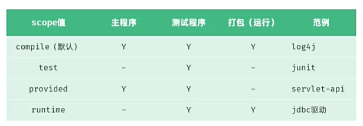

# javaweb

## maven

1. 管理jar包
2. 跨平台构建
3. 标准化目录结构

### 配置

1. 下载地址[Download Apache Maven – Maven](https://maven.apache.org/download.cgi)，解压目录不要有中文

2. `apache-maven-xxx/conf/settings.xml`修改：

   ```xml
   <!--找到localRepository， 添加本地仓库地址-->
   <localRepository>xxx\apache-maven-3.9.11\repo</localRepository>
   
   <!--mirrors 标签中新增标签mirror，为阿里云-->
   <mirror>
       <id>alimaven</id>
       <name>aliyun maven</name>
       <url>http://maven.aliyun.com/nexus/content/groups/public/</url>
       <mirrorOf>central</mirrorOf>
   </mirror>
   ```

3. `apache-maven-xxx/bin`添加到环境变量中

### idea集成

#### 创建maven项目

`setting`->`Build...`->`Build Tools`->`Maven`

- 修改`maven home path`为maven根目录
- 修改`setting file`为`setting.xml`文件
- 修改`Local repository`为设置的本地仓库文件夹

创建空项目后，新创建`module`，`build system`选择maven即可

#### maven坐标

```xml
<groupId>org.example</groupId>
<artifactId>maven-project01</artifactId>
<version>1.0-SNAPSHOT</version>
```

1. groupId：项目隶属组织名称（域名反写）
2. artifactId：项目名称
3. version：项目版本号

这三项在后面配置依赖时会用到

#### 导入maven项目

1. 将文件夹复制到空项目中
2. `File`->`Project Structures`->`Modules`->`+`->`import module`->`选择文件夹中的pom.xml`文件

### 依赖管理

#### 依赖

[依赖下载官网](https://mvnrepository.com/)

在`<dependencies>`标签下增加`<dependency>`标签，然后刷新xml文件即可

```xml
<dependencies>
    <!-- https://mvnrepository.com/artifact/org.springframework/spring-context -->
    <dependency>
        <groupId>org.springframework</groupId>
        <artifactId>spring-context</artifactId>
        <version>6.1.4</version>
    </dependency>
</dependencies>
```

#### 排除依赖

在对应的`<dependecy>`标签内增加`<exclusions>`标签：

```xml
<dependency>
    <groupId>org.springframework</groupId>
    <artifactId>spring-context</artifactId>
    <version>6.1.4</version>
    <!--排除依赖-->
    <exclusions>
        <exclusion>
            <groupId>io.micrometer</groupId>
            <artifactId>micrometer-observation</artifactId>
        </exclusion>
    </exclusions>
</dependency>
```

#### 依赖范围

在`<dependency>`标签内的maven坐标下添加`<scope>`标签，标签值和作用如下：



Y表示可以使用，-表示不行

比如`<scope>test</scope>`表示让某一个依赖包只能在项目的test包下使用，其他包不能使用

### 生命周期

三个周期相互独立

1. clean：清除之前编译的结果
2. default：编译->测试->打包->安装 （执行后一个前会先执行前一个）
3. site：上线

直接在idea的maven面板中的`LifeCycle`运行或者在模块目录下运行以下命令：

```bash
mvn [clean/compile/test/pacakge/install]
```

## JUnit（单测）

### 使用

`pom.xml`添加依赖：

```xml
<dependency>
    <groupId>org.junit.jupiter</groupId>
    <artifactId>junit-jupiter</artifactId>
    <version>5.9.1</version>
</dependency>
```

类名：`xxxTest`

位置：`test/java/com.xxxx/xxxTest`

方法：必须是`public void`，加上注解`@Test`

```java
public class MainTest {
    @Test
    public void test() {
        
    }
}
```

### 断言

在`Assertions`包，最后一个参数通常设置为错误提示信息（String）

文档：[Assertions (JUnit 5.0.1 API)](https://docs.junit.org/5.0.1/api/org/junit/jupiter/api/Assertions.html)

### 常见注解

#### 环境准备和销毁

- `@BeforeAll`：方法必须为static，通常作为setup初始化资源，在所有测试启动前仅运行一次
- `@AfterAll`：方法必须为static，通常用于释放资源，在所有测试完成后仅运行一次
- `@BeforeEach`：通常作为setup初始化资源，在每个测试启动前都运行一次
- `@AfterEach`：通常用于释放资源，在每个测试完成后都运行一次

#### 参数化测试

同时使用下面两个注解：

- `@ParameterizedTest`：标识方法会使用多个参数进行测试
- `@ValueSource([])`：在()内添加一个数组来指明使用的参数

#### 设置测试名

`@DisplayName("xxx")`：显示测试类/方法名为"xxx"

## Spring Boot

### 配置

idea可以自动化配置spring boot：

`new module`->`Spring Boot`->`Type: Maven`->`设置项目名与jdk版本`->`next`

->`选择Spring boot版本`->`Dependency:Web:Spring Web`

#### 启动入口

`main/java/xxx/SpringbootxxxApplication`中的main方法，带有`@SpringBootApplication`注解

#### 请求注解

1. `@RestController`：类注解，标识其是一个请求处理类
2. `@RequestMapping("")`：方法注解，填写对应的请求路径，标识其是该请求路径对应的处理方法

```java
@RestController
public class HelloController {
    @RequestMapping("/hello")
    public String Hello(String name) {
        System.out.println("name: " + name);
        return "Hello " + name + "~";
    }
}
```

### HTTP

- 无状态，不同请求之间相互独立
- 一次请求对应一次响应，请求和响应都由 **行/头/体**组成
- 基于TCP

#### spring boot处理请求

内置的tomcat web服务器会将http文本封装为`HttpServletRequest`对象，在使用时可以直接将其作为函数参数：

```java
String method = request.getMethod();	// get/post
String url = request.getRequestURL().toString();	// http://localhost:8080/request
String uri = request.getRequestURI();	// request
String protocol = request.getProtocol();	// HTTP/1.1
String name = request.getParameter("name");	// 
String age = request.getParameter("age");
// 获取请求头参数
String accept = request.getHeader("accept");
String contentType = request.getHeader("content-type");
```

#### 响应码

- 1xx：响应中，临时状态码
- 2xx：成功
- 3xx：重定向
- 4xx：客户端错误
- 5xx：服务端错误

#### spring boot返回响应

1. 用`HttpServletResponse`对象来设置：

   ```java
   response.setStatus(HttpServletResponse.SC_OK);
   response.setHeader("name", "1");
   response.getWriter().write("<h1>hello response</h1>");
   ```

2. 使用`ResponseEntity`对象来链式设置

   ```java
   @RequestMapping("/response")
   public ResponseEntity<String> response(HttpServletRequest request) {
       return ResponseEntity
           .status(401)
           .header("Access-Control-Allow-Origin", "*")
           .body("");
   }
   ```

一般不手动设置响应状态码和响应头

### 三层架构

- Controller（控制层）：接受请求、响应数据
- Service（业务逻辑层）：处理具体的业务逻辑
- dao（数据访问层）：负责数据访问（增删改查...）

架构：

```bash
--controller
	--xxxController.java
--dao
	--impl
		xxxDaoImpl.java
	xxxDao.java
--service
	--impl
		xxxServiceImpl.java
	xxxService.java
Application.java
```

其中，`impl`存接口实现，`xxxDao`存的是接口，`service`同理

1. controller直接使用service的功能，将请求数据解析后调用service处理业务逻辑

2. service直接使用dao的功能，在处理业务逻辑时涉及数据的增删改查，最后将数据返回给controller

3. dao负责提供数据增删改查的接口，一般和model（模型），数据库关联

4. controller在调用完service完成业务逻辑处理后，将数据封装一层作为相应的数据返回给客户端

#### 分层解耦

为了解决在Controller中主动new Service对象和在Service中主动new Dao对象导致的不方便改变接口实现的问题

通过Spring boot框架提供的**Bean**对象来解决上述问题**（Bean对象是容器中创建和管理的对象）**

##### 控制反转（IOC）

将对象的创建控制权转移给外部容器

##### 依赖注入（DI）

容器为应用程序提供运行时所依赖的资源

##### 解决方案1

使用`@Component`和`@Autowired`注解：

```java
// IOC: 将对象交给容器管理
@Component
public class UserDaoImpl implements UserDao {
    ...
}

// DI: 从容器中取对象
@Component
public class UserServiceImpl implements UserServcie{
    @Autowired
    private UserDao userDao;
}

// DI: 从容器中取对象
@RestController
public class UserController {
    @Autowired
    private UserDao userDao;
}
```

##### 解决方案2

```java
@Repository
public class UserDaoImpl implements UserDao {
    ...
}

@Serivce
public class UserServiceImpl implements UserService {
    @Autowired
    private UserDao userDao;
}

@RestController
public class UserController {
    @Autowired
    private UserDao userDao;
}
```

`@Repository`和`@Service`细化了`@Component`注解，controller一般只设置`@RestController`注解，因为其包含了`@Controller`

##### DI详解

1. 基于`@Autowired`注解的三种注入：

   - 在变量名上添加：

     ```java
     @Autowired
     private UserDao userDao;
     ```

   - 构造函数上添加：

     ```java
     @Serivce
     public class UserServiceImpl implements UserService {
         private final UserDao userDao;
         @Autowired
         UserServiceImpl(UserDao userDao) {
             this.userDao = userDao;
         }
     }
     ```

   - 设置set方法（省略，一般用前两种）

2. `@Autowired`默认按照类型注入，即如果有多个类实现了同一个接口，bean对象就不知道该保存哪个类型，从而报错，解决方案如下：

   - 使用`@Primary`注解表明哪个类是主要实现的类

     ```java
     @Primary
     @Repository
     public class UserDaoImpl implements UserDao {
         ...
     }
     ```

   - 使用`@Qualifier`注解变量或构造函数表明使用哪个实现类

     ```java
     @Autowired
     @Qualifier("userDaoImpl")
     private UserDao userDao;
     ```

   - 使用`@Resource`注解变量表明使用的实现类的名称（**不是Spring框架的提供，推荐使用第二个实现**）

     ```java
     @Resource(name = "userDaoImpl")
     private UserDao userDao;
     ```

