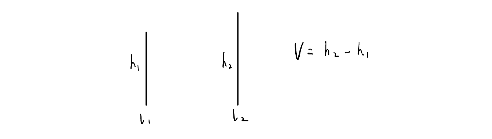
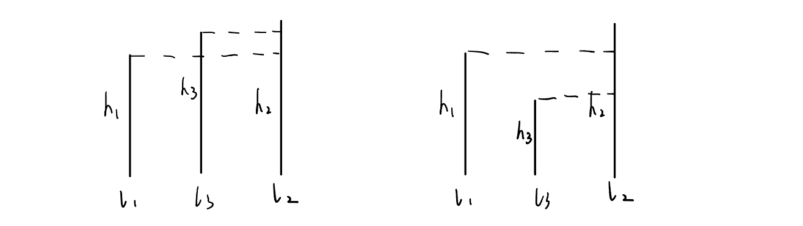
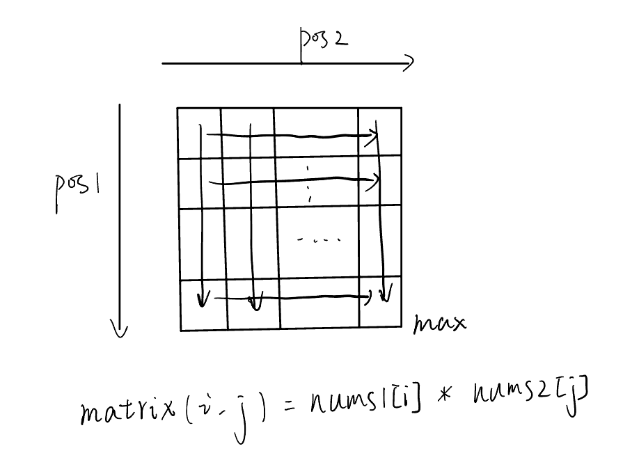
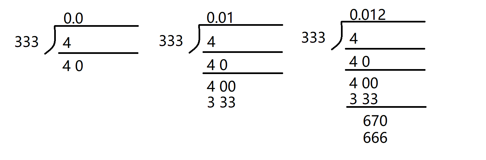

## 1488. 避免洪水泛滥（2025.10.7）

[原题链接](https://leetcode.cn/problems/avoid-flood-in-the-city/description/?envType=daily-question&envId=2025-10-07)

1. 从左到右遍历抽干日， 对于一个**抽干**日，其可能有多个湖泊进行选择，将这些可选择的湖泊（第i个可选择的湖泊）上次下雨和该次下雨时间记为$[last_i, now_i]$，按照贪心的思想，应该将其按照$now_i$从小到大进行排序，即越早可能**泛洪**的湖泊应该更早被抽水，$now_i$更大的湖泊可以尽可能的交给后面的抽干日去处理

但是**固定抽干日**，排序该日可选择的不同湖泊在代码实现上比较困难，于是可以考虑换一个角度，**固定湖泊**，找寻可选择的抽干日：

2. 从左到右遍历湖泊时，假设湖泊$j$会发生洪水，根据其上一次的下雨时间$last$和本次下雨时间$now$，找寻$(last, now)$内的抽干日，假设这些抽干日有$cnt$个，将其从小到大进行排列，根据贪心思想，应该选择距离$last$最近的抽干日，而越晚的抽干日，灵活性越大，可以用于抽干更晚装满的湖，即越晚的抽水日应该留到后面给$now$更大的湖泊使用

以上两种贪心思想等价，但是第二种在代码实现上更简单：利用哈希表记录每个湖泊上次的下雨时间，并将所有的抽干日存储到set中，然后遍历下雨日，在set中找到第一个$> last$的抽干日，并判断其是否合法即可

code：

```c++
class Solution {
public:
    vector<int> avoidFlood(vector<int>& rains) {
        int n = rains.size();
        vector<int> ans(n, -1);
        unordered_map<int, int> last_rain;
        set<int> dry_days;
        for (int i = 0; i < n; i++) {
            if (rains[i] == 0) {
                dry_days.insert(i);
            }
        }
        for (int i = 0; i < n; i++) {
            if (rains[i] > 0) {
                if (last_rain.contains(rains[i])) {
                    int j = last_rain[rains[i]];
                    // > j的第一个, 要用set的upper_bound方法, algorithm的方法会退化为线性时间
                    auto it = dry_days.upper_bound(j);
                    // 必须在第i天之前
                    if (it == dry_days.end()) return {};
                    if ((*it) >= i) return {};
                    ans[(*it)] = rains[i];
                    dry_days.erase(it);
                }
                last_rain[rains[i]] = i;
            }
        }
        // 如果抽干日比下雨日更多，选择湖泊1
        for (int i = 0; i < n; i++) {
            if (rains[i] == 0 && ans[i] == -1) {
                ans[i] = 1;
            }
        }
        return ans;
    }
};
```

时间复杂度：$O(nlogn)$

## 778. 水位上升的泳池中游泳（2025.10.6）

[原题链接](https://leetcode.cn/problems/swim-in-rising-water/description/?envType=daily-question&envId=2025-10-06)

题目提到在方格之间移动不花费时间，求最小的时间t，使得能从(0, 0)移动到(n-1, n-1)

答案t一定有上下界（因为格子中的数值有限），下界为0，上界为$n^2 - 1$，那么可以考虑二分答案：

1. 二分答案t
2. 判断水位为t时，能否从(0, 0)到(n - 1, n - 1)
   - 如果可以，记录答案，减小上界
   - 否则，增大下界

从(0, 0)进行BFS，根据当前水位，可以判断能否到达(n-1, n-1)

code：

```c++
class Solution {
public:
    bool bfs(queue<pair<int, int>> &q, vector<vector<int>> &grid, int t) {
        int m = grid.size();
        int n = grid[0].size();
        vector<vector<int>> vis(m, vector<int>(n, 0));
        if (grid[0][0] > t) return false;
        q.push({0, 0});
        vis[0][0] = 1;
        while (!q.empty()) {
            auto point = q.front();
            q.pop();
            int h = max(t, grid[point.first][point.second]);
            for (int i = 0; i < 4; i++) {
                int nx = point.first + dx[i];
                int ny = point.second + dy[i];
                if (nx < 0 || nx >= m || ny < 0 || ny >= n || vis[nx][ny] != 0 || h < grid[nx][ny])
                    continue;
                vis[nx][ny] = 1;
                q.push({nx, ny});
            }
        }
        return vis[m - 1][n - 1] == 1;
    }
    int swimInWater(vector<vector<int>>& grid) {
        int n = grid.size();
        queue<pair<int, int>> q;
        int l = INT_MAX, r = INT_MIN;
        for (int i = 0; i < n; i++) {
            for (int j = 0; j < n; j++) {
                l = min(l, grid[i][j]);
                r = max(r, grid[i][j]);
            }
        }
        int ans = -1;
        while (l <= r) {
            int mid = l + (r - l) / 2;
            if (bfs(q, grid, mid)) {
                r = mid - 1;
                ans = mid;
            } else {
                l = mid + 1;
            }
        }
        return ans;
    }
    constexpr static int dx[] = {0, 0, 1, -1};
    constexpr static int dy[] = {1, -1, 0, 0};
};
```

时间复杂度：$O(n^2log(n^2))$

## 417. 太平洋大西洋水流问题（2025.10.5）

[原题链接](https://leetcode.cn/problems/pacific-atlantic-water-flow/description/)

可以把二维矩阵看做一个图，单元格抽象为点，设高度为$h$，针对两个相邻单元格$p_1$，$p_2$，其对应的高度为$h_1$，$h_2$，如果有$h_1 >= h2$，则从$p_1$向$p_2$连接一条边。

题目要求出能够流向**PO**和**AO**的单元格，一种想法是在原先的二维矩阵上围上一圈结点，并设置这些结点的属性（标识不同的海洋），然后从每个结点开始BFS遍历，只要其能够同时到达拥有两种属性的结点，该结点就符合题意，时间复杂度为$O(V(V + E))$，其中，$V$是结点个数，$E$是边数，在本题中都是$10^4$数量级，用于通过题目显然不现实。

可以反向思考，从**PO**和**AO**向单元格开始流，只需要翻转一下原先边的方向：

1. 显然，第一行第一列是**PO**能够流向的结点，将这些结点塞入队列，进行一次BFS，就能知道有哪些结点可以流向**PO**
2. 同理，最后一行最后一列是**AO**能流向的结点，同样一次BFS，能知道有哪些结点可以流向**AO**
3. 对于上面求得的两个集合，做一个交集，就是既能流向**PO**，也能流向**AO**的结点

code：

```c++
class Solution {
public:
    void bfs(queue<pair<int, int>> &q, vector<vector<int>>& heights, vector<vector<int>>& vis) {
        int m = heights.size();
        int n = heights[0].size();
        while (!q.empty()) {
            auto point = q.front();
            q.pop();
            int h = heights[point.first][point.second];
            for (int i = 0; i < 4; i++) {
                int nx = point.first + dx[i];
                int ny = point.second + dy[i];
                if (nx < 0 || nx >= m || ny < 0 || ny >= n || vis[nx][ny] == 1 || heights[nx][ny] < h)
                    continue;
                vis[nx][ny] = 1;
                q.push({nx, ny});
            }
        }
    }

    vector<vector<int> > pacificAtlantic(vector<vector<int> > &heights) {
        int m = heights.size();
        int n = heights[0].size();
        vector<vector<int>> pacific_vis(m, vector<int>(n, 0));
        vector<vector<int>> altantic_vis(m, vector<int>(n, 0));
        queue<pair<int, int>> q_pacific, q_altantic;
        for (int i = 0; i < n; i++) {
            pacific_vis[0][i] = 1;
            q_pacific.push({0, i});
            altantic_vis[m - 1][i] = 1;
            q_altantic.push({m - 1, i});
        }
        for (int i = 0; i < m; i++) {
            if (pacific_vis[i][0] == 0) {
                pacific_vis[i][0] = 1;
                q_pacific.push({i, 0});
            }
            if (altantic_vis[i][n - 1] == 0) {
                altantic_vis[i][n - 1] = 1;
                q_altantic.push({i, n - 1});
            }
        }
        bfs(q_pacific, heights, pacific_vis);
        bfs(q_altantic, heights, altantic_vis);
        vector<vector<int>> ans;
        for (int i = 0; i < m; i++) {
            for (int j = 0; j < n; j++) {
                if (pacific_vis[i][j] && altantic_vis[i][j]) {
                    ans.push_back({i, j});
                }
            }
        }
        return ans;
    }

    constexpr static int dx[] = {-1, 1, 0, 0};
    constexpr static int dy[] = {0, 0, 1, -1};
};
```

时间复杂度：$O(V + E)$，其中，$V = mn$，$E = cV$（$c$是一个常数）


## 11. 盛最多水的容器（2025.10.4）

[原题链接](https://leetcode.cn/problems/container-with-most-water/description/?envType=daily-question&envId=2025-10-04)

不妨先考虑只有两条线，那么根据短板效应，两条线中高度最短的那个决定了水的高度：



考虑向中间插入一条线（长或短）：



分析如下：

考虑$l_1$，$l_2$中较短的那条线（假设是$l_1$），由于$l_2$在右端点，设在$l_1$和$l_2$之间的为$l_i$，则显然$l_1$与$l_i$组成的容器容量不会超过$l_1$与$l_2$组成的容器容量

于是可以跳过中间这部分的计算，直接向右移动$l_1$

同理，如果$l_2$较短，向左移动$l_2$，直到$l_1 >= l_2$

每移动一次，就计算一次容量，并保存最大容量

code：

```c++
class Solution {
public:
    int maxArea(vector<int>& height) {
        int l = 0, r = static_cast<int>(height.size()) - 1;
        int ans = 0;
        while (l < r) {
            ans = max(ans, min(height[l], height[r]) * (r - l));
            if (height[l] < height[r]) {
                l++;
            } else {
                r--;
            }
        }
        return ans;
    }
};
```

时间复杂度：$O(n)$

## 42. 接雨水

[原题链接](https://leetcode.cn/problems/trapping-rain-water/description/)

## 407. 接雨水 II（2025.10.3）

[原题链接](https://leetcode.cn/problems/trapping-rain-water-ii/description/?envType=daily-question&envId=2025-10-03)

该题不能向接雨水一样使用单调栈来做（不能遍历所有的行和列然后取能接雨水的最小值）

但同样可以考虑木桶效应（因为最外面一圈格子不可能存下雨水），接雨水考虑的是一维中左右两端的木板，本题是二维，则考虑上下左右四端的木板。根据木桶效应，桶中能装多少水由最短的那块木板，那么应该从四端最短的木板找起，由于其是最短的木板，设其高度为$h$，那么：

1. 如果与其相邻的格子是木板，不做处理
2. 如果与其相邻的格子不是木板， 考虑其高度$hn$：
   - 如果$hn >= h$，那么该格子保存不了雨水，并且由于其比木板更高，原先的木板就没用了，该格子会代替原木板变为高度为$hn$的木板。
   - 如果$hn < h$，那么该格子能够保存$h - hn$单位的雨水，将这些雨水加入$ans$后，该格子不会能够接更多的雨水了，可以将其看做新的高度为$h$的木板，以此来维护新的木桶。

可以使用最小堆来保存四周的木板高度，然后从最低的木板开始遍历，直到堆为空，$ans$中保存的是收集雨水的总和

code：

```c++
class Solution {
public:
    struct Point {
        int x;
        int y;
        int h;
        friend bool operator > (const Point& lhs, const Point& rhs) {
            return lhs.h > rhs.h;
        }
    };
    int trapRainWater(vector<vector<int>>& heightMap) {
        int m = heightMap.size();
        int n = heightMap[0].size();
        if (m < 3 || n < 3) return 0;
        vector<int> visited((m + 1) * (n + 1), 0);
        priority_queue<Point, vector<Point>, greater<>> heap;
        auto arrMap = [n](int i, int j) -> int {
            return i * n + j;
        };
        heap.push({0, 0, heightMap[0][0]}); visited[arrMap(0, 0)] = 1;
        heap.push({0, n - 1, heightMap[0][n - 1]}); visited[arrMap(0, n - 1)] = 1;
        heap.push({m - 1, 0, heightMap[m - 1][0]}); visited[arrMap(m - 1, 0)] = 1;
        heap.push({m - 1, n - 1, heightMap[m - 1][n - 1]}); visited[arrMap(m - 1, n - 1)] = 1;
        for (int i = 1; i < n - 1; i++) {
            heap.push({0, i, heightMap[0][i]}); visited[arrMap(0, i)] = 1;
            heap.push({m - 1, i, heightMap[m - 1][i]}); visited[arrMap(m - 1, i)] = 1;
        }
        for (int j = 1; j < m - 1; j++) {
            heap.push({j, 0, heightMap[j][0]}); visited[arrMap(j, 0)] = 1;
            heap.push({j, n - 1, heightMap[j][n - 1]}); visited[arrMap(j, n - 1)] = 1;
        }
        int remain = m * n - (2 * m + 2 * n - 4);
        int ans = 0;
        while (remain > 0) {
            auto p = heap.top();
            heap.pop();
            for (int i = 0; i < 4; i++) {
                int nx = p.x + dx[i], ny = p.y + dy[i];
                if (nx >= 0 && nx < m && ny >= 0 && ny < n) {
                    if (visited[arrMap(nx, ny)]) continue;
                    int h = heightMap[nx][ny];
                    visited[arrMap(nx, ny)] = 1;
                    remain--;
                    if (h >= p.h) {
                        heap.push({nx, ny, h});
                    } else {
                        ans += p.h - h;
                        heap.push({nx, ny, p.h});
                    }
                }
            }
        }
        return ans;
    }
    constexpr static int dx[] = {0, 0, 1, -1};
    constexpr static int dy[] = {1, -1, 0, 0};
};
```

时间复杂度：二维矩阵$m$行$n$列，时间复杂度为$O(mnlog(mn))$

## 1039. 多边形三角剖分的最低得分（2025.9.29）

[原题链接](https://leetcode.cn/problems/minimum-score-triangulation-of-polygon/?envType=daily-question&envId=2025-09-29)

该题的考点是区间动态规划，仍然从集合的角度来分析

1. 状态表示：dp[l, r]表示由边(l, l + 1)， (l + 1, l + 2)，...，(r - 1, r)，(r, l)组成的多边形被剖分成不同的三角形集合

2. 状态属性：集合中乘积和的最小值

3. 状态转移：

   - 首先考虑如何划分集合：

     由于多边形最后最划分为多个三角形，那么多边形的边都是各个三角形的边，我们以(r, l)这条边隶属于哪个三角形来划分集合：

     (r, l)的两个端点l, r, 只需要再加一个端点就可以组成三角形，设端点为k，则**k = l + 1, ... r - 1**

   ​      于是由k和边(r, l)组成的三角形将原多边形划分为了三个部分：

            1. [l, k]：以(l, l + 1),...,(k, l)边组成的新多边形
            2. [k, r]：以(k, k + 1),...,(r, k)边组成的新多边形
            3. k&(r, l)：以点k和边(r, l)组成的三角形

   

   - 于是状态转移公式：

   $$
   dp[l, r] = min(dp[l, k] + dp[k, r] + v[l] * v[r] * v[k])
   $$

   

为什么选择(r, l)边作为三角形的一个边处理？

因为状态表示中无法直接涉及到(r, l)，而直接使用(r, l)边的三角形又能够将集合划分为不同的部分来完成状态的转移

code：

```c++
class Solution {
public:
    int minScoreTriangulation(vector<int>& values) {
        constexpr int N = 50;
        constexpr int INF = 0x3f3f3f3f;
        vector<vector<int>> dp(N, vector<int>(N, INF));
        int n = values.size();
        for (int i = 0; i < n; i++) {
            dp[i][i] = 0;
            if (i + 1 < n) {
                dp[i][i + 1] = 0;
            }
        }
        for (int len = 2; len < n; len++) {
            for (int l = 0; l < n; l++) {
                int r = l + len;
                if (r >= n) continue;
                // k: l + 1 -> r - 1
                for (int k = l + 1; k < r; k++) {
                    dp[l][r] = min(dp[l][r], 
                        dp[l][k] + dp[k][r] + values[l] * values[k] * values[r]);
                }
            }
        }
        return dp[0][n - 1];
    }
};
```

时间复杂度：$O(n^3)$
## 2040. 两个有序数组的第K小乘积（2025.9.28）

[原题链接](https://leetcode.cn/problems/kth-smallest-product-of-two-sorted-arrays/description/?envType=daily-question&envId=2025-09-28)

直接枚举$n^2$显然是不现实的，注意到两个数组的乘积值域在$[-10^{10}, 10^{10}]$之间

因此可以考虑对答案进行二分：

对于一个数`mid`，设两个数组的乘积中小于`mid`的数有`cnt`个，那么：

1. `cnt < k`，则`mid`有可能是答案，提高答案的下界
2. `cnt >= k`，则`mid`不可能是答案，降低答案的上界

于是问题转化为如何求两个数组的乘积中小于`mid`的个数

### 二分

由`nums1 × nums2 < mid`（`nums1`不为0），得：

1. `nums2 < mid / nums1`（`nums1 > 0`）
2. `nums2 > mid / nums1`（`nums1 < 0`）

两个数组都是排好序的，所以在遍历第一个数组的时候，利用二分求出小于/大于目标数的数字有多少个即可

code:

```c++
class Solution {
public:
    using i64 = long long;
    bool check(vector<int>& nums1, vector<int> &nums2, i64 k, i64 num) {
        // 找nums1 * nums2中，< num的个数cnt，与k比较
        // cnt < k -> true
        // cnt >= k -> false
        i64 cnt = 0;
        for (int n1 : nums1) {
            if (n1 == 0) {
                if (num > 0) cnt += nums2.size();
                continue;
            } 
            i64 n2 = num / n1;
            auto up_it = upper_bound(nums2.begin(), nums2.end(), n2);
            auto low_it = lower_bound(nums2.begin(), nums2.end(), n2);
            if (n1 > 0) {
                int d1 = distance(nums2.begin(), low_it);
                int d2 = distance(nums2.begin(), up_it);
                if (num > 0 && num % n1 != 0) {
                    cnt += max(0, d2);
                } else {
                    cnt += max(0, d1);
                }
            } else {
                int d1 = distance(low_it, nums2.end());
                int d2 = distance(up_it, nums2.end());
                if (num > 0 && num % n1 != 0) {
                    cnt += max(0, d1);
                } else {
                    cnt += max(0, d2);
                }
            }
        }
        return cnt < k;
    }
    long long kthSmallestProduct(vector<int>& nums1, vector<int>& nums2, long long k) {
        i64 low = min({1ll * nums1.front() * nums2.front(), 1ll * nums1.front() * nums2.back(),
                                1ll * nums1.back() * nums2.front(), 1ll * nums1.back() * nums2.back()});
        i64 high = max({1ll * nums1.front() * nums2.front(), 1ll * nums1.front() * nums2.back(),
                                1ll * nums1.back() * nums2.front(), 1ll * nums1.back() * nums2.back()});
        i64 ans = 0;
        while (low <= high) {
            i64 mid = (low + high) >> 1;
            if (check(nums1, nums2, k, mid)) {
                low = mid + 1;
                ans = mid;
            } else {
                high = mid - 1;
            }
        }
        return ans;
    }
};
```

时间复杂度：$O(n (logn)(logk))$

### 矩阵

数组单增，负数正数同时存在，我们可以将分界线列出，假设：

1. `nums1[0~pos1]`是负数，`nums1[pos1~n1]`是正数
2. `nums2[0~pos2]`是负数，`nums1[pos1~n2]`是正数

将`nums1[0~pos1]`与`nums2[0~pos2]`各个数分别相乘，观察性质(以两个数组中元素都大于0为例)：



不难发现，左上角是最小值，随行增加，随列增加，右下角为最大值，之后求该矩阵中小于`mid`的个数，参考[leetcode-240](https://leetcode.cn/problems/search-a-2d-matrix-ii/description/?envType=study-plan-v2&envId=top-100-liked)

具体做法是利用双指针，指向矩阵右上角的坐标，计算矩阵中对应的位置元素，如果该元素大于等于`mid`，向左移动，否则向下移动，直到找到最后一个小于`mid`的元素，移动的过程中，每找到一个小于`mid`的元素，就累加该行的个数

code：

```c++
class Solution {
public:
    using i64 = long long;
    bool check(vector<int>& nums1, vector<int> &nums2, i64 k, i64 num) {
        // 找nums1 * nums2中，< num的个数cnt，与k比较
        // cnt < k -> true
        // cnt >= k -> false
        i64 cnt = 0;
        for (int i = 0, j = pos2; i <= pos1 && j >= 0;) {
            if (1ll * nums1[i] * nums2[j] >= num) {
                i++;
            }
            else {
                cnt += (pos1 - i + 1);
                j--;
            }
        }
        for (int i = 0, j = pos2 + 1; i <= pos1 && j < nums2.size();) {
            if (1ll * nums1[i] * nums2[j] >= num) {
                j++;
            } else {
                cnt += (nums2.size() - j);
                i++;
            }
        }
        for (int i = pos1 + 1, j = 0; i < nums1.size() && j <= pos2;) {
            if (1ll * nums1[i] * nums2[j] >= num) {
                i++;
            } else {
                cnt += (nums1.size() - i);
                j++;
            }
        }
        for (int i = pos1 + 1, j = nums2.size() - 1; i < nums1.size() && j > pos2;) {
            if (1ll * nums1[i] * nums2[j] >= num) {
                j--;
            } else {
                cnt += (j - pos2);
                i++;
            }
        }
        return cnt < k;
    }
    long long kthSmallestProduct(vector<int>& nums1, vector<int>& nums2, long long k) {
        i64 low = min({1ll * nums1.front() * nums2.front(), 1ll * nums1.front() * nums2.back(),
                                1ll * nums1.back() * nums2.front(), 1ll * nums1.back() * nums2.back()});
        i64 high = max({1ll * nums1.front() * nums2.front(), 1ll * nums1.front() * nums2.back(),
                                1ll * nums1.back() * nums2.front(), 1ll * nums1.back() * nums2.back()});
        i64 ans = 0;
        for (int i = 0; i < nums1.size(); i++) {
            if (nums1[i] < 0) pos1 = i;            
        }
        for (int i = 0; i < nums2.size(); i++) {
            if (nums2[i] < 0) pos2 = i;            
        }
        while (low <= high) {
            i64 mid = (low + high) >> 1;
            if (check(nums1, nums2, k, mid)) {
                low = mid + 1;
                ans = mid;
            } else {
                high = mid - 1;
            }
        }
        return ans;
    }
private:
    int pos1{-1};
    int pos2{-1};
};
```

时间复杂度：$O(nlogk)$

## 976. 三角形的最大周长（2025.9.28）

[原题链接](https://leetcode.cn/problems/largest-perimeter-triangle/description/?envType=daily-question&envId=2025-09-28)

枚举三条边a，b，c，三角形三边需要满足：
1. a + b > c
2. a + c > b
3. b + c > a

如果按边大小排序，设c >= b >= a，能简化为一个条件：
1. a + b > c

将边从大到小排序，在枚举一个最长边nums[i] = c时，能使得三角形周长最大的合法集合只能为nums[i], nums[i + 1], nums[i + 2]

1. 如果nums[i], nums[i + 1], nums[i + 2]合法，则三条边组成的三角形周长最大
2. 如果不合法，那么以nums[i] = c作为最长边将不能和nums[i + 3]及之后的边组成三角形

code: 
```c++
class Solution {
public:
    int largestPerimeter(vector<int>& nums) {
        sort(nums.begin(), nums.end(), greater<>());
        int ans = 0;
        for (int i = 2; i < nums.size(); i++) {
            // a <= b <= c
            int a = nums[i], b = nums[i - 1], c = nums[i - 2];
            if (c < a + b) {
                ans = a + b + c;
                break;
            }
        }
        return ans;
    }
};
```
时间复杂度： $O(n)$

## 812. 最大三角形面积（2025.9.27）

[原题链接](https://leetcode.cn/problems/largest-triangle-area/description/?envType=daily-question&envId=2025-09-27)

枚举三个点A，B，C，设三条边的边长为a，b，c

根据海伦公式（或者用余弦定理）得出：

$S = \sqrt {p (p - a) (p - b) (p - c)}$

其中，$p = \frac {a + b + c} {2}$

注意，如果三个点x坐标或y坐标相同，三角形不合法

code:

```c++
class Solution {
public:
    double getDistance(int x1, int y1, int x2, int y2) {
        double d2 = pow(x1 - x2, 2) + pow(y1 - y2, 2);
        return sqrt(d2);
    }
    double largestTriangleArea(vector<vector<int>>& points) {
        int n = points.size();
        double ans = INT_MIN;
        for (int i = 0; i < n; i++) {
            for (int j = i + 1; j < n; j++) {
                for (int k = j + 1; k < n; k++) {
                    auto &pi = points[i];
                    auto &pj = points[j];
                    auto &pk = points[k];
                    if (pi[0] == pj[0] && pi[0] == pk[0]) continue;
                    if (pi[1] == pj[1] && pi[1] == pk[1]) continue;
                    double a = getDistance(pi[0], pi[1], pj[0], pj[1]);
                    double b = getDistance(pi[0], pi[1], pk[0], pk[1]);
                    double c = getDistance(pj[0], pj[1], pk[0], pk[1]);
                    double sum = (a + b + c) / 2;
                    ans = max(ans, sqrt(sum * (sum - a) * (sum - b) * (sum - c)));
                }
            }
        }
        return ans;
    }
};
```
时间复杂度： $O(n^3)$

## 611. 有效三角形的个数（2025.9.26）
[原题链接](https://leetcode.cn/problems/valid-triangle-number/description/?envType=daily-question&envId=2025-09-26)
### 排序 + 二分
将边长度按从小到大排序

因为需要三条边，无论如何都要枚举两条边a，b，不妨从小到大进行枚举（即`a <= b`）

设第三条边为c，那么c需要满足：
1. `a + b > c`
2. `a + c > b`
3. `b + c > a`

在枚举c的过程中，为了避免重复，c必须满足`c >= b`

故上述条件简化为：
1. `a <= b <= c`
2. `a + b > c`

设a，b对应的下标分别为i，j，那么c的下标范围是：

`[l, r] = [j + 1, lower_bound(nums.begin() + j + 1, nums.end(), a + b)]`
，如果`r < l`，则没有与a，b对应的c存在
code：
```c++
class Solution {
public:
    int triangleNumber(vector<int>& nums) {
        // 枚举a, b
        // c: a + b > c, a + c > b, b + c > a
        // -> c < a + b && c > b - a && c > a - b
        sort(nums.begin(), nums.end());
        int ans = 0;
        for (int i = 0; i < nums.size(); i++) {
            for (int j = i + 1; j < nums.size(); j++) {
                int k = j + 1;
                int start = max(nums[j] - nums[i], nums[i] - nums[j]);
                int end = nums[i] + nums[j];
                auto l = upper_bound(nums.begin() + k, nums.end(), start);
                auto r = lower_bound(nums.begin() + k, nums.end(), end);
                if (r - l < 0) continue;
                ans += (r - l);
            }
        }
        if (ans < 0) ans = 0;
        return ans;
    }
};
```
时间复杂度: $O(n^2logn)$
### 排序 + 双指针
二分的代码不难发现一个规律：枚举a，b后，寻找c时，只需要找到满足`c < a + b`的最大的c

换句话说，对于前一个b，有`c < a + b`，对于下一个b，也有可能有`c < a + b`

因此，我们只需要维护c所在区间的最大值下标

条件是：只要`c < a + b`，就让c的下标右移

c所在区间的最小值下标一定是b的下标+1

于是可以采用双指针，在枚举b的同时，维护c当前可能的最大值下标

code:
```c++
class Solution {
public:
    int triangleNumber(vector<int>& nums) {
        // 枚举a, b
        // c: a + b > c
        // a <= b <= c
        sort(nums.begin(), nums.end());
        int ans = 0;
        for (int i = 0; i < nums.size(); i++) {
            for (int j = i + 1, k = j + 1; j < nums.size(); j++) {
                // k是c合法范围内的最大值下标
                k = max(k, j + 1);
                int end = nums[i] + nums[j];
                while (k < nums.size() && nums[k] < end) {
                    k++;
                }
                ans += max(0, k - j - 1);
            }
        }
        return ans;
    }
};
```
时间复杂度：$O(n^2)$

## 120. 三角形最小路径和（2025.9.25）

[原题链接](https://leetcode.cn/problems/triangle/description/?envType=daily-question&envId=2025-09-25)

三角形dp，从集合的角度分析：

1. 状态表示：dp(i, j)：从triangle(0, 0)走到(i, j)的不同路径组成的集合

2. 状态计算：集合中路径总和的最小值

3. 状态转移：根据路径中的最后一次转移来划分集合

   - 从(i - 1, j)走到(i, j)

   - 从(i - 1, j - 1)走到(i, j)

   - 转移公式：
     $$
     dp(i, j) =
     \begin{cases}
     triangle(i, j), & i = 0, j = 0 \\
     dp(i - 1, j) + triangle(i, j), & i > 0, j = 0 \\
     min(dp(i - 1, j), dp(i - 1, j - 1)) + triangle(i, j) & i > 0, j > 0 \\
     \end{cases}
     $$

4. 优化：注意到在计算dp(i, ...)时，只需要dp(i - 1, ...)，所以可以将状态优化为1维数组，在计算状态时只保留上一层的状态dp(j)

code:

```c++
class Solution {
public:
    int minimumTotal(vector<vector<int>>& triangle) {
        int ans = INT_MAX;
        vector<int> dp(triangle.size(), INT_MAX / 2);
        dp[0] = triangle[0][0];
        for (int i = 1; i < triangle.size(); i++) {
            for (int j = triangle[i].size() - 1; j >= 0; j--) {
                int old_dp = INT_MAX / 2;
                if (j >= 1) old_dp = dp[j - 1];
                dp[j] = min(dp[j], old_dp) + triangle[i][j];
            }
        }
        for (int i = 0; i < dp.size(); i++) {
            ans = min(ans, dp[i]);
        }
        return ans;
    }
};
```
时间复杂度： $O(n^2)$
## 166. 分数到小数（2025.9.24）

[原题链接](https://leetcode.cn/problems/fraction-to-recurring-decimal/description/?envType=daily-question&envId=2025-09-24)

问题的难度在于如何判定循环小数的范围

使用长除法观察示例$\frac {4} {333} = 0.\dot 0 \dot 1 \dot 2$：



1. 小数点后第1位为0时，对应的被除数为40
2. 小数点后第2位为1时，对应的被除数为400
3. 小数点后第3位为2时，对应的被除数为670

以此类推...， 小数点后第4位开始循环，对应的被除数为40

不难发现，当小数点后开始循环时，对应的被除数一定已经出现过，可以使用哈希表来保存出现过的被除数，当一个被除数重复出现时，说明有循环小数并已经开始循环

于是问题来到了如何判断哪一部分是循环小数，我们可以通过存储下面两个信息来解决：

1. **小数点后第k位对应的被除数**
2. **小数点后当前的总位数n**

当被除数重复时，小数点后**第k位~第n位**就是循环小数所在的部分，前者可以用hashmap解决，后者可以开辟一个额外变量来记录

由于题目中分子，分母的范围在[INT_MIN, INT_MAX]，所以在计算时最好使用long long，同时将小数点前和小数点后的计算分开，更加清晰

code:

```c++
class Solution {
public:
    using i64 = long long;
    void transform_quotient(string &ans, i64 quotient) {
        string res("");
        while (quotient > 0) {
            int mod = quotient % 10;
            quotient /= 10;
            res += static_cast<char>(mod + '0');
        }
        if (res.size() == 0) return;
        for (int i = res.size() - 1; i >= 0; i--) {
            ans += res[i];
        }
    }
    string fractionToDecimal(int numerator, int denominator) {
        bool neg1 = numerator < 0;
        bool neg2 = denominator < 0;
        i64 numerator1 = abs(numerator * 1ll);
        i64 denominator1 = abs(denominator * 1ll);
        string ans("");
        // 小数点前
        if (numerator1 >= denominator1) {
            while (numerator1 >= denominator1) {
                i64 quotient = numerator1 / denominator1;
                numerator1 %= denominator1;
                transform_quotient(ans, quotient);
            }
        } else {
            ans += '0';
        }
        // 小数点后
        if (numerator1 != 0){
            ans += '.';
            int index = ans.size();
            vector<int> cycle;
            unordered_map<int, int> hash;
            while (true) {
                numerator1 *= 10;
                if (hash.contains(numerator1)) {
                    int st = hash[numerator1];
                    string tmp = ans.substr(0, cycle[st]) + '(';
                    for (int i = cycle[st]; i < ans.size(); i++) {
                        tmp += ans[i];
                    }
                    tmp += ')';
                    ans = tmp;
                    break;
                }
                int quotient = numerator1 / denominator1;
                cycle.push_back(index);
                hash[numerator1] = cycle.size() - 1;
                index++;
                numerator1 %= denominator1;
                ans += static_cast<char>(quotient + '0');
                if (numerator1 == 0) {
                    break;
                }
            }
        }
        if (neg1 != neg2 && numerator != 0) {
            ans = "-" + ans;        
        }
        return ans;
    }
};
```
时间复杂度：设小数点后位数数量级为n，代码时间复杂度为$O(n)$
