# linux环境下cmake + clangd + lldb搭建cpp开发环境

## 一. 基础环境

- wsl2
- ubuntu22
- ubuntu24

以上均可（其他没试过，不过理论上都可以）

## 二. 源配置

如果要配置多编译器环境或者更想用**gcc/g++**，这里的源配置主要针对需要下载高等级的gcc版本

由于一些低版本的ubuntu（如22）默认下载gcc11版本，如果想要下载更高的版本，12以及往上，可以使用下面两条命令：

```bash
sudo add-apt-repository ppa:ubuntu-toolchain-r/test
sudo add-apt-repository ppa:ubuntu-toolchain-r/ppa
```

然后可以安装高版本的gcc和g++

```bash
apt search gcc-12
# apt search gcc-13
sudo apt install gcc-12
sudo apt install g++-12
```

不过由于是国外源，下载的会比较慢，需要额外配置镜像（这个镜像不是`/etc/apt/sources.list`文件）

执行上面两条`add-apt-repository`命令后，查看`/etc/apt/sources.list.d`目录：

```bash
ll /etc/apt/sources.list.d
```

如下图所示（一个ppa，一个test）：

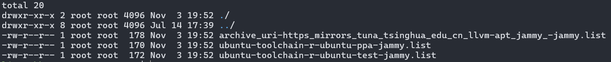

以`ppa-jammy.list`为例，里面的内容原本是：

```bash
deb https://ppa.launchpadcontent.net/ubuntu-toolchain-r/ppa/ubuntu/ jammy main 
# deb-src https://ppa.launchpadcontent.net/ubuntu-toolchain-r/ppa/ubuntu/ jammy main
```

使用如下命令换为中科大的源（最后两个参数是`ppa`和`test`两个文件名）：

```bash
sudo sed -i 's|https://ppa.launchpadcontent.net|https://launchpad.proxy.ustclug.org|g' /etc/apt/sources.list.d/ubuntu-toolchain-r-ubuntu-ppa-jammy.list /etc/apt/sources.list.d/ubuntu-toolchain-r-ubuntu-test-jammy.list
```

然后执行：

```bash
sudo apt update
sudo apt install gcc-12 g++-12
```

就会快很多了

## 三. gcc/g++版本切换（可选）

如果电脑下有多个gcc/g++，想要切换版本，首先查看各个gcc/g++的版本号：

```bash
ls -l /usr/bin | grep gcc
```

如下图：

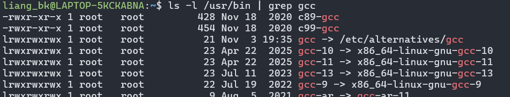

使用`update-alternatives`命令设置各个gcc/g++的优先级：

```bash
# 13的权值是100, 11是80...
sudo update-alternatives --install /usr/bin/gcc gcc /usr/bin/gcc-13 100 --slave /usr/bin/g++ g++ /usr/bin/g++-13 --slave /usr/bin/gcov gcov /usr/bin/gcov-13
sudo update-alternatives --install /usr/bin/gcc gcc /usr/bin/gcc-11 80 --slave /usr/bin/g++ g++ /usr/bin/g++-11 --slave /usr/bin/gcov gcov /usr/bin/gcov-11
sudo update-alternatives --install /usr/bin/gcc gcc /usr/bin/gcc-10 60 --slave /usr/bin/g++ g++ /usr/bin/g++-10 --slave /usr/bin/gcov gcov /usr/bin/gcov-10
```

设置完毕后再执行`gcc -v`就能看到当前是`gcc-13`

如果想要切换版本：

```bash
sudo update-alternatives --config gcc
```

如下图，选择对应版本即可：

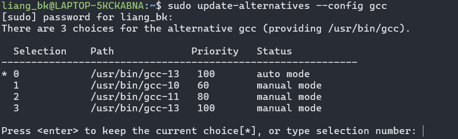

## 四. llvm配置

国外的网址：[apt llvm](https://apt.llvm.org/)

找到下图中的脚本命令：

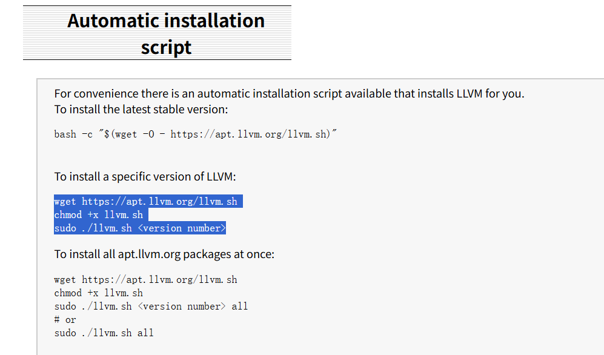

和版本：

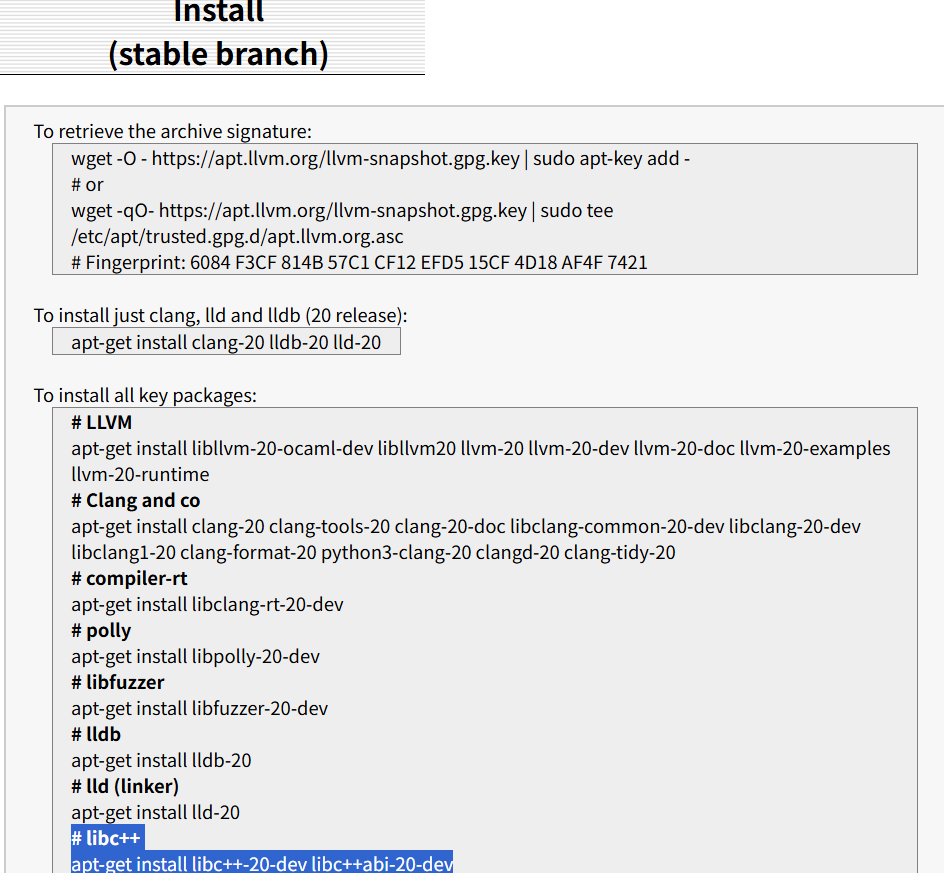

（我安装的时候stable版本是20）

但不要执行，同样是由于国外源太慢的问题，这次换清华源：[tsinghua apt llvm](https://mirrors4.tuna.tsinghua.edu.cn/help/llvm-apt/)

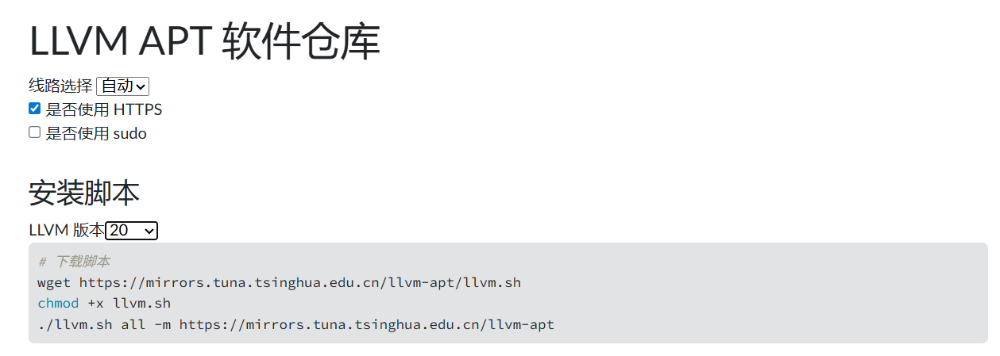

在`LLVM版本`选为20（一般选stable版本就对了）

将上面的命令逐行粘贴到终端执行：

```bash
sudo wget https://mirrors.tuna.tsinghua.edu.cn/llvm-apt/llvm.sh
sudo chmod +x llvm.sh
sudo ./llvm.sh all -m https://mirrors.tuna.tsinghua.edu.cn/llvm-apt
```

之后再安装`libstdc++`，配置`gcc/g++`使用

```bash
sudo apt-get install libc++-20-dev libc++abi-20-dev
```

这样就安装好了llvm全套（`clang/clang++/clangd/lldb`）和`libc++`

## 五. cmake配置

不推荐直接从apt下载cmake，版本一般比较旧

一般从源码安装或者作者仓库中拉取，具体参考下面这篇文章：

[ubuntu 22.04环境中cmake安装 - 知乎](https://zhuanlan.zhihu.com/p/694017813)

## 六. vscode配置

插件安装列表（自行安装），还有一个Test Explorer UI插件没有截进来：

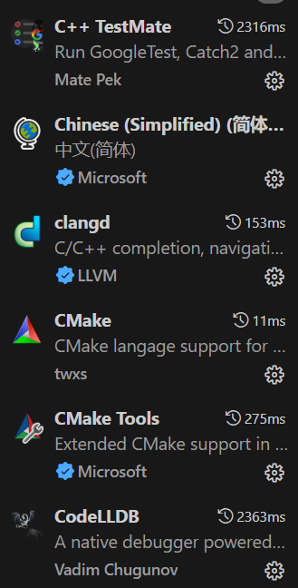


### 6.1 clangd

#### 6.1.1 clangd path

刚下载完clangd，会弹窗提示没有下载clangd-server，这时候不要点击，直接去clangd设置中：

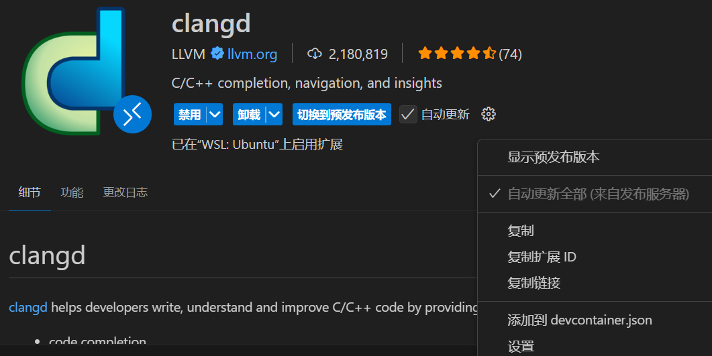

不是用户的设置而是wsl2或者虚拟机的设置中，找到`Clangd: Path`选项，之前下载`llvm`组件时已经下载了`clangd-<version>`（`<version>`是stable的版本号），直接填入到选项中：

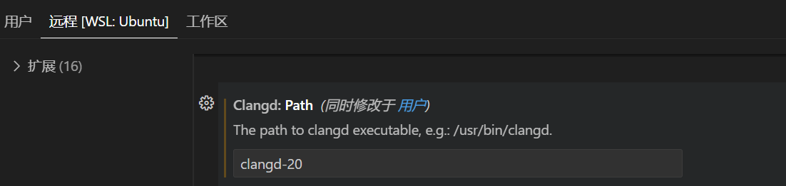

#### 6.1.2 .clangd配置系统文件寻找路径

1. 使用clang/clang++头文件

   在项目目录下创建`.clangd`文件，然后填入下面的内容：

   ```yaml
   CompileFlags:
     Add:
       - "-stdlib=libc++"  # 主要是这行
       - "-ferror-limit=0"
     Compiler: clang++-20
   ```

2. 使用gcc，可以这么写（不需要配置`-stdlib`，因为linux下默认用`libstdc++`）：

   ```yaml
   CompileFlags:
     Add:
       - "-I/usr/include/c++/13" # 
       - "-ferror-limit=0"
     Compiler: g++-13

### 6.2 codelldb

#### 6.2.1 安装vsix

下载插件后，可能会报错，弹窗`open ... url`，点击后在浏览器下载一个`.vsix`文件

然后在扩展中安装：

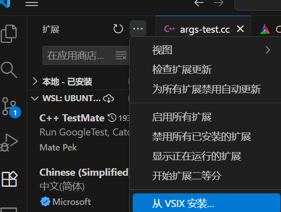

#### 6.2.2 调试

配置好cmake tools之前的cmake项

打断点，按`F5`调试，一开始会报错，让创建`launch.json`文件，跟着步骤创建：

```json
{
    // 使用 IntelliSense 了解相关属性。 
    // 悬停以查看现有属性的描述。
    // 欲了解更多信息，请访问: https://go.microsoft.com/fwlink/?linkid=830387
    "version": "0.2.0",
    "configurations": [
        {
            "type": "lldb",
            "request": "launch",
            "name": "Debug",
            "program": "${workspaceFolder}/<executable file>",
            "args": [],
            "cwd": "${workspaceFolder}"
        }
    ]
}
```

把`"program"`项换为可执行文件的位置，就可以正常调试了

### 6.3 cmake

#### 6.3.1 cmake path

在CMake插件中的设置中，找到`Cmake: Cmake Path`选项，设置为cmake的可执行文件路径：

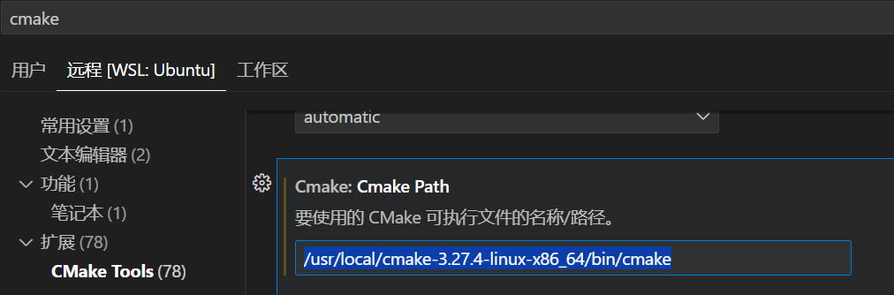

#### 6.3.2 cmake快速创建项目

- 创建一个文件夹，然后使用vscode打开
- `Ctrl + Shift + P`唤出命令面板
- 输入`cmake:quick`，找到`CMake: Quick Start`
- 按提示步骤完成剩余操作

#### 6.3.3 CMAKE_EXPORT_COMPILE_COMMANDS

使用`git`下载一个cmake项目，比如`fmt: git clone https://github.com/fmtlib/fmt.git`

如果要使用clang++，则找到项目根目录下的`CMakeLists.txt`，加入：

```cmake
# 生成 compile_commands.json
set(CMAKE_EXPORT_COMPILE_COMMANDS ON)
```

上述命令会在`build`目录下生成`compile_commands.json`，clangd会根据这个文件生成索引，存放在项目的`.cache`目录下，如果没有，可能不会正常工作

至此，clangd应该能够正常工作了

#### 6.3.4 cmake tools

使用过clion和vs2022都清楚有比较方便的切换启动哪个可执行程序的功能，借助cmake tools插件，可以做到这一点，修改`launch.json`（主要是`"program"`项）：

```json
{
    // 使用 IntelliSense 了解相关属性。 
    // 悬停以查看现有属性的描述。
    // 欲了解更多信息，请访问: https://go.microsoft.com/fwlink/?linkid=830387
    "version": "0.2.0",
    "configurations": [
        {
            "type": "lldb",
            "request": "launch",
            "name": "Debug",
            "program": "${command:cmake.launchTargetPath}",
            "args": [],
            "cwd": "${workspaceFolder}"
        }
    ]
}
```

在vscode左侧cmake-tools的图标中，选择启动和调试的目标即可：

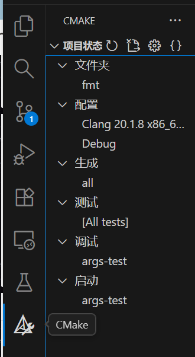

### 6.4 unit-test

安装`C++ TestMate`和`Test Explorer UI`后，在左侧测试按钮中可以进行对应的测试：

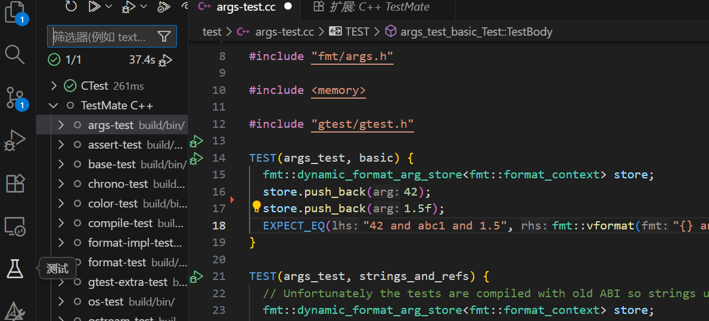

在编译后也可以在对应的测试文件中直接使用图形化运行按钮进行测试

但是测试文件（指可执行文件）的识别默认为build或者out目录下的带有`test`名的文件，所以在生成可执行文件时要注意正确的命名：

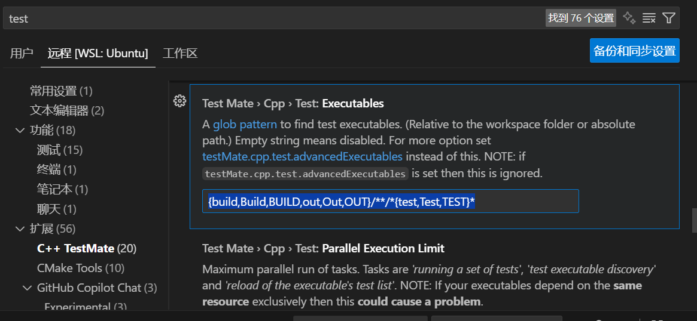

## 七. windows下环境配置

请参考[VSCode C/C++开发环境配置 Clang/LLVM+LLDB+CMake](https://www.ispellbook.com/post/VSCodeCppDevConfig)

windows上使用lldb和msvc stl只能看到stl组件的地址，看不到内容，建议直接使用cmake-tools自带的cppdbg，或者用lldb配合MinGW使用，个人认为window上还是直接用msvc工具链比较好

## 八. vcpkg配置

### 8.1 下载与环境配置

下载：

```bash
git clone https://github.com/microsoft/vcpkg.git # 克隆仓库
cd vcpkg
./bootstrap-vcpkg.sh # Linux bash
```

环境配置：

在`~/.bashrc`文件最后添加：

```bash
export VCPKG_ROOT=/path/to/vcpkg # vcpkg文件夹的实际路径
export PATH=$VCPKG_ROOT:$PATH
```

### 8.2 案例

1. 创建vcpkg依赖

   ```bash
   mkdir vcpkg_test && cd vcpkg_test
   vcpkg new --application # 初始化vcpkg项目
   vcpkg add port fmt # 添加 fmt 依赖项
   ```

2. 创建cmake项目

   `Ctrl` + `Shift` + `P`唤出vscode命令行，使用`CMake: Quick Start`创建cmake项目 

3. 设置`CMakePresets.json`

   项目目录创建`CMakePresets.json`

   ```json
   {
       "version": 2,
       "configurePresets": [
           {
               "name": "vcpkg",
               "generator": "Ninja",
               "binaryDir": "${sourceDir}/build",
               "cacheVariables": {
                   "CMAKE_TOOLCHAIN_FILE": "$env{VCPKG_ROOT}/scripts/buildsystems/vcpkg.cmake"
               },
           }
       ]
   }
   ```

   如有需要可以再创建`CMakeUserPresets.json`

   ```json
   {
       "version": 2,
       "configurePresets": [
           {
               "name": "default",
               "inherits": "vcpkg",
               "environment": {
                   "VCPKG_ROOT": "" // 填vcpkg的实际路径
               }
           }
       ]
   }
   ```

4. 此时可以在CMake-Tools提供的配置中选择对应的配置：

   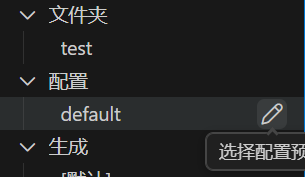

5. `CMakeLists.txt`，`main.cpp`

   ```cmake
   cmake_minimum_required(VERSION 3.10)
   
   project(Helloworld)
   # 生成 compile_commands.json
   set(CMAKE_EXPORT_COMPILE_COMMANDS ON)
   set(CMAKE_CXX_FLAGS "${CMAKE_CXX_FLAGS} -stdlib=libc++")
   # 设置链接标志
   set(CMAKE_EXE_LINKER_FLAGS "${CMAKE_EXE_LINKER_FLAGS} -stdlib=libc++ -lc++abi")
   find_package(fmt CONFIG REQUIRED) # 指定vcpkg的查找的库
   
   add_executable(Helloworld helloworld.cpp)
   
   target_link_libraries(Helloworld PRIVATE fmt::fmt)
   ```

   ```c++
   #include <fmt/core.h>
   int main()
   {
       fmt::print("Hello World!\n");
       return 0;
   }
   ```

6. 编译即可

如果要下载到全局可以直接：

`vcpkg install fmt`

路径在：

`xxx/vcpkg/installed/x64-linux`

如果要让clangd解析到对应的头文件，需要额外配置.clangd

```yaml
CompileFlags:
  Add:
    - "-I/usr/include/c++/13" #
    - "-Isystem/xxx/vcpkg/installed/x64-linux/include"
    - "-ferror-limit=0"
  Compiler: g++-13
```

### 8.3 其他配置

### 8.3.1 适配clang与libc++

**警告：**

如果不是非使用`libc++`库不可，就不需要下面的内容，直接`CMakePresets.json`里面指定编译器就好了，反正`clang++`和`libstdc++`也能一块用


vcpkg安装和主动拉取依赖默认用gcc工具链（如果有的话），编译链接也一样

如果要配clang和libc++，需要修改以下几个配置：

1. CC，CXX：

   改一下两个环境变量所指的编译器（在`~/.bashrc`）：

   ```bash
   export CC=clang-20
   export CXX=clang++-20
   ```

2. `CMakePresets.json`，原先写在CMake中的内容，现在要放在该文件里：

   ```json
   {
       "version": 2,
       "configurePresets": [
           {
               "name": "vcpkg",
               "generator": "Ninja",
               "binaryDir": "${sourceDir}/build",
               "cacheVariables": {
                   "VCPKG_TARGET_TRIPLET": "x64-linux-clang-libcxx",
                   "CMAKE_BUILD_TYPE": "Debug",
                   "CMAKE_C_COMPILER": "clang-20",
                   "CMAKE_CXX_COMPILER": "clang++-20",
                   "CMAKE_TOOLCHAIN_FILE": "$env{VCPKG_ROOT}/scripts/buildsystems/vcpkg.cmake"
               },
               "environment": {
                   "CC": "clang-20",
                   "CXX": "clang++-20"
               }
           }
       ]
   }
   ```

3. `xxx/vcpkg/triplets/community`中新建`x64-linux-clang-libcxx.cmake`

   ```cmake
   set(VCPKG_TARGET_ARCHITECTURE x64)
   set(VCPKG_CRT_LINKAGE dynamic)
   set(VCPKG_LIBRARY_LINKAGE static)
   set(VCPKG_CMAKE_SYSTEM_NAME Linux)
   
   # 注意：VCPKG_CXX_FLAGS 是会被传入编译器的变量
   set(VCPKG_C_FLAGS "${VCPKG_C_FLAGS}")
   set(VCPKG_CXX_FLAGS "${VCPKG_CXX_FLAGS} -stdlib=libc++")
   set(VCPKG_LINKER_FLAGS "${VCPKG_LINKER_FLAGS} -stdlib=libc++")
   set(VCPKG_EXE_LINKER_FLAGS "${VCPKG_EXE_LINKER_FLAGS} -stdlib=libc++ -lc++abi")
   
   ```

   直接用`vcpkg install`命令默认使用`/vcpkg/triplets/x64-linux.cmake`文件

4. 使用`vcpkg install fmt:x64-linux-clang-libcxx`安装对应的包，同样的CMakeLists.txt指定链接标志，见**9.1的解决方案**

### 8.3.2 先找全局再拉依赖

案例中vcpkg的使用方式属于manifest，属于自动下载依赖到项目中，不会去vcpkg的已经安装的包里找，工作模式类似一般CMake项目中的`third_party`文件夹，优点是版本能控制，缺点就是每次修改CMakeLists.txt重新载入的时间就比较长

查了一下好像没办法在这种模式下直接的先找全局包，没找到再拉依赖

问了下gemini给出的答案是：

配置**二进制缓存**。

虽然这依然会在项目下生成 `vcpkg_installed` 目录，但它**不会重新编译**代码，而是直接从缓存（或全局缓存）中拷贝编译好的二进制文件。这是 vcpkg 官方推荐的复用机制。

1. **设置环境变量：** 在你的系统环境变量中添加（或确保默认已启用）：

   Bash

   ```
   VCPKG_DEFAULT_BINARY_CACHE=<你的缓存路径>
   # Windows 默认通常在 %LOCALAPPDATA%\vcpkg\archives
   # Linux/Mac 默认通常在 $HOME/.cache/vcpkg/archives
   ```

2. **效果：** 当你在全局 `vcpkg install xxx` 时，编译产物会存入 Cache。 当你在项目中 build 时，vcpkg 发现 `vcpkg.json` 需要同样的库（且版本、编译器参数一致），它会直接从 Cache 极速解压到 `vcpkg_installed`，跳过编译过程。

### 8.4 常用指令

- list
- install
- remove
- search
- update

## 九. 常见问题

### 9.1 llvm标准库头文件内报错

#### 问题描述

此问题针对强迫症患者，如果你点进去头文件碰到了下面的情况：

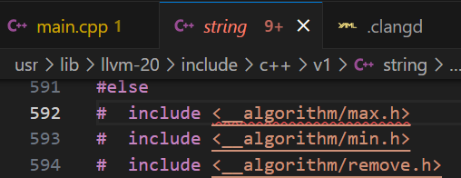

那么在项目下配置`.clangd`已经没用了

#### 解决方案

在`~/`目录下新增`.config/clangd/config.yaml`文件，把`.clangd`的内容复制过来

这个全局文件的优先级比项目下`.clangd`要高，所以配置之后项目路径下那个就没用了，至于为什么内容头文件会爆这么多错，搜了一堆也没找到答案，凑活用吧

### 9.2 codelldb调试无法正常显示STL内容

#### 问题描述

比如源码为：

```c++
struct node {
    unordered_map<int, int> map;
};
int main() {
    node node;
    node.map.insert({1, 1});
    return 0;
}
```

在`return 0`处打断点，显示的是：

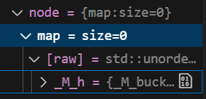

可以看到内嵌到`struct`或者`class`内的STL组件可能无法正常显示

#### 解决方案

https://github.com/vadimcn/codelldb/issues/707

原因还是llvm工具链的问题，`clang++`，`lldb`，`libc++`对应的是`g++`，`gdb`，`libstdc++`，虽然`llvm`支持使用`libstdc++`做链接，但是多少有些小问题，比如性能上，再比如这个`lldb`不能正确显示`unordered_map`，最新的`llvm-21`中的`lldb`已经把这个问题修复了：

[[lldb] Fix StdUnorderedMapSynthProvider for GCC #164251](https://github.com/llvm/llvm-project/pull/164251)

有两种解决办法：

1. 修改`CMakeLists.txt`，使用llvm组件（这些组件在llvm配置时应该就配置完成了）：

   ```cmake
   # 设置编译器
   set(CMAKE_CXX_COMPILER clang++-20)
   # 添加编译标志 库名 libc++.so
   set(CMAKE_CXX_FLAGS "${CMAKE_CXX_FLAGS} -stdlib=libc++")
   # 设置链接标志 库名 libc++abi.so
   set(CMAKE_EXE_LINKER_FLAGS "${CMAKE_EXE_LINKER_FLAGS} -stdlib=libc++ -lc++abi")
   ```

   重新编译，再调试：

   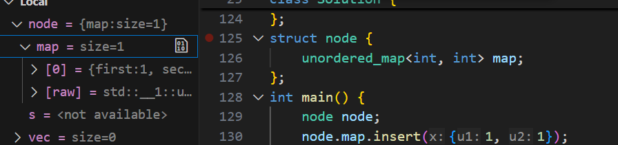

   这么做会强制程序链接`libc++`库，但是linux上一般会默认链接`libstdc++`，因此每个cmake项目都要搞一遍，尤其是再去配vcpkg环境或者是xmake的项目（默认都是链接`libstdc++`的），都得额外搞一套配置，不然到时候`libstdc++`和`libc++`链接冲突了很难搞，考虑到库切换起来很麻烦，切换编译器很简单（而且兼容），推荐还是用第二种方法

2. 修改本地的lldb formatter，然后改codelldb的后端

   用下面的命令找`gnu_libstdcpp.py`这个文件：

   ```bash
   find /usr -name "gnu_libstdcpp.py" 2>/dev/null
   ```

   复制一份备用，然后拉取llvm项目上最新的文件：

   ```bash
   # 复制一份备用
   sudo cp /usr/lib/llvm-20/lib/python3.10/site-packages/lldb/formatters/cpp/gnu_libstdcpp.py \
           /usr/lib/llvm-20/lib/python3.10/site-packages/lldb/formatters/cpp/gnu_libstdcpp.py.bak
   # 下载github最新文件
   sudo wget https://raw.githubusercontent.com/llvm/llvm-project/main/lldb/examples/synthetic/gnu_libstdcpp.py \
             -O /usr/lib/llvm-20/lib/python3.10/site-packages/lldb/formatters/cpp/gnu_libstdcpp.py
   ```

   vscode修改codelldb，使用本地的lldb：

   - `Ctrl` + `Shift` + `P`
   - `>LLDB: Use Alternate Backend`
   - 输入`lldb-<version>`（下哪个版本就用哪个版本）

   codelldb自己会解析后端，完事

ps：在linux上使用llvm工具链还是不太方便，修改了好多配置，不想折腾还是默认使用g++和gdb比较好

### 9.3 clangd设置代码补全

#### 问题描述

clangd默认配置在代码补全的时候会把模板或函数的所有参数都补全出来，例如，当你输入了

```c++
std::set
```

并试图使用clangd提供的代码补全时，它会补全为：

```c++
std::set<class, class, class>
```

可以使用`Tab`一个一个填充或删除参数，但这样比较麻烦

#### 解决方案

在`.vscode`文件夹下新增`settings.json`，内容为：

```json
{
    "clangd.arguments": [
        "--function-arg-placeholders=false",
        "--completion-style=bundled"
    ]
}
```

这样会影响在当前项目目录下`clangd`的补全功能，当输入`std::set`时，会补全为`std::set<>`

也可以直接在`clangd`插件的设置中找到`arguments`项，设置上面两个参数，这样会影响所有目录下的补全行为

## 参考

- [如何在 Ubuntu 中安装和切换多版本 GCC 编译器 - 系统极客](https://www.sysgeek.cn/ubuntu-install-gcc-compiler/)

- [ubuntu 22.04 切 gcc/g++ 版本 - 知乎](https://zhuanlan.zhihu.com/p/639332690)

- [WSL下 C++ 使用 clang19 编译器并配置 vscode 的 clangd 服务器_哔哩哔哩_bilibili](https://www.bilibili.com/video/BV1gPNJe6E3z/?spm_id_from=333.1387.top_right_bar_window_history.content.click&vd_source=b93859dd8360e859dab85c63d1b91f9f)

- [基于VSCode+Clangd+lldb搭建Linux C++环境_vscode lldb-CSDN博客](https://blog.csdn.net/weixin_45896211/article/details/135310728)

- [ubuntu 22.04环境中cmake安装 - 知乎](https://zhuanlan.zhihu.com/p/694017813)

- [VSCode C/C++开发环境配置 Clang/LLVM+LLDB+CMake](https://www.ispellbook.com/post/VSCodeCppDevConfig)

