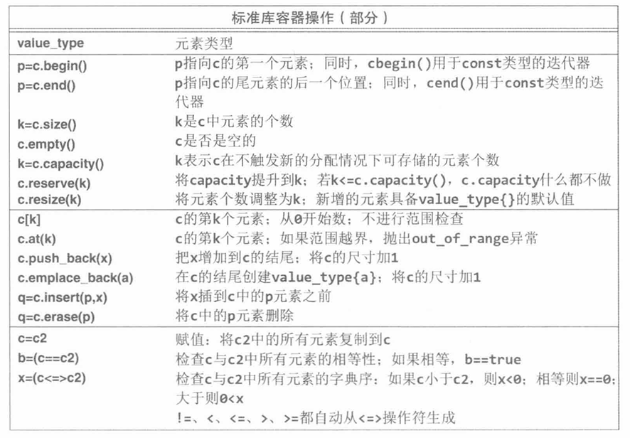
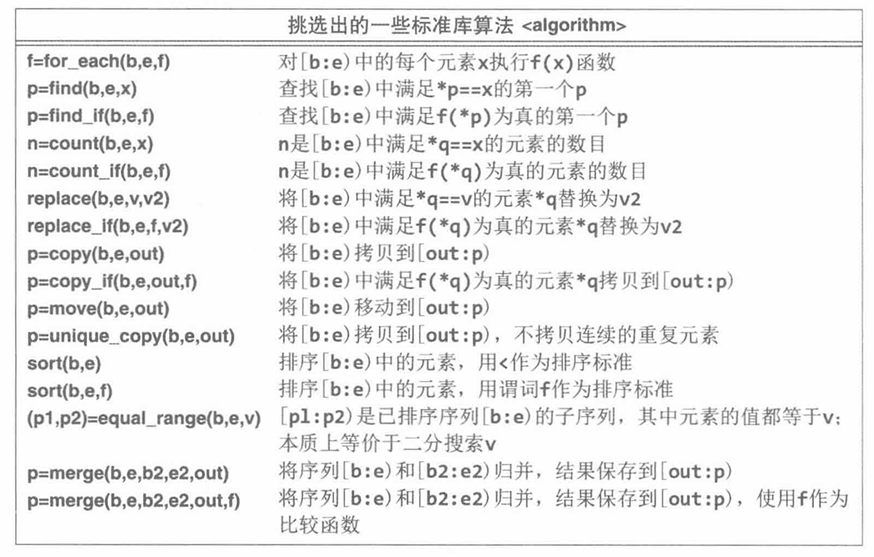

## reference（引用）

c++中的引用是一种给变量起别名的方法，类似于指针，原变量和引用将指向同一块内存地址

```c++
void add_three(int &a);
int a = 10;
int &b = a;	// b是a的别名
```

**指针引用**：顾名思义是对指针变量起别名，其形式通常为`type* &x`

```c++
// 可以这么理解，&b代表b是一个引用, 而int*是这个引用的类型
void change_pointer(int* &b);

int* a = new int;
int* &b = a;
```

## move_semantics（移动语义）

> 移动语义是指在c++对象中移动资源的这一动作，普通的对象拷贝可能花费不小的时间和空间资源，而**移动语义可以直接将对象A的资源转移给对象B，同时A的资源被清零**

由于移动针对**类对象（class object）**之间的过程，所以对普通类型（如int，double，裸指针）之间使用移动语义并不能移动资源，移动语义也不应该在普通类型中进行使用

移动语义离不开下面要介绍的左值和右值的概念，在c++中，任何一个**表达式**要么是左值要么是右值，例如：

```c++
// a 是左值, 10 是右值
int a = 10;
// b 是左值, a * 2 是右值
int b = a * 2;
```

### lvalue（左值）and rvalue（右值）

官方定义是，左值表示在内存中占据某个可识别位置的表达式（在表达式被计算完毕后仍然能够存在）

例子：

```c++
int add(int x, int y);
int a = 5;
int *p = &a;
int b = add(1, 3);
int &c = b;
vector &&d = {1,2,3}
```

在上面的代码中，`=`左边的表达式（变量）都是左值（`vector &&`表示一个`vector`的右值引用，后面会介绍）

与左值相反，是那些表达式被计算完毕后，无法继续存在的临时值，如字面量（字符串除外），或者一个函数的返回结果：

```c++
int add(int x, int y);
10;
add(1, 3);
2 * 4 + add(1, 3);
int x = 1, y = 2;
x * y;
```

上面的`10`，`add(1, 3)`，`x * y`都是右值

### 左值引用和右值引用

`reference`之前已经介绍过，就是给变量起别名

左值引用就是给左值变量起别名

右值引用就是给右值变量起别名，但右值在表达式结束后不应该存在，所以现代C++新的规则就是右值引用会延长引用的右值的生命周期，例如：

```c++
// 如果a是int类型，那么10在赋值表达式结束后，生命周期结束
int &&a = 10;
// 现在a是一个右值引用，并且引用了10，那么10在内存中不会消失，直到a消失后其再消失

// getString()会返回一个临时的string对象，如果s1是一个string类型，那么该对象在赋值结束后，生命周期结束
string getString();
string &&s1 = getString();
// 现在这个对象被s1所引用，同样的，该临时变量的生命周期只有在s1结束后才结束
```

**tips**：<u>一个右值引用的变量仍然是一个左值（因为在赋值表达式计算完毕后其仍能存在）</u>

### std::move

头文件`<utility>`中的`std::move`函数负责将一个左值无条件的转为右值，除此之外其什么都不做（不做资源的实际转移）

```c++
// 定义一个vector对象
std::vector<int> stealing_ints = {1, 2, 3}

// std::move()将stealing_ints变为一个右值，不产生新对象，也不改变原对象的内容
std::vector<int> &&rvalue_stealing_ints = std::move(stealing_ints);
// rvalue_stealing_ints是绑定在该右值的一个右值引用

// 因为是引用，所以可以同时使用stealing_ints和rvalue_stealing_ints来访问或修改该对象
std::cout << "Printing from stealing_ints: " << stealing_ints[1] << std::endl;
```

### 移动语义

移动语义通常指在对象之间利用移动资源的方式来代替复制资源的方式，比如下面这个例子：

```c++
// 定义一个vector
std::vector<int> int_array = {1, 2, 3, 4};

// 将int_array的资源移动到stealing_ints上 
std::vector<int> stealing_ints = std::move(int_array);
// 该表达式结束之后, int_array的资源就被清空了（如底层指针变为nullptr）
```

上面的代码首先将`int_array`转为一个右值，然后将其资源转移到`stealing_ints`中，在此表达时候不应该直接使用`int_array`（除非重新构建一个对象）

**为什么要先转为右值？**

资源的移动实际上是通过类的移动构造函数做到的，类似深拷贝函数，而移动构造函数要求参数为一个右值引用

下面是一个将对象移动到函数中的例子：

```c++
void move_add_three_and_print(std::vector<int> &&vec) {
  // 调用vector的移动构造函数，转移资源
  std::vector<int> vec1 = std::move(vec);
  vec1.push_back(3);
  for (const int &item : vec1) {
    std::cout << item << " ";
  }
  std::cout << "\n";
}
int main() {
	std::vector<int> int_array2 = {1, 2, 3, 4};
    // vec右值引用，引用了int_array2
    move_add_three_and_print(std::move(int_array2));
    // 之后不应该直接使用int_array2,因为其资源已经被移动
}
```

**为什么要在函数中再次调用`std::move`？**

`vec`是一个右值引用，但其本身是一个左值，而移动构造函数接受一个右值作为参数，所以需要将`vec`先转为右值再赋值给`vec1`才能够正确转移，否则会调用`vector`的拷贝构造函数

具体可以参考下面这段代码（来源：[现代c++教程](https://changkun.de/modern-cpp/zh-cn/03-runtime/#%E5%8F%B3%E5%80%BC%E5%BC%95%E7%94%A8%E5%92%8C%E5%B7%A6%E5%80%BC%E5%BC%95%E7%94%A8)）：

```c++
#include <iostream>
#include <string>

void reference(std::string& str) {
    std::cout << "左值" << std::endl;
}
void reference(std::string&& str) {
    std::cout << "右值" << std::endl;
}

int main()
{
    std::string lv1 = "string,"; // lv1 是一个左值
    // std::string&& r1 = lv1; // 非法, 右值引用不能引用左值
    std::string&& rv1 = std::move(lv1); // 合法, std::move可以将左值转移为右值
    std::cout << rv1 << std::endl; // string,

    const std::string& lv2 = lv1 + lv1; // 合法, 常量左值引用能够延长临时变量的生命周期
    // lv2 += "Test"; // 非法, 常量引用无法被修改
    std::cout << lv2 << std::endl; // string,string,

    std::string&& rv2 = lv1 + lv2; // 合法, 右值引用延长临时对象生命周期
    rv2 += "Test"; // 合法, 非常量引用能够修改临时变量
    std::cout << rv2 << std::endl; // string,string,string,Test

    reference(rv2); // 输出左值

    return 0;
}
```

`reference(rv2)`实际输出的是左值，也就代表着其实际调用了`void reference(std::string&amp; str)`函数

## move_constructors（移动构造）

移动构造函数和移动赋值运算符是在类内部实现的方法，用于将一个对象的资源转移到另一个对象

```c++
class Person {
public:
  Person() : age_(0), nicknames_({}), valid_(true) {}

  // 构造函数通过接受一个std::vector<std::string>右值作为参数
  // 这使得构造时比一般的会更快，因为不需要复制vector的底层数组
  Person(uint32_t age, std::vector<std::string> &&nicknames)
      : age_(age), nicknames_(std::move(nicknames)), valid_(true) {}

  // Person类的移动构造函数：接受一个Person类型的右值
  // 具体过程是：将传入的右值中的对象成员，通过std::move()转为右值
  // 再调用vector的移动构造函数，实现资源转移
  
  // vector是如何转移资源的？
  // 假设vector有一个void* arr指针用于指向开辟的动态数组
  // nicknames_(std::move(person.nicknames_))实际上做：
  // 1. nicknames_.arr = person.nicknames_.arr;
  // 2. person.nicknames_arr = nullptr;
  Person(Person &&person)
      : age_(person.age_), nicknames_(std::move(person.nicknames_)),
        valid_(true) {
    std::cout << "Calling the move constructor for class Person.\n";
    // 将被移动对象的实例标志置为false
    person.valid_ = false;
  }

  // Person类的移动赋值运算符，原理与移动构造函数相同
  Person &operator=(Person &&other) {
    std::cout << "Calling the move assignment operator for class Person.\n";
    age_ = other.age_;
    nicknames_ = std::move(other.nicknames_);
    valid_ = true;

    // 将被移动对象的实例标志置为false
    other.valid_ = false;
    return *this;
  }

  // delete关键字代表将类的指定构造函数删除
  // Person类将不再有拷贝构造函数
  Person(const Person &) = delete;
  Person &operator=(const Person &) = delete;

  uint32_t GetAge() { return age_; }

  // 返回类型中的这个 & 符号意味着我们返回对 nicknames_[i] 处字符串的引用。
  // 这也意味着我们不拷贝结果字符串，
  // 此函数返回的内存地址实际上是指向向量 nicknames_ 内存的地址。
  std::string &GetNicknameAtI(size_t i) { return nicknames_[i]; }

  void PrintValid() {
    if (valid_) {
      std::cout << "Object is valid." << std::endl;
    } else {
      std::cout << "Object is invalid." << std::endl;
    }
  }

private:
  uint32_t age_;
  std::vector<std::string> nicknames_;
  // 跟踪对象的数据是否有效，即是否所有数据都已移动到另一个实例。
  bool valid_;
};
```

测试：

```c++
int main() {
  // 创建一个Person对象，此时调用的是Person(uint32_t age, std::vector<std::string> &&nicknames)构造函数
  Person andy(15445, {"andy", "pavlo"});
  std::cout << "Printing andy's validity: ";
  andy.PrintValid();

  // 将andy对象转为右值，并使用移动赋值运算符将andy的资源移动到andy1
  Person andy1;
  andy1 = std::move(andy);

  // 此时andy1的资源是有效的，而andy的资源已经被转移了，不再有效
  std::cout << "Printing andy1's validity: ";
  andy1.PrintValid();
  std::cout << "Printing andy's validity: ";
  andy.PrintValid();

  // 该表达式使用Person类的移动构造函数
  
  Person andy2(std::move(andy1));

  // 跟上面一样，该表达式结束后，andy2将拥有andy1的资源，andy1资源被转移，不再有效
  // 后续不应该继续使用andy1，除非重新初始化andy1，
  std::cout << "Printing andy2's validity: ";
  andy2.PrintValid();
  std::cout << "Printing andy1's validity: ";
  andy1.PrintValid();

  // 拷贝构造函数和拷贝运算符函数被删除，下面的代码都会报编译错误
  // Person andy3;
  // andy3 = andy2;

  // Person andy4(andy2);

  return 0;
}
```

## C++ Templates（C++模板）

### 模板类

在类定义前使用`template<typename T>`来标识模板类：

```c++
template<typename T>
class Foo {
  public:
    Foo(T var) : var_(var) {}
    void print() {
      std::cout << var_ << std::endl;
    }
  private:
    T var_;
};
```

其中`T`是传递的类型，`typename`用作声明类型的关键字（也可以用`class`），模板类型可以设置多个，如下：

```c++
template<typename T, typename U> 
class Foo2 {
  public:
    Foo2(T var1, U var2) 
      : var1_(var1)
      , var2_(var2) {}
    void print() {
      std::cout << var1_ << " and " << var2_ << std::endl;
    }
  private:
    T var1_;
    U var2_;
};
```

特化模板类：当模板类型为指定类型（如`size_t`）时单独设计的代码，当外部显示指定了类型时，会使用这部分代码：

```c++
template<typename T>
class FooSpecial {
  public:
    FooSpecial(T var) : var_(var) {}
    void print() {
      std::cout << var_ << std::endl;
    }
  private:
    T var_;
};

// 特化的模板类，专门化于float类型。
// 指定类型FooSpecial<float> foo;时，会使用下面的类
template<>
class FooSpecial<float> {
  public:
    FooSpecial(float var) : var_(var) {}
    void print() {
      std::cout << "hello float! " << var_ << std::endl;
    }
  private:
    float var_;
};
```

类模板的参数不一定是类型，可以是值：

```c++
// 这里的T不是类型，而是在使用时需要填入的一个值，如Bar<10>
// std::array就使用了该类模板，用于指定静态数组的大小
template<int T>
class Bar {
  public: 
    Bar() {}
    void print_int() {
      std::cout << "print int: " << T << std::endl;
    }
};
```

### 模板函数

在函数上使用模板与在类上使用模板几乎相同，也可以在一个普通的类或者类模板中声明一个模板成员函数：

```c++
template<typename T>
class Foo3 {
  public:
    Foo3(T var) : var_(var) {}
    template<typename U>
    void solve(U var) {
        // 做一些处理跟var有关的事
    }
    void print() {
      std::cout << var_ << std::endl;
    }
  private:
    T var_;
};
```

**tips**：使用模板时，声明与定义应该放在同一个文件中，通常做法都是在头文件中声明并定义模板

## 杂项

### wrapper class（包装类）

- 包装类使用RAII（资源获取即初始化）的思想，将一部分资源交给包装类来管理（内存，文件，网络描述符），当包装类被实例构造时，代表其管理的底层资源是可用的，被析构时，资源自动变得不可用

- 包装类通常禁用拷贝构造函数，避免多个对象管理同一资源；但支持移动语义，转移资源的所有权

```c++
class IntPtrManager {
  public:
    // 包装类的所有构造函数都应该初始化一个资源。
    // 在这种情况下，这意味着分配我们正在管理的内存。
    // 这个指针数据的默认值是 0。
    IntPtrManager() {
      ptr_ = new int;
      *ptr_ = 0;
    }

    // 这个包装类的另一个构造函数，接受一个初始值。
    IntPtrManager(int val) {
      ptr_ = new int;
      *ptr_ = val;
    }

    // 包装类的析构函数。析构函数必须销毁它正在管理的资源；
    // 在这种情况下，析构函数删除指针！
    ~IntPtrManager() {
      // 注意，由于移动构造函数通过将 ptr_ 值设置为 nullptr 来标记对象无效，
      // 我们必须在析构函数中考虑这一点。
      // 我们不想对 nullptr 调用 delete！
      if (ptr_) {
        delete ptr_;
      }
    }

    // 这个包装类的移动构造函数。注意在移动构造函数被调用后，
    // 实际上将 other 的所有数据移动到被构造的指定实例中，
    // other 对象不再是 IntPtrManager 类的有效实例，
    // 因为它没有内存可以管理。
    IntPtrManager(IntPtrManager&& other) {
      ptr_ = other.ptr_;
      other.ptr_ = nullptr;
    }

    // 这个包装类的移动赋值操作符。
    // 与移动构造函数类似的技术。
    IntPtrManager &operator=(IntPtrManager &&other) {
      if (ptr_ == other.ptr_) {
        return *this;
      }
      if (ptr_) {
        delete ptr_;
      }
      ptr_ = other.ptr_;
      other.ptr_ = nullptr;
      return *this;
    }

    // 我们删除拷贝构造函数和拷贝赋值操作符，
    // 所以这个类不能被拷贝构造。
    IntPtrManager(const IntPtrManager &) = delete;
    IntPtrManager &operator=(const IntPtrManager &) = delete;

    // 设置函数。
    void SetVal(int val) {
      *ptr_ = val;
    }

    // 获取函数。
    int GetVal() const {
      return *ptr_;
    }

  private:
    int *ptr_;

};

```

### namespace（命名空间）

- 命名空间主要用于提供作用域、组织代码、防止命名冲突

- 使用`namespace xxx`定义一个命名空间（可以嵌套）

  ```c++
  namespace name1 {
      ...
      namespace name2 {
          ...
      }
  }
  ```

- 使用`::`操作符访问不同命名空间的标识符，如`name::name2::x`

- 使用`using`关键字引入命名空间或其中的标识符，如`using namespace std;`，`using std::cout`

- 匿名空间，即不指定名字的命名空间：

  ```c++
  namespace {
      ...
  }
  ```

  编译器会主动生成独一无二的名字

- 实践：

  - 在头文件中定义有名字的命名空间，在源文件名定义匿名空间

    （匿名空间定义在头文件中，那么所有包含了头文件的源文件都将有一个对应空间的副本）

  - 在头文件中适当使用`using name::;`，不要使用`using namespace xxx;`

    （头文件中使用`using namespace xxx`会影响到所有包含其的源文件）

  - 如果只是想暂时使用命名空间或某个标识符，可以在函数中使用`using`

### iterator（迭代器）

提供对容器（数组、链表、树）中的元素的统一访问方式，无需暴露容器内部结构、

- 形式：定义在每个容器内部，定义一个`vector`的迭代器`std::vector<int>::iterator it`

- 提供访问和修改：类似指针，指向容器中的某个位置，使用`*`操作符可以操作对应的数据，根据容器类型的不同有不同的数据类型：

  - 顺序容器（如`vector`）：`*iterator`即为`T`类型
  - 关联容器（如`map`）：`*iterator`即为`pair<K, V>`类型

- 提供移动：从容器的某个位置移动到另一个位置，前缀`++`，`--`操作符，分别表示将迭代器从当前位置向后移动一位和向前移动一位

- 容器提供：

  

- 算法提供：

  

## 容器

### vector

### priority_queue

默认是大根堆，需要重载`<`

使用`greater`指定小根堆，需要重载`>`

### map

### unordered_map

## 自动推导

`decltype`和`auto`是现代c++中的类型推导工具

### auto

使用`auto`可以极大简化代码：

```c++
// 下面两行代码等价
// std::vector<int>::iterator it = nums.begin();
auto it = nums.begin();
```

使用`auto`还可以定义`lambda`表达式，自动推导函数类型，函数返回类型等...

`auto`会自动推导赋值表达式右侧的类型，类似模板参数`template<typename T>`，二者的推导规则几乎相同

#### 按值传递

使用`auto`，默认会忽略顶层`const`和引用（行为与使用模板参数的函数传值类似）：

```c++
int x = 42;
int &y = x;
const int &z = y;

auto a = x; // 即int a = x;
auto b = y; // 即int b = y;
auto c = z; // 即int c = z;
```

#### 引用传递

使用`auto&`，与普通类型引用类似，同时会保留`const`属性：

```c++
int x = 42;
int &y = x;
const int &z = y;

auto& a = x; // 即int& a = x;
auto& b = y; // 即int& b = y;
auto& c = z; // 即const int& c = z;
```

#### 万能引用

使用`auto&&`，这不是上面提到的右值引用，而是遵守**引用折叠规则**的万能引用，它根据赋值表达式右侧的值类型（左值/右值）来决定左侧变量的类型：

```c++
int x = 42;
const int &y = x;

auto&& a = x; // 即int& a = x;
auto&& b = y; // 即const int& b = y;
auto&& c = 42; // 即int&& c = 42;
```

这与模板参数的推导类似：

```c++
template<typename T>
auto func1(T&& t) -> void {
    // t的类型根据传入参数决定
}
// 上面的代码
// 在传入左值时参数被推导为T& t
// 在传入右值时参数被推导为T&& t
```

#### 安全实践

由于使用`auto`来定义变量会默认发生拷贝，比如：

`auto vec = nums;`（假设`nums`是一个`vector<int>`类型变量）

`vec`和`nums`就是两个不同的数组

当只需要读取而不需要修改变量，且不想要拷贝带来的开销，可以使用：

```c++
vector<vector<int>> nums1 = {
    {1, 2, 3}, 
    {4, 5, 6}
};
// 使用了容器的便利特性
for (const auto& vec : nums1) {
    // vec不会拷贝原数组
    for (const auto& i : vec) {
        cout << i << ' ';
    }
}
```

### decltype

`decltype`像是一个高级的`auto`，它根据给定的表达式，推导出原表达式的精确类型，包括顶层`const`引用

对于`decltype(e)`来说：

1. 如果`e` 是一个**变量**（如 `x`）或**类成员访问**（如 `obj.member`），那么 `decltype(e)` 就是该变量或成员声明的类型。
2. 如果表达式 `e` 值类别是**左值**，`decltype(e)` 是 `T&`（引用类型），其中 `T` 是 `e` 的类型（这个`T`不是模板类型那个`T`）。
3. 如果表达式 `e` 值类别是**纯右值**），`decltype(e)` 是 `T`（原类型）。
4. 如果表达式`e`值类别是**将亡值**，`decltype(e)`是`T&&`（右值引用）。

```c++
int i = 0;
// 规则1 
decltype(i); // 推导为int
// 规则2
decltype((i)); // 推导为int&

int& func() {
    return i;
}
decltype(func()); //推导为int&

// 规则3
decltype(1 + 2); // 推导为int

// 规则4
decltype(std::move(i)); // 推导为int&&
```

### 函数类型推导

使用`auto`可以推导出迭代器，函数类型等复杂的类型：

```c++
int add_func(int a, int b) {
    return a + b;
}

int main() {
    auto minus_func = [](int a, int b) { return a - b; };

    std::vector<std::function<decltype(add_func)>> funcVec = {
        add_func,
        minus_func
    };

    funcVec[0](1, 2);
    funcVec[1](1, 2);
}
```

### 函数模板返回值推导

`decltype(auto)`表示使用`decltype`的规则来推导`auto`，当不确定模板的返回值时，使用其可以返回精确的类型

```c++
template <typename Container, typename Index>
decltype(auto) get(Container& c, Index i) { // 更简洁！
    return c[i]; // 如果 c[i] 返回 int&，则函数返回 int&
}
```

## 内存管理

### unique_ptr

### shared_ptr

### weak_ptr

## 锁与同步

### 读写锁

c++中没有专用的读者-写者锁库，但可以通过`std::shared_mutex`，`std::shared_lock`和`std::unique_lock`来模拟

- `std::shared_mutex`允许**共享锁定**和**独占锁定**
- `std::shared_lock`以共享的方式来占用一个`std::shared_mutex`（其他线程同样可以使用`std::shared_lock`来获得该锁，但不允许其他线程使用`std::unique_lock`获得锁）
- `std::unique_lock`以独占的方式来占用一个`std::shared_mutex`（其他线程此时无法获得锁，除非该锁被主动释放）

例：

```c++
#include <iostream>
#include <mutex>
#include <shared_mutex>
#include <thread>

// 定义一个全局count变量和一个供所有线程使用的shared mutex
int count = 0;
std::shared_mutex m;

// 读线程使用std::shared_lock来获得对count变量的只读共享访问，并读取count变量
// 有意思的点在于只读是人为规定的, 如果某个线程执行了写入, 可能出现一些意想不到的效果
void read_value() {
  std::shared_lock lk(m);
  std::cout << "Reading value " + std::to_string(count) + "\n" << std::flush;
}

// 这个函数使用std::unique_lock来获得对count变量的独占访问并写入值, 一旦其获得锁, 除非其主动释放, 否则其他线程无法获得锁
void write_value() {
  std::unique_lock lk(m);
  count += 3;
}
```


## 参考资料
- [C++之旅](https://book.douban.com/subject/36596125/)
- [CMU-bootcamp 翻译版](https://book.douban.com/subject/36596125/)